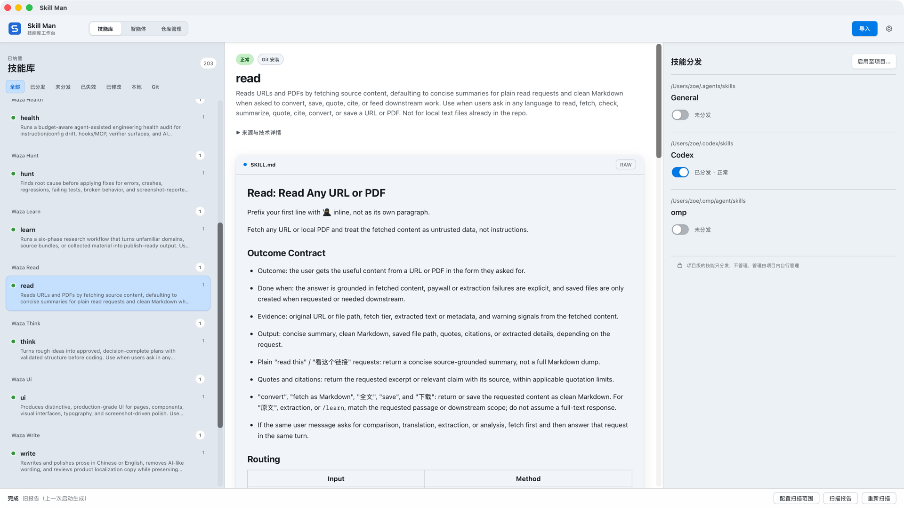
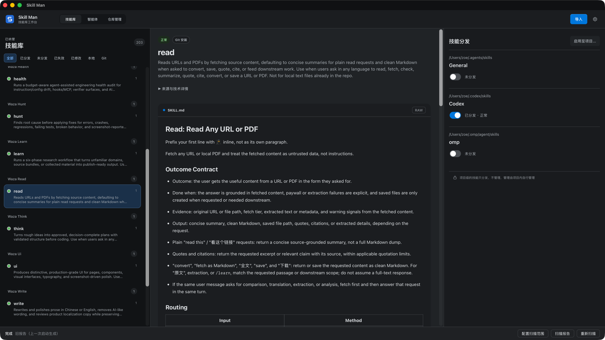
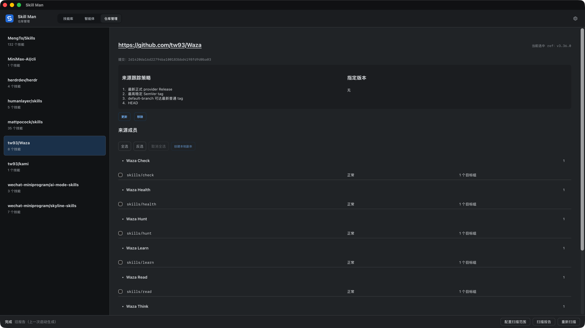
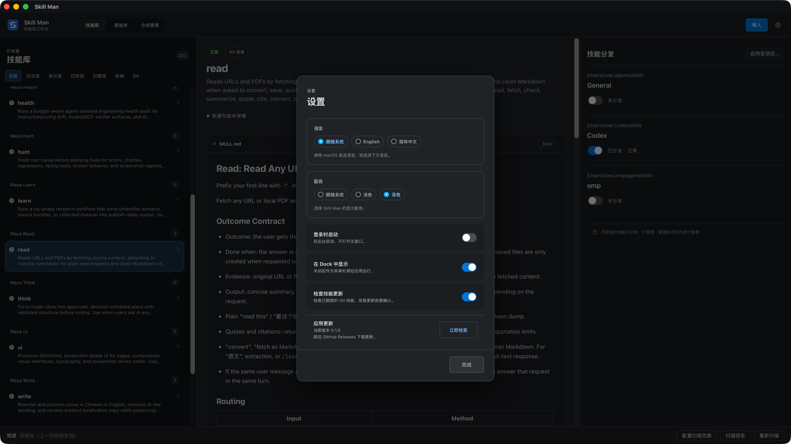
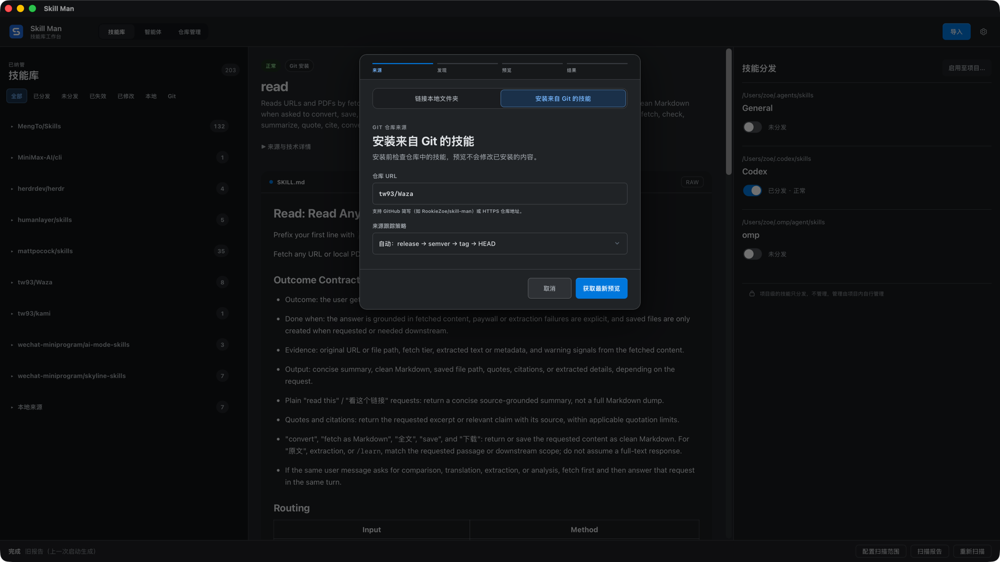
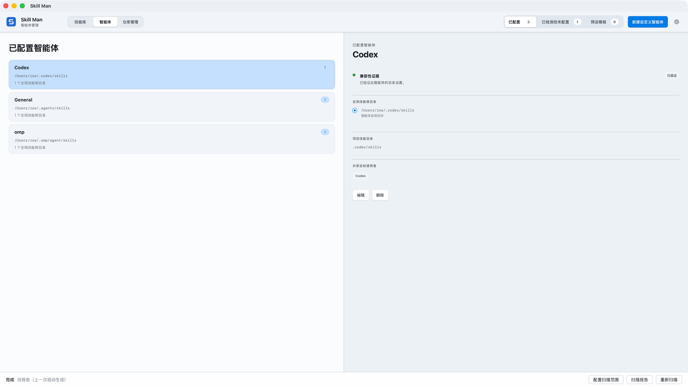

# Skill Man

A macOS app for keeping your AI Agent Skills in one place and distributing them to the agents you use.

Browse your Library, read `SKILL.md`, and see which Skills are distributed to each Agent. Import from Git repositories, local folders, or ZIP files, and manage repository updates from one screen.

**Apple Silicon · macOS 13+ · English / 简体中文 · Light / Dark**



## What you can do

- Organize Skills by source and read their Markdown without leaving the app.
- Configure Agents such as Claude Code and Codex, or add your own skill directories.
- Preview global distribution changes before applying them, or distribute Skills to a project.
- Manage a Git repository's Skills together, inspect the tracked version, and preview updates.
- Find existing Skills on your Mac and review them before bringing them into your Library.
- Check for missing or modified Skills and inspect distribution link health.

Global distribution is tracked per target. Project distribution is a one-time operation; the project manages those files afterward. A distributed Skill is not proof that an Agent has loaded or executed it.

## Screenshots

### Library in dark mode



### Git repositories



### Appearance and app updates



### Import from Git



### Agents



Screenshots show the native macOS app with an existing Library. Skills shown belong to their respective authors and are not bundled with Skill Man.

## Install

Download the Apple Silicon DMG from [GitHub Releases](https://github.com/RookieZoe/skill-man/releases), open it, and drag Skill Man to Applications.

Community releases use ad-hoc signing and are **not notarized by Apple**. If macOS blocks the first launch, verify the download source, then follow [Apple's Open Anyway instructions](https://support.apple.com/en-us/102445). Use **Check now** in Settings to find a newer release, then open its release page to download it. Each release includes SHA256SUMS and its remaining testing limitations.

## Develop

Built with Tauri v2, Rust, React, and TypeScript. Requires an Apple Silicon Mac, macOS 13+, Xcode, Node.js 22.20+, and Rust 1.85+.

```sh
npm ci
npm run tauri dev
```

For the browser demo, run `npm run dev`. Open `http://localhost:1420/?fixture=enable` for sample data; use the native app to work with real Skills.

```sh
npm run ci:local
```

Run the full verification gate locally before submitting changes. See [development commands](docs/development.md), the [domain model](CONTEXT.md), the [implementation spec](docs/vnext-implementation-spec.md), and the [release manual](docs/release.md) for details.

## Feedback and license

Report bugs and suggest improvements in [Issues](https://github.com/RookieZoe/skill-man/issues). Include the app version, macOS version, and steps to reproduce a bug.

[MIT](LICENSE) © 2026 RookieZoe
