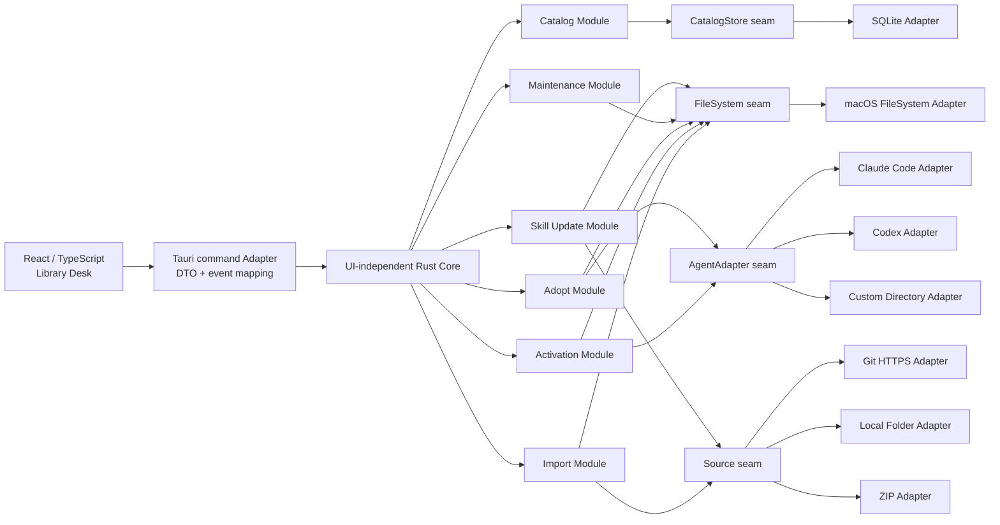

# Skill Man MVP 可开工实施 Spec

> 状态：Draft
>
> 目标读者：负责从零实现 Skill Man MVP 的开发 agent、维护者与测试者。
>
> 权威来源：[CONTEXT.md](../CONTEXT.md)、[ADR-0001 至 ADR-0009](adr/)、[Agent Skills 加载研究](research/2026-07-20-agent-skills-loading.md)、[macOS 技术栈研究](research/2026-07-20-macos-tech-stack.md)、[Wayfinder 地图](https://github.com/RookieZoe/skill-man/issues/1)。本文件汇总这些决议并补充可执行的工程设计；如有冲突，以领域词汇和 ADR 为准。

## 1. 摘要与完成标准

Skill Man 是一个 Tauri v2（Rust 核心 + React/TypeScript UI）macOS 应用，集中管理本机用户级 AI Agent Skills：Library 固定于 `~/Library/Application Support/skill-man/` 并作为单一可信源；Skill 通过 Link 或 Install 进入 Library；既有 Untracked Skill 通过 Adopt 收编；每个 Agent 的启用状态由条目级、直指最终实体的 Activation 符号链接表达。主窗口采用 Library Desk（列表 / 详情 / 按 Agent 检查器），菜单栏提供最近启用 Skill 的快捷视图。任何写操作先生成计划、preflight 后可预览，Import/Update 走 staging 稳定路径替换，Adopt 走逐 Skill 事务与批次 Undo；失败或崩溃经 durable journal 恢复。MVP 仅 GUI、仅 Apple Silicon + macOS 13+，经 Developer ID 签名/公证的 `.dmg` 与 GitHub Releases + Tauri updater 分发。

**可开工定义：**实施 agent 仅凭本文件 + CONTEXT.md + ADR 即可从阶段 0 开始编码，无需再询问产品范围。

**MVP 完成定义：**第 13 节阶段 0–7 全部验收；第 14 节测试矩阵与关键场景全部通过；发布 Gate 通过；不存在文档承诺但实现缺失的功能。


## 2. 产品目标、用户与范围

### 2.1 目标

Skill Man 是一个 macOS 桌面应用，用一套可审计、可恢复的工作流统一管理本机用户级 AI Agent Skills。它解决四个问题：

1. 用户无法从一个位置知道本机有哪些 Skill、来自哪里、是否被修改或失效；
2. 同一 Skill 在多个 Agent 之间的启用状态依赖手工复制或多级符号链接，容易漂移；
3. 既有 Agent 目录混合了真实目录、软链接、共享目录和外部 installer 产物，收编时容易误删或覆盖；
4. 远程 Skill 的来源、版本和更新缺少稳定记录。

MVP 的成功标准不是“能复制目录”，而是：**Library 成为 Managed Skill 的单一可信源；任何写操作都可预览、不会静默覆盖用户内容，失败或崩溃后能恢复到一致状态。**

### 2.2 目标用户

首要用户是在同一台 Mac 上同时使用 Claude Code、Codex 或自定义 Agent 的开发者。他们可能已有数十个用户级 Skill，且现有目录中真实目录与软链接混合。MVP 假设用户理解文件路径和 Git 来源，但不要求理解 Skill Man 的 Library 物理布局。

### 2.3 MVP 范围

- 浏览 Library 中全部 Managed Skill，查看来源、健康状态、最终实体路径和只读 `SKILL.md`；
- 通过 **Link**、远程 **Install**、文件 **Install** 将新 Skill **Import** 到 Library；
- 为 Claude Code、Codex 和用户配置的 Custom Agent 独立 **Enable / Disable** Skill；
- 扫描用户级 Agent 与 shared/legacy 目录中的 **Untracked** Skill，并通过 **Adopt** 收编；
- 识别并处理 Library Conflict、Activation Conflict、Broken、Modified 和缺失 Activation；
- 检查可追踪远程 Skill 的更新，用户确认后 Update；
- 提供可跳过的首次启动、四项 Preferences、常规主窗口和常驻菜单栏快捷面板；
- 通过签名、公证的 `.dmg` 和 GitHub Releases 分发 Apple Silicon/macOS 13+ 应用，并使用 Tauri updater 更新应用本身。

### 2.4 产品原则

- **本地优先：**除用户触发的 Git/更新请求外，数据和操作留在本机；MVP 无账号、云同步和遥测。
- **先计划后写入：**Import、Adopt、Update、Remove、Repair 和冲突替换都先生成计划并做 preflight。
- **不静默破坏：**未知或被外部改变的路径一律停下并报告，不猜测、不强制覆盖。
- **显式确认：**所有 Apply 级写操作（Import、Enable/Disable、Adopt、Update、Remove、Repair、路径变更）都以 Preview 中的明确按钮为确认点；Preview 即确认界面，不存在无确认的后台写入。
- **一套领域语义：**Disable 始终删除 Activation，不调用 Agent 自身的 disable 配置。
- **GUI-only：**所有受支持操作由 GUI 发起；内部 Rust interface 不是公共或实验性自动化接口。

### 2.5 非功能目标

- 应用在无网络时仍能浏览、Enable/Disable、健康检查和管理本地来源；网络失败不打断启动；
- 所有跨文件系统写操作都必须支持故障注入测试和启动恢复；
- 普通 Library 浏览与过滤在 1,000 个 Skill、20 个 Agent 的 fixture 下，列表首屏渲染 < 100 ms、筛选响应 < 50 ms（开发机测量）；不满足则列表必须虚拟化；
- 冷启动窗口骨架 < 2 s 可见；恢复未完成前禁止新的写操作；恢复、健康检查和轻量扫描的状态必须可见；
- 键盘导航、可见焦点、语义化控件和基础 VoiceOver 使用纳入 MVP 验收。


## 3. 规范词汇与领域不变量

所有 UI 文案、Rust 类型、TypeScript DTO、数据库概念和测试名称必须使用 [CONTEXT.md](../CONTEXT.md) 的规范词汇。

### 3.1 核心词汇

| 词汇 | 实施定义 |
|---|---|
| **Skill** | 一个含可读 `SKILL.md` 的目录。产品身份是目录名；frontmatter `name` / `description` 只用于展示和兼容性提示。 |
| **Library** | `~/Library/Application Support/skill-man/` 下的应用自有目录树与 SQLite 索引；全部 Managed Skill 的单一可信源。 |
| **Managed** | 已进入 Library、由 Skill Man 追踪的 Skill。 |
| **Untracked** | 位于 Agent skills 目录或 shared/legacy 扫描源，但不在 Library 中的 Skill。 |
| **Import** | 新 Skill 进入 Library 的动作；方式仅为 Link 或 Install。 |
| **Link** | 引用本地开发目录；实体留在原处，Library 记录指针。 |
| **Install** | 将远程或文件来源的 Skill 实体复制到 Library。 |
| **Adopt** | 把既有 Untracked Skill 收编为 Managed；不得将此流程命名为 Import。 |
| **Activation** | Agent skills 目录中的条目级符号链接，直指 Skill 最终实体。 |
| **Enable / Disable** | Enable 创建 Activation；Disable 删除 Activation。 |
| **Broken** | Library 条目仍在，但 Link 最终实体不可用，或 Install 实体/`SKILL.md` 缺失或不可读，或预期 Activation 指向已消失的 Library 实体。实体存在但内容不同属 Modified，不属于 Broken。 |
| **Modified** | Install 实体与安装或最近 Update 后记录的内容 hash 不同。 |
| **Conflict** | Library 内目录名冲突，或 Agent 目标位置被同名 Untracked 条目占用。 |
| **Remove** | 从 Library 移除 Managed Skill。对 Link 不删除外部实体；不要使用 Delete/Uninstall 作为产品动作名。 |

### 3.2 三种身份不得混用

1. **产品身份：目录名。**用于 Library 唯一约束、Conflict 判定、URL/DTO 中的稳定展示键。
2. **文件系统实体身份：canonical target。**用于扫描、Adopt 分组、识别同一实体的多处 appearance 和链接环；不能替代产品身份。
3. **Agent 可见名称：frontmatter `name`。**部分 Agent 按此注册或去重。目录名不一致时，Skill Man 仍以目录名管理，并展示兼容性警告；Enable 到明确不兼容的 Agent 前再次确认。

### 3.3 不变量

- Library 不复用任何 Agent 约定目录，也不能位于 Agent skills 目录内；
- 每个 Managed Skill 有且只有一个目录名身份和一个最终实体；
- Link 的最终实体在 Library 外，Install 的最终实体在 `<Library>/skills/<name>`；
- Activation 一定是一跳：Install Activation → Library 实体，Link Activation → 外部源目录；
- 不允许把整个 Agent skills 根目录做成软链接；
- 一个 Skill 可在多个 Agent 上独立 Enable；shared/legacy 目录不能作为 Managed Activation 目标；
- 普通 Import 不替换同名 Skill；只有显式 Update 或重新从文件 Install 才进入稳定路径替换流程；
- 任何删除只作用于 Skill Man 可证明拥有且仍符合预期的路径对象；目标类型或 canonical target 变化时必须停止；
- SQLite 的 desired state 与文件系统 observed state 分开保存。文件系统不是启用矩阵的权威来源；健康检查负责比较两者。


## 4. 系统架构与模块接口

### 4.1 调用方向



依赖只能由 UI 向内指向 Rust Core，再由 Core 指向 seam。React 不直接访问 SQLite、Git、ZIP 或用户 Home 目录；Adapter 不反向依赖 UI。Tauri command 只是 Adapter，不拥有领域规则。

### 4.2 Rust Core 的深 Module

每个 Module 以自己的 Interface 作为调用和测试 surface，隐藏 preflight、状态迁移、journal、补偿和 Adapter 组合细节。

| Module | 最小 Interface | 隐藏的 Implementation |
|---|---|---|
| **Catalog** | `list(query)`, `inspect(skill_id)`, `list_agents()` | SQLite 查询、来源聚合、desired/observed health 合成、稳定排序。 |
| **Import** | `discover(source, options)`, `plan(request)`, `apply(plan_token)` | Git/目录/ZIP 获取、两阶段发现、解析/安全校验、Conflict、staging、稳定路径落盘、来源记录。 |
| **Activation** | `plan(SetActivation)`, `apply(plan_token)` | Agent path 校验、占用检测、条目级建删链、desired state 与 observed state 更新、兼容性确认。 |
| **Adopt** | `scan(scope)`, `plan(selection)`, `apply(plan_token)`, `undo(batch_id)` | canonical 分组、appearance 识别、shared 拆分、逐 Skill 事务、批次结果、临时备份和 Undo 占用复查。 |
| **Maintenance** | `startup_check()`, `repair(request)`, `remove(request)` | 启动恢复、Activation 健康、轻量 Untracked 扫描、Broken 重新定位、所有权复查、Remove 补偿。 |
| **Skill Update** | `check(policy)`, `plan(skill_ids)`, `apply(plan_token)` | 24 小时冷却、同 repo fetch 合并、ref/commit/hash 比较、Modified 和上游 path 消失处置。 |

`plan_token` 是 Core 内部的短期 opaque 标识，关联只读计划、涉及路径的 `lstat`/canonical 指纹和过期时间。`apply` 必须重新做 preflight；指纹变化时返回结构化 `PlanStale`，要求 UI 刷新计划，不能继续写入。

### 4.3 真实 seam 与 Adapter

- **CatalogStore seam**：SQLite Adapter 与测试用 in-memory Adapter；负责数据库事务和 migration，不负责文件系统补偿。
- **FileSystem seam**：macOS Adapter 与 fault-injecting temp-home Adapter；提供 `lstat`、受控 canonicalize、同卷 rename、跨卷 copy、原子临时路径、符号链接、权限与 fsync 能力。不得暴露“任意递归删除”给调用者。
- **Source seam**：Git HTTPS、Local Folder、ZIP 三个 Adapter；产出只读 staged tree 和来源证据，不直接写 Library 或 Agent 目录。
- **AgentAdapter seam**：Claude Code、Codex、Custom Directory；声明名称、默认/配置路径、排除目录、已验证能力和兼容性检查。Adapter 只描述目标及验证，不自行修改 Library。
- **Clock seam**：system 与 deterministic test Adapter，用于 24 小时冷却、plan 过期和审计时间。

不要为只有一个实现且测试无需替换的细节创建假想 seam。journal/recovery 是 Core 内部深 Module，因为它协调 FileSystem 与 CatalogStore，而不是某个外部后端的替换点。

### 4.4 建议目录

```text
src-tauri/
├── Cargo.toml
└── src/
    ├── main.rs                 # Tauri bootstrap only
    ├── lib.rs                  # composition root
    ├── core/
    │   ├── domain.rs           # canonical domain types and errors
    │   ├── catalog.rs
    │   ├── import.rs
    │   ├── activation.rs
    │   ├── adopt.rs
    │   ├── maintenance.rs
    │   ├── update.rs
    │   └── operation.rs        # plans, journal, compensation, recovery
    ├── seams/
    │   ├── catalog_store.rs
    │   ├── filesystem.rs
    │   ├── source.rs
    │   ├── agent.rs
    │   └── clock.rs
    ├── adapters/
    │   ├── sqlite/
    │   ├── macos_fs.rs
    │   ├── git_https.rs
    │   ├── local_folder.rs
    │   ├── zip.rs
    │   └── agents/
    └── tauri/
        ├── commands.rs
        ├── dto.rs
        ├── lifecycle.rs
        └── tray.rs
src/
├── app/                        # bootstrap, query cache, command client
├── features/                   # library, import, activation, adopt, settings
├── ui/                         # shared macOS-style primitives
└── test-fixtures/
```

### 4.5 Tauri command Adapter

Tauri command 必须使用明确、可序列化的 request/result DTO，不传原始数据库行、`std::path::PathBuf` 或未分类字符串错误。建议按用户意图暴露：

- catalog/agent 查询；
- Import discover/plan/apply；
- Activation plan/apply；
- Adopt scan/plan/apply/undo；
- health/startup 状态、repair、Remove；
- Skill update check/plan/apply；
- Preferences 与 Agent path 配置。

所有写入返回 `OperationResult`：`operation_id`、逐 Skill 结果、产生/删除/保留的路径摘要、最新 catalog snapshot version，以及可恢复/可重试信息。错误使用 tagged union，至少区分 Validation、Conflict、PlanStale、PermissionDenied、SourceUnavailable、DiskFull、Modified、RecoveryRequired 和 Internal；UI 不解析英文错误文本决定流程。

### 4.6 启动顺序

1. 初始化日志、Library 目录与 SQLite；
2. 执行 schema migration；
3. 读取 durable operation journal，并恢复或标记未完成操作；
4. 恢复完成前允许打开只读窗口，但禁用所有写操作；
5. 运行 Activation 健康检查与轻量 Untracked 扫描；
6. 呈现 Library Desk；
7. 根据 Preferences 和冷却期在后台检查 App/Skill 更新。网络检查不能阻塞窗口。


## 5. Library 布局与数据模型

### 5.1 物理布局

```text
~/Library/Application Support/skill-man/
├── skill-man.sqlite3
├── skills/
│   └── <directory-name>/       # 仅 Install（含 Adopt 迁入）实体
├── staging/
│   └── <operation-id>/
├── operations/
│   └── <operation-id>/
│       ├── journal.json
│       └── backup/
└── cache/
    └── git/                    # 可清理的 bare/mirror 或 fetch cache
```

**Link 在 `skills/` 下没有任何物理条目**：Link 的“指针”只存在于 SQLite（`final_entity_path` 指向外部源目录）；Activation 同样直指外部实体。这保证 Library 目录树永远只含 Skill Man 拥有的实体。

`staging/`、`operations/` 和 `cache/` 不是 Skill，也不得被扫描或展示。Library 路径固定；MVP 没有迁移逻辑。

### 5.2 目录名规则

导入或收编前把名称标准化为 Unicode NFC，并生成仅用于冲突比较的 case-folded `identity_key`。保留原目录名用于显示和实际路径。拒绝：空名称、`.`/`..`、以 `.` 开头、路径分隔符、NUL/控制字符、首尾空白，以及 UTF-8 超过 128 bytes 的名称。同一 `identity_key` 在 Library 中唯一，避免默认大小写不敏感的 macOS volume 上产生碰撞。

### 5.3 SQLite 运行约束

- 数据库启用 `foreign_keys=ON`、WAL 和有限 busy timeout；MVP 仍由单个应用进程写入，不把 WAL 当作多客户端协议；
- schema 以单调递增整数版本迁移；迁移必须在备份和事务中执行；失败时应用保持只读并提供诊断，不启动部分新 schema；
- 所有时间持久化为 UTC RFC 3339 或整数 epoch，DTO 统一输出 RFC 3339；
- 所有 ID 对 UI 都是 opaque string；目录名不是数据库主键，以便审计记录和关联在未来迁移时保持稳定；
- 每次成功写操作递增 catalog `snapshot_version`，前端用它丢弃过期查询结果。

### 5.4 逻辑 schema

| 表 | 关键字段与约束 |
|---|---|
| `skills` | `id`, `directory_name`, `identity_key UNIQUE`, `display_name`, `description`, `source_kind(link/remote_install/file_install)`, `library_entry_path`（Link 为 NULL）, `final_entity_path`, `recorded_content_hash`, `health(healthy/broken/modified)`, `created_at`, `updated_at`。 |
| `remote_sources` | `skill_id PK/FK`, `source_url`, `requested_ref`, `resolved_commit`, `skill_path`, `last_checked_at`, `last_updated_at`。未指定 ref 时 `requested_ref` 显式记录默认分支语义。 |
| `file_sources` | `skill_id PK/FK`, `original_path`, `original_filename`, `installed_at`。只作溯源，不用于后续跟踪。 |
| `agents` | `id`, `name UNIQUE`, `kind(claude_preset/codex_preset/custom)`, `skills_path`, `path_identity_key UNIQUE`, `detected`, `compatibility(verified/unknown)`, timestamps。 |
| `activations` | `skill_id`, `agent_id`, `desired_enabled`, `expected_entry_path UNIQUE`, `expected_target_path`, `observed_state(present/missing/target_mismatch/dangling/occupied)`, `last_enabled_at`, `last_checked_at`; PK=`(skill_id, agent_id)`。 |

Adopt 完成后的来源归一：迁入 Library 的真实目录记为 `file_install`（`file_sources.original_path` = 原 appearance 路径，hash 基线取 Adopt 完成时刻）；登记为 Link 的记为 `link`。Remove 时 `activations`、`remote_sources`、`file_sources` 随 `skills` 级联删除；`operation_*` 审计行保留（`skill_id` 允许为 NULL）。
| `operation_batches` | `id`, `kind`, `state(planned/applying/completed/partially_failed/rolled_back/recovery_required)`, `started_at`, `finished_at`, `undo_expires_on_close`, summary。 |
| `operation_items` | `batch_id`, `skill_id nullable`, `state`, `error_code nullable`, `error_detail`, `audit_summary`; 保存 Adopt/批量 Update 的逐 Skill 结果，不保存可执行指令。 |
| `preferences` | 单行：`launch_at_login=false`, `show_in_dock=true`, `check_app_updates=true`, `check_skill_updates=true`，及两类最近检查时间。不得成为任意 key/value 设置仓。 |
| `catalog_meta` | 单行 schema version、catalog snapshot version、最近成功 startup check 时间。 |

`operation_*` 是审计和恢复状态索引；真正能补偿文件系统操作的步骤记录位于 `operations/<id>/journal.json`。不能只靠数据库事务声称跨文件系统操作可回滚。

### 5.5 内容 hash

MVP 使用带版本前缀的确定性 tree hash：`tree-sha256-v1:<hex>`。

1. 不跟随 Skill 内符号链接；
2. 按相对路径 UTF-8 bytes 排序；
3. 对每个条目写入类型、规范相对路径；普通文件再写入内容 bytes，符号链接写入原始 link target bytes，空目录也写入条目；
4. 不包含 mtime、owner、扩展属性等机器相关元数据；
5. 任何读取失败都使 hash 结果不可用并返回结构化错误，不把部分 hash 当作 Modified。

Install 完成和每次 Update 后记录 hash。健康检查或详情刷新可重算；不同于记录值时进入 Modified。Link 不进入 Modified，源不可读时进入 Broken。

### 5.6 状态派生

- **Managed / source kind** 来自 SQLite；
- **desired activation** 来自 `activations.desired_enabled`；
- **observed activation** 由健康检查通过 `lstat` 和不跟随/受控跟随解析得到；
- **Broken / Modified** 是持久化的最近观察结果，但每次相关操作前必须重新观察；
- **Conflict** 是计划/preflight 结果，不作为可无限期复用的静态事实；路径变化后必须重新计算；
- 一个 Skill 同时存在多个健康问题时，列表与详情主状态按 Broken > Modified > Healthy 展示；Activation 级问题（missing/occupied/target_mismatch）只在检查器与修复入口展示，不覆盖 Skill 级状态；
- UI 不直接组合路径推导状态，统一消费 Rust Core 输出的 snapshot。


## 6. 文件系统安全与事务协议

### 6.1 路径解析与所有权

- 用户输入的路径（Link 源、Custom Agent 目录、本地文件来源）先经 UI 展示原始字符串，再由 Rust Core 单独处理；前端不拼接、不规范化路径。
- Core 解析顺序：`expanduser` 只允许把开头 `~` 展开为当前用户 Home → `std::fs::canonicalize` 无尾随链接部分 → 对最终组件 `lstat` → 记录 canonical 路径与 entry 类型。符号链接本身作为对象时（Link 源、Activation、Adopt appearance）只 `lstat` 不穿透；验证目标时才受控跟随，深度上限 16，并检测循环。
- 写操作仅允许落在：`<Library>/skills`、`staging`、`operations`、`cache`、已配置 Agent 的 skills 目录、以及 Adopt/Undo 明确计划的 appearance 路径。其他绝对路径一律拒绝。
- 每次 Apply 前重新 `lstat` 计划中的全部涉及路径并对比指纹；任何类型、target 或存在性变化 → `PlanStale`，放弃操作。
- 时间开销可接受时，跨卷迁移的 backup 校验采用逐文件大小与 hash 抽查；校验失败立即中止并恢复。

### 6.2 符号链接规则

- 创建：`symlink(target, entry)`；`target` 必须是 Skill 最终实体目录的绝对 canonical 路径。
- 删除 Activation：先 `lstat(entry)`，确认它是符号链接、target 等于 SQLite 记录的 `expected_target_path`、且路径在对应 Agent skills 目录内，然后 `remove_file(entry)`。任何一项不符，记录 `target_mismatch` 并停止，绝不删除真实目录。
- 修复缺失 Activation 前先检查目标位置未被其他内容占用；被占用走 Conflict 流程。
- `~/.agents/skills` 等 shared 目录永不作为创建 Activation 的目标；Adopt 中它们是只读 appearance 来源。

### 6.3 Staging 与稳定路径替换

1. Source Adapter 把内容获取到 `<Library>/staging/<operation-id>/<name>`；
2. Core 校验：`SKILL.md` 存在且可读、目录名合法、无绝对/越界符号链接、总大小与单文件大小在限额内。frontmatter 解析失败**不**阻止导入（ADR-0004：格式兼容性不是硬门槛），仅记录兼容性警告并在详情中提示；多 Skill 集合按两阶段发现（见 8.3）产出的候选逐个独立校验。Skill 内部允许相对符号链接，但其解析结果必须存在且仍在该 Skill 根目录内，否则拒绝导入；
3. 校验失败 → 清理 staging，Library 与 Activation 不变；
4. 成功后：同卷原子 `rename` 到 `<Library>/skills/.<name>.new-<opid>`，再对旧实体做“备份移出 → rename 新实体”的稳定路径替换；完成后验证所有 Activation 的链接文本仍等于预期稳定路径且解析目标为新实体；失败时从新实体/备份恢复原状；
5. 因 target 是稳定路径而非 inode，Activation 内容不受替换影响——这正是 ADR-0001 选择稳定路径的原因。

### 6.4 事务与 journal

涉及多个文件系统步骤的操作（Adopt、Update、Remove、Activation 批量变更）使用统一 `Operation` 状态机：

```text
planned → applying → committed | partially_failed | rolled_back | recovery_required
```

- 在第一步可写动作前，把完整计划写入 `operations/<operation-id>/journal.json` 并 fsync；journal 包含：版本、操作类型、逐项步骤、每步的输入/期望输出/补偿动作、batch 与 item 映射、当前游标。
- 每完成一步立即更新游标并 fsync；进程崩溃后，下次启动由 Maintenance Module 重放：已完成步骤幂等跳过；对未完成步骤采用确定性规则——**若下一步骤的全部前置条件仍成立则继续向前执行，否则从当前点逆序补偿**；任一步不可安全继续也不可安全补偿 → `recovery_required`。
- 补偿按逆序执行；补偿失败 → `recovery_required`，UI 呈现明确的待处理项并锁定相关 Skill/Agent 的写操作，直到人工在结果页选择重试、放弃补偿或接受当前状态。任何终态下 `operation_items` 记录每个 Skill 的最终状态，保证 `skills`/`activations` 表与文件系统实际状态一致或明确标注残留。
- 成功完成（或用户确认放弃补偿）后：删除 `backup/`、将 journal 归档保留（不再可 Undo），并在 `operation_items` 写入逐 Skill 结果。

### 6.5 Adopt 事务细节

- 每 Skill 独立 batch item；一个 Skill 失败只回滚该 Skill，不回滚批次中其他成功项。
- 真实目录迁移：canonicalize 源 → staging 移动（同卷 rename；跨卷 copy + 校验 + 删除源）→ SQLite 登记 → 处理原 appearance（删除空目录/替换为 Activation）→ 建 Activation。
- 既有软链 appearance：先解析 canonical target——**若最终实体仍在任一 Agent skills 目录内，按真实目录规则迁入 Library**；仅当最终实体位于所有 Agent 目录之外时才登记 Link（实体留在原处）→ 用受管 Activation 替换原软链。
- `~/.agents/skills` 真实目录被多个 Agent 使用时：实体迁入 Library，再为每个目标 Agent 建私有 Activation，实现共享层拆分。
- Undo 仅限当前结果页未关闭且应用未重启：逆序执行补偿；每步前重新检查原路径未被外部占用；被占用则跳过该项并报告，不强行覆盖。

### 6.6 限额与资源保护

| 资源 | 默认值 | 超限行为 |
|---|---|---|
| 单 Skill 解压/检出大小 | 256 MB | 拒绝并清理 staging |
| 单文件 | 32 MB | 拒绝（`SKILL.md` 自身超过 512 KB 直接拒绝） |
| 单来源 Skill 数 | 100 | 发现阶段截断并提示，不静默丢失 |
| Git fetch 超时 | 60 s 连接 / 300 s 总计 | 取消、清理、报告 `SourceUnavailable` |
| 磁盘剩余空间阈值 | 预计占用 ×2 + 100 MB | preflight 拒绝，报 `DiskFull` |
| 内容 hash 总数据量 | 与上述一致 | 增量流式计算，不全量载入内存 |

以上限额是防滥用的安全默认值，不构成承诺的性能目标；在 Release Notes 中保持可调整。


## 7. Agent Adapter 与兼容性

### 7.1 Adapter 契约

每个 Agent Adapter 声明：显示名、默认 skills 路径、排除子路径、`compatibility` 等级（`verified` / `unknown`）、以及可选的兼容性检查（例如 frontmatter 名称敏感度）。Adapter 不负责创建 Library 条目、不调用 Agent 自身的安装/禁用命令、不读写 Agent 配置文件。

### 7.2 内置 Preset

| Preset | skills 路径 | compatibility | 关键规则 |
|---|---|---|---|
| Claude Code | `~/.claude/skills` | `verified`（条目级软链官方支持；版本化实证） | 只建条目级 Activation；健康检查覆盖“自动更新静默删链”场景；同 canonical target 去重只作提示，不阻止。 |
| Codex | `~/.codex/skills` | `verified`（源码确认跟随软链） | 永不扫描、Adopt 或写入 `~/.codex/skills/.system`；`~/.agents/skills` 是 shared/legacy 扫描源，不是 Codex Activation 目标。 |
| Custom | 用户配置绝对路径 | `unknown` | 仅承诺文件系统投放；UI 标注“兼容性未知”；路径创建需显式确认。 |

Preset 始终展示，缺失目录标为未检测到，创建前必须用户确认。Preset 路径可被用户覆盖为同义词位置并恢复默认；但只要该 Agent 仍存在任何 Activation，路径修改入口即被阻止并列出阻塞项，用户必须先全部 Disable；流程不得自动迁移 Activation 或在旧路径遗留软链。

### 7.3 路径安全规则

- Agent skills 路径不得等于或包含 Library 路径，反之亦然；不同 Agent 的路径不得相同或互为父子；
- 路径变更是先阻止后执行的模型：存在 Activation → 阻止并列出阻塞项 → 用户手动全部 Disable → 才允许修改记录 → 修改后立即健康检查；
- Custom Agent 路径解析使用与第 6.1 节相同的 canonicalize + 类型检查；不跟随符号链接判断占用。

### 7.4 兼容性检测

Enable plan 时，若 Skill 目录名与 frontmatter `name` 不同，且目标 Agent 属于已知按 frontmatter 注册的实现（如 Codex、Cursor 生态），UI 显示“Agent 中可见名称”及不一致警告，并要求显式确认；这不改变目录名身份，也不自动改名。

### 7.5 不承诺的内容

- 不验证 Claude Code/Codex 进程当前是否运行、是否已重载 Skill；
- 不调用 Agent 的 disable 配置；
- 不为 Cursor/Gemini/opencode 提供内置 Preset；它们的目录可经 Custom Agent 使用，且 UI 标注兼容性未知（Cursor 条目级软链有版本化实证，可在 Custom 配置时提示参考版本，但不构成支持承诺）。


## 8. 核心用户流程

### 8.1 浏览与查看

主窗口打开即为 Library Desk：左侧列表、中间详情、右侧 Enable by Agent 检查器。列表支持全部/Broken/Modified/Link/Install 筛选；详情展示来源、最终实体路径、目录名身份、最近活动和只读 `SKILL.md`。任何浏览、筛选、查看均不产生文件系统写入。

### 8.2 Enable / Disable

- Enable 普通路径：plan 检查目标位置无占用 → apply 创建条目级 Activation → 记录 desired state → 更新 observed state。
- Enable 遇占用：进入 Activation Conflict sheet，提供 Adopt existing item / Remove then replace（显式确认）/ Cancel；任何路径前再次 preflight。Remove then replace 对占用条目使用 journal + 临时备份，与其他写操作共享同一恢复与 Undo 语义，不直接不可恢复地删除真实目录。
- Disable：确认 Activation 仍符合预期（符号链接且 target 匹配）后删除；不符合则报告 `target_mismatch` 并停下。
- Broken Link 的 Activation 保留；源恢复后健康检查自动回到 healthy，无需用户重新 Enable。

### 8.3 Import

单个 sheet 覆盖三种来源，流程为 Source → Discover → Preview → Result：

- **Link local folder**：选择本地目录；不复制实体，Library 记录指针，Activation 直指源目录。
- **Install from Git**：输入 GitHub shorthand、GitHub/GitLab URL 或一般 Git HTTPS；不支持 OAuth/PAT/SSH；两阶段发现：先在标准位置（仓库根、`skills/` 等常规层级）浅层枚举，**无结果时递归扫描兜底**，并提供“强制全深度扫描”高级选项；发现结果按候选 Skill 多选 → 预览。
- **Install from file**：接受文件夹或 `.zip`；作为一次性快照记录原路径与 hash，不跟踪原位置。
- Preview 显示每个候选的目录名、目标位置和 Library Conflict；同名冲突阻止提交，不自动加后缀、不覆盖。成功后展示结果与下一步（去详情 / Enable）。

### 8.4 Adopt

- 扫描：默认轻量扫描已配置 Agent 目录与 shared/legacy 源（MVP 为 `~/.agents/skills` 顶层条目）；首次启动为完整扫描；手动 Rescan 随时可用。
- 分组：按 canonical target 聚合 appearance；展示真实目录/软链、出现位置、风险（safe / external / broken / conflict）、建议目标 Agent。同一 canonical target 在多处出现且目录名不一致时，展示全部名称并默认取字典序第一作为产品身份，确认前可看到。
- 风险判定：`external` = 软链最终实体位于 Home 之外、缓存/包管理目录（如 `Library/Caches`、`node_modules`）或其他 installer 明显管理的位置；`conflict` = 与 Managed 同名但实体不同。
- 选择：默认勾选 safe；external 需手动勾选；broken 不可选（Broken Untracked 无实体，不能 Adopt，但提供重新定位、删除该目录条目或忽略，处理后 Rescan）；conflict 不可选，显示原因（保留现有 Managed；若用户想替换，须先 Remove 或改名后重扫）。
- 预览：每个 Skill 展示逐步事务计划（迁移/登记、SQLite、替换 appearance、创建 Activation）。
- 执行：逐 Skill 独立事务；结果页显示成功/失败；失败项已回滚，不影响成功项。
- Undo：结果页未关闭且未重启前可整批 Undo；逐项复查原路径未被外部占用。

### 8.5 Update

- 后台检查仅针对可追踪 remote Install（默认分支/branch）；tag/commit 固定来源不检查；
- 同一仓库的多个 Skill 合并为一次 fetch，UI 按仓库分组展示更新，允许逐个或批量更新；
- 发现更新只提示，不自动应用；
- 确认 Update：重新 staging → 校验 → 稳定路径替换 → 更新 hash 与 resolved commit；失败保留旧实体与 Activation；
- Modified 状态下只有“放弃本地修改并更新”或“取消”；
- 上游 `skillPath` 已消失：保留当前本地实体与 Activation，不自动删除、不猜测迁移；用户在详情中选择——重新选择仓库内路径、固定当前版本并停止检查，或 Remove。

### 8.6 Remove 与重新定位

- Remove 先 Disable 全部 Activation，再删除 Library 条目；Link 不删除外部实体，Install 删除实体。流程提供预览与确认，采用 journal 保证部分失败可恢复。
- Broken Link 详情提供“重新定位”：选择新源目录 → 校验 `SKILL.md` 可读且目录名一致（frontmatter `name` 存在时也必须匹配）→ 预览确认 → 更新指针与 Activation → 健康检查恢复。

### 8.7 首次启动

三步可跳过：创建 Library（固定路径）→ 查看/设置 Agent Preset（缺失目录仅标记，创建需确认）→ 只读**完整扫描**存量 Skill。首次启动的扫描必须是完整扫描；此后的启动只做轻量扫描。跳过不执行任何 Adopt 或写入。完成后展示扫描结果并引导进入 Adopt。

### 8.8 健康检查与修复

启动时对所有 desired activation 检查条目存在、类型为软链、target 匹配、最终实体可读且含 `SKILL.md`。缺失或漂移标记 observed state；UI 提供一键修复，修复前复查占用。dangling（最终实体消失）保留并标记 Broken。


## 9. 主窗口、Sheet 与菜单栏体验

### 9.1 视觉基线

采用 Apple Liquid Glass 方向：SF Pro 系统字体、系统灰 canvas、Apple 蓝主操作、系统红/橙/绿仅作语义状态色、低对比分隔线。玻璃材质只用于 toolbar、sidebar、inspector、sheet 和菜单栏面板；正文、表格和代码预览保持清晰，不做全屏模糊。控件使用 macOS 习惯的 switch、segmented control、sheet、popover；不使用网页式 hover 上浮和彩色卡片墙。图标统一为轻量线性图标，不混用文字符号。

### 9.2 主窗口（Library Desk）

- 窗口顶部为统一 toolbar：标题、Run health check、Adopt、Import（主操作）、菜单栏模拟入口（仅原型；正式版由系统菜单栏提供）与 Preferences；
- 左侧 Library 列表：筛选 chips + 行内 Skill 状态点；选中态为蓝色 selection；
- 中间详情：状态 badge、来源 tag、大标题（目录名）、来源/实体路径/身份/活动 metadata、Broken/Modified inline notice、只读 `SKILL.md` 预览；
- 右侧 Enable by Agent：每个 Agent 一行独立 switch；缺失/占用/dangling 以 inline 状态与 Repair/Conflict 入口表达；
- 详情中 frontmatter name 与目录名不一致时显示 Agent 可见名称提示。

### 9.3 Sheet 与焦点行为

Import、Adopt、Conflict、首次启动和 Preferences 均以 sheet 呈现：初始焦点落在 sheet 内、Escape 关闭、背景点击关闭、关闭后焦点回到触发控件；写操作按钮在 preflight 通过前禁用。步骤型流程显示 Source → Discover → Preview → Result 进度。Apply 执行期间禁用关闭；Discover 等网络/IO 阶段关闭 sheet 即取消任务并清理 staging。

### 9.4 菜单栏面板

应用运行期间菜单栏常驻。面板为 Library Desk 快捷视图：最近启用 Skill（名称、状态、启用 Agent 数、打开详情入口）、打开主窗口、退出。红色关闭按钮只关闭主窗口，`⌘Q` 或菜单“退出”才终止应用。面板不复制完整管理界面。

### 9.5 空态与错误呈现

- Library 为空时展示首次启动入口与三种 Import 方式；
- 扫描未发现 Untracked 时明确显示“无需收编”；
- 权限/网络失败以 inline notice 呈现，附具体受影响路径与重试入口，不用模态轰炸；
- 所有错误消息使用结构化错误码映射的中文文案，包含下一步可执行动作。


## 10. 后台行为、设置与应用生命周期

### 10.1 固定后台行为

- 每次启动：schema 检查 → journal 恢复 → Activation 健康检查 → 轻量 Untracked 扫描；
- App 与 Skill 更新检查：各自最多每 24 小时一次（以成功检查时间计），只提示、不自动下载/应用；
- 后台检查在独立异步任务中执行，失败静默降级为下次再试，不阻塞 UI；用户主动发起的操作（手动检查、Import、Update）失败则显示 inline notice 与重试入口；
- 实时 Agent 目录监听不在 MVP；外部变化通过启动检查、Rescan 和手动 health check 发现。

### 10.2 Preferences（严格四项）

1. 登录时启动（默认关）；
2. 在 Dock 中显示（默认开；关闭后为菜单栏 accessory 模式）；
3. 自动检查应用更新（默认开）；
4. 自动检查 Skill 更新（默认开）。

Library 路径、主题、语言、通知、“关闭窗口时退出”不提供设置。红色关闭只关主窗口；`⌘Q` 退出。Agent 路径配置属于 Agent 管理与首次启动流程（含覆盖/恢复默认），不是 Preferences 的第五项。

### 10.3 应用生命周期

- 登录启动以后台模式运行，不自动打开主窗口；
- 应用运行中菜单栏常驻；从菜单栏或 Dock 可重新打开主窗口；
- 升级替换应用二进制后，首次启动照常执行 migration 与 journal 恢复；schema 过新无法识别的版本拒绝写入并提示更新策略。

### 10.4 不可恢复与锁定状态

`recovery_required`、schema 版本不兼容、Library 目录权限失败均进入只读锁定：浏览可用、写操作禁用、UI 明确显示诊断与后续动作（修复权限、重试恢复、查看日志）。日志与诊断不包含 Skill 内容正文，仅包含路径、错误码与操作 ID。


## 11. 安全、隐私与权限

### 11.1 不执行导入内容

Import/Adopt 只枚举、解析 frontmatter、复制/移动和建链；不执行 `SKILL.md` 指令、仓库脚本、git hook、postinstall 或上游 CLI，不调用 `npx`。前端不得通过 shell 能力间接执行。Skill 内容最终会成为 Agent 指令，因此 Preview 必须展示来源 URL/路径、commit 与风险说明。

### 11.2 最小权限

- Tauri capabilities 按功能最小化：不给前端任意 Home 目录的通用文件系统权限；路径验证、软链、Git、ZIP、SQLite 均在 Rust Core，经窄 DTO 暴露；
- 网络仅用于用户触发的 Git fetch 与按设置的更新检查；MVP 无遥测、无分析、无崩溃上报；
- 日志包含路径与错误码，不包含 Skill 正文、远端响应体中的敏感数据或凭据。

### 11.3 输入与归档安全

- 所有用户输入路径按第 6.1 节解析；拒绝空、控制字符与越界；
- ZIP 拒绝绝对路径、`..` 分量、越界符号链接与超限内容；
- 远程发现不执行 Git LFS/子模块初始化；浅层 clone 失败时全深度 fallback 并记录。

### 11.4 数据保护

- SQLite 明文存于固定 Library 路径，不包含凭据；
- 不支持私有仓库认证，因此也不存储 PAT/token；
- Apple 证书、ASC API key、updater 私钥只存在于受保护的 CI secrets 与维护者本机，不进入仓库与构建产物。

### 11.5 隐私面

应用读取的用户路径仅 Library、已配置 Agent skills 目录、shared/legacy 扫描源以及用户显式选择的来源目录；无后台同步与账号体系。卸载不在 MVP 自动清理范围内（文档说明手动移除 Library 与残留 Activation 的指引即可，不构成产品动作）。


## 12. 发布、签名、公证与更新

遵循 ADR-0006，要点固化如下：

- 平台：Apple Silicon、macOS 13+，单一 `.dmg`（不发布 Intel/universal）；
- Bundle ID：`io.github.rookiezoe.skillman`；版本号同时由 `Cargo.toml` 与 `tauri.conf.json` 同步，CI 校验一致；
- 公开测试版前：开源 MIT、建立 Apple Developer ID Application 签名链、ASC API key 公证、staple；Gatekeeper 验收通过前不发公开 Release；
- 通道：GitHub Releases 单通道；tag 触发 CI 构建 Draft Release，人工检查后 Publish；不做 Homebrew、官网/CDN、Stable/Beta 双通道。**0.x 公开测试版必须发布为普通 Release，禁止使用 GitHub Prerelease**，以维持 `releases/latest/download/latest.json` 唯一通道；
- Updater：Tauri 官方 updater，`latest.json` 固定从 `releases/latest/download/latest.json` 获取；更新提示必须展示版本号、release notes 与下载大小，用户确认后下载，下载完成后再次确认才重启安装；
- Updater 信任链：公钥随源码提交并嵌入应用；私钥轮换时，在旧私钥仍可用时先发布含新公钥的过渡版本；私钥遗失**不得**通过关闭签名验证降级发布；私钥与发布密钥分离管理；
- 回滚演练 = 从 GitHub Releases 手动重装上一签名版本；MVP 不提供内置降级通道；
- CI：PR/常规构建不接触发布 secrets；release workflow 受环境保护，第三方 Actions 固定完整 SHA；每次构建产出 checksum 与 release notes。

发布验收（Gate）包括：`codesign --verify`、`spctl --assess --type execute`、staple 检查、干净用户环境首次启动、updater 从上一版本真实升级并回滚演练。


## 13. 分阶段实施计划

| 阶段 | 交付物 | 完成定义 |
|---|---|---|
| **0. 工程与契约** | Tauri v2 + React/TS 工程、core crate 骨架、DTO 约定、CI（fmt/lint/test/build）、macOS 13+/aarch64 基线 | CI 绿；无 CLI；前端无任意文件系统能力；目录结构符合第 4.4 节。 |
| **1. 领域与 SQLite** | domain 类型、schema/migration、CatalogStore Adapter、状态机 | 单测覆盖目录名/identity_key 唯一、状态迁移、迁移失败只读锁定、路径互斥约束。 |
| **2. 安全文件操作与恢复** | FileSystem seam、macOS/temp-home fault Adapter、staging/journal/补偿、PlanStale | 集成测试：循环/嵌套/dangling 链、ZIP traversal、跨卷迁移、进程被杀恢复、删除不误删真实目录。 |
| **3. Import 与 Update** | Git/Folder/ZIP Source Adapters、两阶段发现、多选、Preview/Apply、hash 与 Modified、24h 冷却检查 | fixture 仓库：分支/tag/commit、多 Skill 仓、上游 path 消失、Modified 不覆盖、稳定路径替换后 Activation 仍有效、超时与限额。 |
| **4. Agent Adapter 与 Activation** | Claude/Codex/Custom Adapter、Enable/Disable、Conflict 三选一、健康检查与修复 | 隔离临时 HOME 断言真实软链；同名占用三选一；Claude 删链后一键修复；`.system` 与 shared 目录规则通过测试。 |
| **5. Adopt 与 Undo** | 扫描/分组、逐 Skill 事务、shared 拆分、结果页 Undo | 真实目录迁移、外部 Link 登记、Broken Untracked 拒绝、部分失败独立回滚、Undo 外部占用保护。 |
| **6. UI 与 macOS 体验** | Library Desk、Sheet 流程、首次启动、四项 Preferences、菜单栏面板、Liquid Glass 视觉 | 前端组件/交互测试；人工 macOS 冒烟：tray 显隐/失焦、Dock 开关、关闭窗口≠退出、键盘与 VoiceOver 基础可用。 |
| **7. 发布与更新** | 签名/公证/staple CI、Draft→Publish 流程、updater 配置与演练 | 第 12 节 Release Gate 全部通过；无 secrets 的常规构建与受保护 release 构建分离。 |

阶段 1–2 必须先于任何会写 Agent 目录的工作；3 与 4 可在核心接口稳定后并行；5 依赖 2 与 4；6 可先用 fixture 驱动但最终接线依赖 3–5；7 不阻塞本地开发，但 Gate 未过前不得公开发布。


## 14. 测试矩阵与验收标准

### 14.1 测试层级

1. **Rust 单测**：domain 规则、identity_key、状态机、journal 重放、hash 确定性、错误码映射；
2. **Rust 集成测试（隔离临时 HOME）**：文件系统全部写路径、符号链接全形态、跨卷迁移、崩溃注入（每步 kill）、TOCTOU 变更、ZIP/Git fixture；
3. **前端测试**：组件渲染（三栏、sheet 步骤、状态 badge）、交互（筛选、switch、sheet 焦点与 Escape）、基于 fixture DTO 的集成流；
4. **人工 macOS 验收**：真实签名构建上的 tray/TCC/更新/Gatekeeper。

### 14.2 关键验收场景（必须有自动化或明确人工 checklist）

| 场景 | 期望 |
|---|---|
| Import 同名 Skill | 阻止并提示；不产生后缀改名、不覆盖。 |
| Enable 目标被 Untracked 占用 | 三选一；Cancel 后文件系统与数据库完全不变。 |
| Claude 自动更新删链后启动 | observed=missing，提供一键修复；修复后 Activation 恢复。 |
| Link 源移动 | Broken、Activation 保留；重新定位后 healthy。 |
| Install 更新失败（网络中断） | 旧实体与 Activation 不变；staging 清理。 |
| Modified Install 收到更新 | 只提供放弃修改并更新或取消。 |
| Adopt 批次第二项失败 | 第一项成功保留，第二项回滚；结果页可 Undo 全部成功项；Undo 遇外部占用跳过该项。 |
| 应用升级 schema migration 中断 | 恢复备份、只读锁定、显示诊断。 |
| Apply 前外部改动目标路径 | `PlanStale`，放弃写入，要求刷新计划。 |
| Agent 路径改为另一 Agent 子目录 | preflight 拒绝。 |

### 14.3 性能与资源验收

- 1,000 Skill / 20 Agent fixture：列表渲染与筛选交互无明显卡顿；启动健康检查不阻塞窗口展示；
- 网络任务全部可取消；取消后无残留 staging；
- 内存中不保留完整 Skill 正文集合，只读预览按需读取。

### 14.4 完成定义（MVP 完工）

- 第 13 节所有阶段验收通过；
- 第 14.2 场景全部有对应测试或人工 checklist 记录；
- Release Gate 通过且公开 Draft 经人工确认；
- 文档（README、本 spec、ADR 链接）与实现状态一致，不存在文档承诺但实现缺失的功能。


## 15. 明确不做与未来重评

### 15.1 MVP 不做

- CLI、URL scheme、本地 API、AppleScript/Shortcuts 等一切无头自动化接口（ADR-0008；post-MVP 重评门槛与跟踪见 Issue #17）；
- 项目级 Skill、Project/Profile 管理；
- app 内编辑 Skill 内容（只读查看，编辑交给编辑器）；
- 多机/云同步、账号体系、遥测；
- 非 macOS 平台、Intel Mac、universal binary；
- Library 路径迁移、自定义主题/语言/通知；
- 实时 Agent 目录监听、自动应用更新；
- Cursor/Gemini/opencode 内置 Preset（可经 Custom Agent 使用，兼容性未知）；
- 私有仓库认证（OAuth/PAT/SSH）。

### 15.2 未来重评入口

- **CLI/无头接口**：满足“真实自动化需求 + Rust 核心经事务/恢复验证”双门槛后重开设计；实现前另行并发 ADR（GUI IPC 单写者、本地服务或跨进程锁）；
- **更多 Agent Preset**：以版本化实证研究为依据逐个评估；
- **云同步/项目级 Skill**：在 MVP 使用反馈明确后另行决策，当前 spec 不预留数据结构。

## 16. 追踪矩阵

| Spec 章节 | 权威来源 |
|---|---|
| 2 范围 | Issue #1 地图、ADR-0005、ADR-0007 |
| 3 词汇/身份/不变量 | CONTEXT.md、ADR-0001、ADR-0003、Issue #4 |
| 4 架构 | ADR-0002、ADR-0008 |
| 5 数据模型 | ADR-0003、ADR-0004、ADR-0005、ADR-0007 |
| 6 文件系统/事务 | ADR-0001、ADR-0003、ADR-0004、ADR-0005、研究 §6 |
| 7 Agent Adapter | ADR-0003、ADR-0007、研究 §3/§6 |
| 8 用户流程 | ADR-0003、ADR-0004、ADR-0005、ADR-0009、原型 commit `2bc7eb3` |
| 9 UI/菜单栏 | ADR-0007、ADR-0009、Issue #6 |
| 10 后台/设置 | ADR-0007 |
| 11 安全/权限 | ADR-0004、ADR-0006、技术研究 |
| 12 发布/更新 | ADR-0006 |
| 13–14 实施/验收 | ADR-0002、研究风险项 |
| 15 范围外/重评 | ADR-0005、ADR-0006、ADR-0008、Issue #17 |

本 spec 批准后即冻结：任何新增范围或改变不变量的工作，必须先新增/修改 ADR，再回到本文件更新对应章节。
