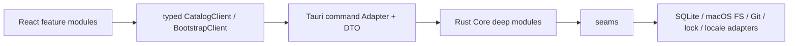
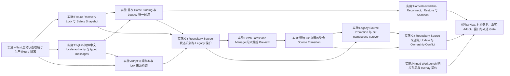

# Skill Man vNext 实施 Spec

> 状态：Ready for implementation
>
> Wayfinder map：[Skill Man 地图：vNext 真实数据可信、Home 首次绑定与中文体验](https://github.com/RookieZoe/skill-man/issues/32)
>
> 汇总票：[汇总：vNext 真实数据可信、可配置与中文体验 spec](https://github.com/RookieZoe/skill-man/issues/38)

## 1. 权威、范围与完成标准

本文件是 vNext 变更的实施权威。它把已关闭 Wayfinder 决策合并为一套无冲突的 schema、Core Module、seam、Adapter、typed Tauri DTO、React 状态机与验收契约。实施 agent 不得重新决定本文件已经定案的产品行为。

仍未被本文件改动的 MVP 行为继续遵循[历史 MVP 实施 Spec](mvp-implementation-spec.md)；发生冲突时，优先级为：

1. [CONTEXT.md](../CONTEXT.md) 中的规范领域词；
2. ADR-0010 至 ADR-0021 的长期不变量；
3. 本 vNext Spec 的实施编排和验收细节；
4. 旧 ADR 与历史 MVP Spec 中未被取代的部分。

### 1.1 本次交付

- 生产启动只读取真实 App-level state、Home 与 Catalog；fixture 只能存在于测试或显式 prototype composition。
- 建立统一 Skill Man Home、不可变 Home Binding、Legacy 唯一一次绑定前过渡及完整 fail-closed 状态。
- 提供 English 与简体中文的单一 locale authority；所有 App Copy、ARIA、native menu/tray 与公开错误可本地化，Source Content 原样保留。
- 实现 Pinned Workbench 自适应布局、明确的滚动归属、原生最小尺寸与稳定 overlay/focus 行为。
- Adopt 保留 Local Link 的逐实体证据；受支持远程 Git provider 以完整 Git Repository Source、Source Release 和 Source Transition 纳管。lock 仅是 provenance hint 与 external ownership claim，不把旧本地内容称为已验证远端来源。
- 通过自动化矩阵与四项人工 Gate，证明真实数据恢复、多跳 Adopt、WKWebView 布局和双语体验。

### 1.2 明确不做

- Home Binding 建立后的 Preferences 改址、Relocate 或普通 re-home。
- 自动删除或改写用户来源 Skill；把 fixture 恢复冒充 Remove、Adopt 或 Activation Repair。
- 翻译 Skill 名称、描述、正文、路径、URL、Git 标识、release notes 或外部命令输出。
- 非 macOS、CLI、URL scheme、本地 API、Project 注册、项目级扫描/Adopt/健康检查与项目生命周期。
- 签名、公证与真实 updater 升级验收；继续由[发布前：配置签名、公证并完成真实升级验收](https://github.com/RookieZoe/skill-man/issues/31)跟踪。
- 在本 Spec 汇总票内修改产品代码或清理本机数据。

### 1.3 vNext 完成定义

只有以下条件全部满足，vNext 才完成：

1. 第 9 节全部实施票关闭；native dependency 图无跳过的 blocker。
2. 第 10 节自动化矩阵通过，四项人工 Gate 留下日期、操作者、构建 commit 与证据链接。
3. 生产 composition root 不包含 fixture seed/fallback；无法读取真实状态时显示 closed failure state，而非 demo 数据。
4. 所有跨文件系统写入均有明确 commit point、崩溃恢复方向与 fail-closed 歧义处理。
5. README、本 Spec、CONTEXT 与 ADR 不再给出相反结论。

## 2. 不变量与旧决策取代矩阵

### 2.1 全局安全不变量

1. **真实数据优先。** 生产 Catalog 只来自已验证的 Bound Home；错误、空库与不可用状态不能 fallback 到 fixture。
2. **先识别再打开。** bootstrap locator、Home marker、卷身份与 Catalog identity 未验证前，不得以可写方式打开 SQLite，也不得构造产品写 Module。
3. **单一写门。** 所有 Import、Adopt、Update、Remove、Enable/Disable、Repair 与 Home 写操作共享一个 `WriteGate` snapshot；Fixture Recovery 自身使用独立、显式确认的 recovery capability。
4. **绑定身份而非字符串路径。** Bound Home 由 `home_id`、locator、marker、Catalog 与卷身份共同证明；路径相同不等于身份相同。
5. **无静默 re-home。** Reconnect 与 Restore 只恢复同一 `home_id`；只有 Abandon Home and Start New 能结束旧绑定并产生新身份。
6. **Safety Snapshot 永不自动删除。** 删除必须由用户显式发起，并在同一 `home_id` 下至少一次后续成功启动和一份手动产生的 Complete Scan Report 后重新验证它仍是非活动 Snapshot；Startup Probe 与 Incomplete Report 不够。
7. **Source Content 保真。** locale、Preview、Adopt、迁移与错误呈现都不能改写 Source Content。
8. **Adopt 单一 owner。** 对 Git Repository Source，单一 external installer lock 的完整适用 claims CAS 释放是 Source Transition 的逻辑 commit point；commit 前整体 rollback，commit 后只整体 roll-forward。
9. **查看不等于选择。** Local Source 候选仍需逐项显式 Include；Git Repository Source 的完整成员集不可逐项裁剪，只有全部阻塞项解决后的一次 Source Group Confirmation 才能开始 Source Transition。
10. **DTO 不携带自由 App 文案。** Core 不接收 locale；跨 Tauri seam 的公开语义使用 closed code、typed params 与单独 diagnostic。
11. **检测不等于配置。** Agent Preset Detection 只读且零 Catalog 写；只有当前 Home 中用户显式创建的 Agent Configuration 才进入扫描、Adopt 与分发。
12. **版本控制不等于 ownership。** 控制区外、没有 applicable external claim 的用户 Git 开发工作区是 Local Source；Adopt 只登记真实路径，不移动、复制或改写内容。
13. **部分扫描不冒充完整。** 单 Root 失败不抹掉其它 Root 的只读结果；可能迁移、删除、替换实体或释放 external ownership 的操作必须等待完整 Scan Coverage。
14. **Git 版本只属于来源。** Git Repository Source 的 Source Tracking Policy、Source Release、Update、成员增删与 Remove 都是来源级事实；Source Member 没有独立版本，不能逐项 Update/Remove。
15. **Git 快照不可编辑。** Git Source Member 只保存 current Source Release 的只读快照；不支持 Modified，字节不匹配进入 Source Snapshot Mismatch 并阻止 Update、新 Enable 与普通来源写，但保留只读/Disable/Local copy/显式 Restore。
16. **目录名不是持久身份。** Managed Skill 使用稳定 `skill_id`，Git Source Member 使用 `(remote_id, skillPath)`，Directory Identity 只决定 Activation entry。Git 同名成员可在 Library 共存，但同一 Target 的 entry 仍唯一。
17. **分发范围不伪装。** Global Enable 创建 Target-scoped Activation；Project Enable 只创建 operation-scoped 一次性软链。二者不混批，Project 不获得持久状态、Disable、健康检查或 Repair。
18. **批量不伪装全局原子性。** Enable 批次先完整 preflight，再以 `(Managed Skill, resolved physical target, Directory Identity)` cell 为独立提交单位；局部失败不回滚其它成功项，系统级 WriteGate/Home identity 失效才停止尚未开始项。
19. **启动探测不冒充扫描。** Startup Probe 只观察 configured Root/Target 的存在性、可读性与路径身份；不产生 Scan Coverage、Scan Report 或操作资格。常态启动不自动执行完整 Rescan。
20. **缓存不冒充现场。** 跨启动 Scan Report cache 只能作为 Stale 展示与差异基线；只有当前 Open Home 中手动/onboarding Scan Run 原子发布的 Report 才能创建 Adopt plan。
21. **扫描不阻塞写。** 相关产品写、Home/WriteGate/Agent Configuration generation 变化优先，使运行中的 Scan Run Superseded；不能用无限规模扫描持锁冻结产品。
22. **管理工具不替 Agent 限制规模。** Skill Man 不设置 Root、Skill、entry、entity、文件或内容字节的业务上限；以流式磁盘 evidence、有界并发/内存背压、cycle/hop 护栏和无进度 watchdog 保证可终止。

### 2.2 被取代的旧结论

| 旧来源                              | 被取代的结论                                       | vNext 权威结论                                                                                                     |
| ----------------------------------- | -------------------------------------------------- | ------------------------------------------------------------------------------------------------------------------ |
| ADR-0007、历史 Spec §4.6/§5.1/§8.7  | 启动即在固定路径创建 Library；首次启动可跳过       | 默认路径仍相同，但 Use Default 与 Choose… 都需显式确认；取消保持 Unconfigured、零 Home 产物                        |
| ADR-0007、历史 Spec §5.1/§15.1      | Library 路径固定且没有迁移                         | 首次绑定前可选择 Home；Legacy 仅有一次 copy/原位过渡；绑定后仍没有 Preferences 改址、Relocate 或普通 re-home       |
| ADR-0007、ADR-0009、历史 Spec §10.2 | Preferences 严格四项且不提供语言设置               | 四个既有 boolean 保留；另加非 switch 的 Language 选择 `system                                                      | en  | zh-Hans` |
| 历史 Spec §4.6                      | SQLite migration/open 先于状态识别                 | 先读 App-level state、校验 identity、执行 fixture/recovery gate，再决定只读或可写 Catalog open                     |
| 历史 Spec §5.4                      | `remote_sources` 每 Skill 一行且没有 parent        | repository 级 Remote Source Parent + per-Skill Remote Binding；mirror 仅为可重建 cache                             |
| ADR-0013 的 Git provider 部分、旧 vNext §3.4/§8.3/§8.4 | 同一 Git repository 的 Skill 可有独立 ref、commit、Preview、handoff 与 Update | [ADR-0014](adr/0014-git-repository-source-releases-and-transitions.md) + [ADR-0018](adr/0018-git-source-namespaces-and-immutable-members.md)：一个 Git Repository Source 使用一项 Source Tracking Policy；完整 Source Release 与 Source Transition 是唯一成员、提交、恢复和更新单位 |
| ADR-0001/ADR-0003/ADR-0014、旧 vNext §3.1/§3.4/§8.3 | Skill 身份等于目录名；Install 使用 flat `skills/<name>`；Git 成员可 Modified、显式 mapping 或逐项 Remove | [ADR-0018](adr/0018-git-source-namespaces-and-immutable-members.md)：`skill_id`/`(remote_id, skillPath)`/Directory Identity 分层；Git 快照使用 `skills/git/<remote_id>/<skill_id>`，来源级同步且不可编辑 |
| ADR-0005、ADR-0013、历史 Spec §6.5/§8.4 | canonical path 当实体、Git 只从 lock 进入、safe 候选默认勾选 | [ADR-0017](adr/0017-canonical-scan-aggregation-and-source-attribution.md)：scan generation 内按文件系统对象聚合；外部 Git 开发工作区仍是 Local；bounded worktree/lock 只形成 source hint；全部选择显式 |
| ADR-0005、ADR-0007、历史 Spec §5.4/§7/§8.7 | 仅 Claude/Codex、一个 Agent 一个路径、固定 shared 扫描源且 Activation 归 Agent | [ADR-0016](adr/0016-agent-configurations-global-roots-and-shared-targets.md)：九个 Preset 模板；显式 Home-scoped Agent Configuration 驱动多 Root 扫描；一个 Target；shared Target 的 Activation 归物理 Target |
| ADR-0007、旧 vNext §4.6/§5.1/§8.1 | 启动时轻量/完整扫描并等待 Detection、Rescan、health 后才呈现 Library；Report 全量驻内存 | [ADR-0020](adr/0020-startup-observations-and-manual-rescan.md)：Library first；Detection/Startup Probe/Target health 异步；完整 Rescan 只在 onboarding/手动触发；流式磁盘 Evidence Store、原子 Report 与无限业务规模 |
| ADR-0009、历史 Agent Inspector | 每个 Agent 显示一份看似独立的 Activation 开关；只有单 Skill 全局操作 | [ADR-0019](adr/0019-enable-surfaces-target-resolution-and-batch-semantics.md)：shared Target 合并为单一 Activation Target Group；Global/Project 严格分流；Library 临时多选支持批量 Enable |
| ADR-0016 的项目路径护栏 | 项目级目录一律不得经过 filesystem symlink | [ADR-0019](adr/0019-enable-surfaces-target-resolution-and-batch-semantics.md)：允许有意的项目内 symlink chain，但每个 hop、最近现存祖先与最终容器都必须受 canonical 项目根 containment |
| 历史 Spec §8.4                      | external 只是 warning，可手动勾选继续              | Provenance Conflict、Verification Deferred 与链路错误是 closed states；只有精确忽略 lock 或修复/Retry 后才能换路径 |
| 历史 Spec §9                        | 900×600、三栏到 860px、页面可能滚动                | 原生最小 760×520；1060px 断点；pane/drawer/Notice tray 明确拥有滚动；页面无横向滚动                                |
| 当前 production composition         | 空 SQLite seed fixture；读失败 fallback fixture    | 永久删除生产 seed/fallback；Fresh Home 是 Empty Library + PresetRegistry/Detection + 零 Agent Configuration；失败显示真实状态 |

ADR-0004 的 File Install/非 Git Import/Update、ADR-0005 未被 ADR-0013/ADR-0016/ADR-0017 取代的 journal/批量隔离、ADR-0013 的 lock/tree/CAS/单一 owner 安全规则，以及非 Git sourceType 的既有行为继续有效。受支持 Git provider 的身份、namespace、版本选择、成员生命周期和 Local 出口以 ADR-0018 为准。ADR-0007 的四个 boolean 行为继续有效；Agent Preset、扫描路径和 Activation Target 规则以 ADR-0016 为准，扫描聚合、来源归属、部分结果和汇总 contract 以 ADR-0017 为准，Enable 操作面、项目目录解析、Conflict 与批量提交以 ADR-0019 为准，启动观察、完整 Rescan 触发/调度、缓存、取消、资源与 stale 语义以 ADR-0020 为准，Agent Management 表面形态、Enable/扫描汇总/来源组的 sheet 信息结构与共享 UI 契约（Evidence rail、selection shelf、mid 抽屉）以 [ADR-0021](adr/0021-agent-management-and-enable-ui-architecture.md) 为准。

## 3. 持久化权威与 schema

### 3.1 物理布局

```text
~/Library/Application Support/skill-man-state/
├── home-binding.json       # bootstrap locator；当前 binding + abandoned history
├── locale.json             # system | en | zh-Hans
└── recovery-ledger.json    # active/completed Home 与 fixture recovery operations

<Skill Man Home>/
├── .skill-man-home.json    # Home marker
├── skill-man.sqlite3       # Catalog SQLite + WAL/SHM
├── skills/
│   ├── git/<remote-id>/<skill-id>/  # current immutable Git Source Member snapshots
│   └── …                            # non-Git Install entities；既有 contract 不变
├── remotes/<remote-id>/source.json  # source identity/policy/current release manifest
├── operations/             # durable product operation journals/backups
├── cache/                  # 可重建；含 cache/git bare mirrors
└── staging/                # 瞬态；启动恢复后清理
```

`skill-man-state` 与默认 Home 同级且互不包含。Agent skills 目录、shared/installer root 与用户 Local Source 不属于 Home。Local Source 只在 Catalog 记录 canonical 最终实体路径；Home 不创建 Link pointer。Git member storage path 只由 `remote_id + skill_id` 决定，repository rename、URL alias、Directory Identity 或 `skillPath` 不迁移该路径。

### 3.2 App-level state 文件

三个文件都使用 versioned JSON，写入协议统一为：同目录 temp file → 写完整 bytes → file fsync → atomic rename → parent fsync。`home-binding.json` 或 `recovery-ledger.json` 解析失败、未知 schema、字段矛盾或目录不可读时进入 `AppStateUnavailable`，不得猜测或重建；`locale.json` 失败按本节下述 English 安全基线处理，不能把坏值发布为有效 selection。

`home-binding.json` 的最小逻辑结构：

```text
schema_version
current: null | { home_id, path, volume_fsid, volume_uuid, bound_at }
abandoned: [{ home_id, path, volume_fsid, volume_uuid, abandoned_at }]
```

- `current = null` 表示没有活动 Home Binding；`abandoned` 历史仍必须保留。
- `home_id` 为 UUID v4；`path` 必须是绝对、UTF-8 可表示且确认时不含 symlink component 的路径。
- APFS `volume_uuid` 是稳定卷身份；`volume_fsid` 仅作挂载期 diagnostic，macOS 重启后允许其变化。任一无法取得时 Home Candidate 不可确认。
- 同一 `home_id` 不得同时出现在 `current` 与 `abandoned`。

`locale.json` 只含 `schema_version` 与 `selection`。缺失按 `system`；未知值或不可读时以 English 安全基线启动、记录 diagnostic，但不创建 Home。

`recovery-ledger.json` 记录单一 `active` operation 与只追加的 completed metadata。每项至少包括 `operation_id`、`kind`、`home_id?`、live/snapshot/prepared 路径、manifest hash、cursor、commit point 和时间。路径/identity/manifest 与 cursor 冲突时保持 recovery lock；不能仅凭 cursor 猜测方向。

### 3.3 Home marker 与三方身份证明

`.skill-man-home.json` 记录 `schema_version`、`home_id`、`volume_fsid`、`volume_uuid`、`created_at`。Catalog `catalog_meta` 记录相同 Home identity。只有 locator、marker、Catalog 的 `home_id` 与 `volume_uuid` 和当前卷一致，状态才是 Bound；`volume_fsid` 保留给 diagnostic，不作为跨启动的相等条件。

- locator 存在但路径/卷不可达：`HomeUnavailable`。
- 路径可达但任一 identity 不一致：`HomeIdentityMismatch`。
- locator 缺失/损坏/自相矛盾：`AppStateUnavailable`。
- 无 locator 且默认旧路径存在：只读 Legacy classifier；不得直接写 SQLite。

### 3.4 Catalog schema 迁移

当前 schema v4 之后按顺序保留两个独立 migration，禁止多个实施票争用同一个版本：

#### schema v5 — Home identity

- `catalog_meta` 新增 nullable `home_id`、`volume_fsid`、`volume_uuid`、`home_bound_at`。
- nullable 只服务未绑定 Legacy/恢复中间态；任何 `BoundCatalogStore` 构造都要求四项非空并已与 locator/marker 核对。
- Fresh Home Candidate 在 SQLite 初始化时直接写入；Legacy 原位或 copy 过渡在 locator commit 前写入并验证。
- v4 Catalog 不能由普通 `open()` 自动迁移；只能由 Home Binding/Legacy operation 在 Snapshot/backup 后迁移。

#### schema v6 — 历史 Remote Source Parent

```text
remote_source_parents(
  remote_id PK, canonical_url UNIQUE, created_at
)
remote_source_aliases(
  remote_id FK, alias_url UNIQUE, confirmed_at,
  PK(remote_id, alias_url)
)
remote_bindings(
  skill_id PK/FK, remote_id FK,
  requested_ref, verification_anchor_commit, original_commit_known,
  skill_path, provider_hash nullable,
  remote_baseline_hash, current_baseline_hash,
  last_checked_at, last_updated_at
)
```

- 删除旧 `remote_sources` 只能发生在同一 SQLite migration transaction 成功复制并通过 foreign-key check 后。
- v6 是已交付的逐成员历史模型：它可供安全读取、Disable/Remove 与历史审计，但不能仅凭该版本号或其 `requested_ref`、anchor、baseline 推断当前 Git Repository Source。
- migration 不读取或修改外部 `.skill-lock.json`，也不把已有 Skill Man-owned Install 当作新 Adopt。

#### Git Repository Source capability — 后继来源组 migration

schema v7 是 ADR-0014 的历史来源组 foundation；它不具备 ADR-0018 的 namespace、tracking policy、immutable member/tombstone 与同名能力，因此不能单独判定为当前 Git Repository Source。**migration 编号绝不是运行时资格、修复或迁移判定条件**。启动必须以 Source Capability Scan 实际检查 Catalog 的表、列、foreign-key/unique 约束和 `remotes/<remote-id>/source.json` 的必需事实；只有本节 v7 foundation 加 schema v9 contract 全部成立才是当前能力。扫描零写入；缺失、部分或矛盾能力一律归为 Legacy Per-Skill Git State，不得借 `schema_version`、`PRAGMA user_version` 或空值猜测为新模型。

v7 历史 foundation 为：

```text
git_repository_sources(
  remote_id PK/FK remote_source_parents,
  provider, canonical_url, tracking_ref,
  current_release_id nullable FK, created_at, updated_at,
  UNIQUE(provider, canonical_url)
)
git_source_releases(
  release_id PK, remote_id FK,
  tracking_ref, resolved_commit, discovered_at,
  UNIQUE(remote_id, resolved_commit)
)
git_source_release_members(
  release_id FK, skill_path, skill_name,
  tree_hash, provider_hash nullable,
  PK(release_id, skill_path)
)
git_source_members(
  skill_id PK/FK, remote_id FK,
  current_skill_path, remote_baseline_hash, current_baseline_hash,
  last_checked_at, last_updated_at
)
```

- `git_source_releases` 与 `git_source_release_members` 共同保存完整发现事实；`git_source_members` 不保存独立 ref、commit 或 Verification Anchor。
- `source.json` 与 Catalog 必须共同证明 `remote_id`、provider、canonical repository、tracking ref 与当前 release；它们不保存 checkout、credentials、外部 lock 全文或旧外部内容。
- 新的 Git Repository Source 在首次 Source Transition 的来源级 Catalog transaction 中创建。一个无歧义 legacy parent 只在显式 Source Promotion 确认后原地保留 `remote_id` 并创建这些能力；旧逐成员 ref、commit、anchor 和 baseline 复制到 operation audit/history 后不再担任当前 release truth。
- 两个 parent、多个 ref、部分成员、manifest/row 不一致或 foreign-key/integrity 检查失败均不得自动合并、修复或提升。保留 Legacy Per-Skill Git State，直到用户在新的完整 Preview 中处理冲突。

#### schema v8 — Agent Configuration、Global Skills Root 与 Target-scoped Activation

schema v8 clean-cutover 到 [ADR-0016](adr/0016-agent-configurations-global-roots-and-shared-targets.md)：

```text
agent_configurations(
  agent_id PK,
  origin, preset_key nullable,
  name, name_identity_key UNIQUE,
  compatibility, project_skills_dir nullable,
  created_at, updated_at
)
global_skill_roots(
  root_id PK,
  configured_path, path_identity_key UNIQUE,
  created_at, updated_at
)
agent_global_roots(
  agent_id FK, root_id FK,
  role(scan_only/activation_target),
  PK(agent_id, root_id)
)
activations(
  skill_id FK, target_root_id FK,
  directory_identity_key,
  desired_enabled, expected_entry_path, expected_target_path,
  observed_state, last_enabled_at, last_checked_at,
  PK(skill_id, target_root_id)
)
UNIQUE active_activation_entry(
  target_root_id, directory_identity_key
) WHERE desired_enabled
recent_project_folders(
  canonical_path_key PK,
  canonical_path, last_used_at
)
```

- 每个 Agent Configuration 恰有一个 `activation_target` membership；同一 Root 可供多个 Agent 共享。
- `PresetRegistry` 与 Detection Observation 不持久化；空 `agent_configurations` 是 Fresh Home 的合法状态。
- `activations` 从 Agent FK 改为 Target Root FK；只有 `desired_enabled` 记录占用 `(Target, Directory Identity)`，disabled 历史不阻止后继 Skill 的 Target-local Switch。存在 Activation 的 Target 至少有一个 Agent 引用，删除使用 `RESTRICT` 加 Core last-reference invariant，不 cascade 删除 Activation。
- `recent_project_folders` 是当前 Bound Home 内最多 10 条、按 `last_used_at` 驱逐的 UI history；只有 Project Enable 至少一个 cell 成功后更新。它没有 Project ID、Agent FK、状态或权限语义，Clear 只清历史，使用路径仍需完整 preflight。
- 旧 `agents.skills_path` 成为单一 Target Root，旧 Activation 按 canonical Target 聚合；路径、name identity、Target 或聚合有歧义时整个 migration fail closed。旧 `detected` 丢弃，不能当配置证据。

#### schema v9 — Git namespace、tracking policy 与 immutable member

schema v9 clean-cutover 到 [ADR-0018](adr/0018-git-source-namespaces-and-immutable-members.md)。它不重写已发布 migration；SQLite 必须在单一 transaction 中重建 `skills` 的 identity constraint、扩展 Git source tables 并通过 foreign-key/integrity check 后才提交：

```text
skills(
  id PK,
  directory_name, directory_identity_key,   # ordinary indexed comparison key, not globally UNIQUE
  source_kind, final_entity_path, health, …
)
git_repository_sources(
  remote_id PK/FK remote_source_parents,
  provider, canonical_url,
  tracking_mode, tracking_value nullable,
  current_selected_ref nullable,
  current_release_id nullable FK,
  created_at, updated_at,
  UNIQUE(provider, canonical_url)
)
git_source_releases(
  release_id PK, remote_id FK,
  selection_kind, selected_ref,
  resolved_commit, discovered_at,
  UNIQUE(remote_id, selected_ref, resolved_commit)
)
git_source_release_members(
  release_id FK, skill_id FK,
  skill_path, directory_name, directory_identity_key,
  tree_hash, provider_hash nullable,
  PK(release_id, skill_path),
  UNIQUE(release_id, skill_id)
)
git_source_members(
  skill_id PK/FK, remote_id FK,
  skill_path, storage_relpath,
  presence(current/absent),
  first_seen_release_id FK, last_seen_release_id FK,
  last_checked_at, last_updated_at,
  UNIQUE(remote_id, skill_path),
  UNIQUE(remote_id, storage_relpath)
)
```

- `tracking_mode` 是 `auto_release_tag_head`、`prerelease_channel`、`fixed_tag`、`fixed_commit`、`branch` 或 `head`；只有需要参数的 mode 使用 `tracking_value`。auto policy 依次解析 latest stable provider Release、highest stable SemVer tag、default-branch-reachable latest ordinary tag、`HEAD`。
- `git_source_release_members` 是成功 Source Transition 后的不可变完整 manifest；Draft 不写表。`git_source_members` 不保存 independent ref/commit/baseline，也不允许改变 `skill_path` 来表达 rename。
- `storage_relpath` 必须严格等于 `skills/git/<remote_id>/<skill_id>`。current member 必须有匹配 current release row 和可验证只读 tree；absent member 是 Source Member Tombstone，无当前实体，但保留稳定 `(remote_id, skill_path, skill_id)` 到整个来源 Remove。
- `skills.health` 或等价 closed source state 必须能表达 `source_snapshot_mismatch`，且它与 `modified` 互斥。Git row 不得进入 Modified。
- 非 Git 与非 Git 的 Directory Identity Conflict 由 Core 执行；数据库不得再用全局 UNIQUE 误阻断 Git 同名成员或 Create Local Source Copy。
- `source.json` 与 Catalog 必须共同证明 `remote_id`、provider、canonical repository/aliases、tracking mode/value、current selected ref 和 current release。任一缺失/矛盾继续归 Remote Source Identity Conflict 或 Legacy capability，不能启动时补写。

### 3.5 fixture recovery fingerprint

生产代码只保留不可变 `FixtureFingerprintV1` 常量，不保留可用于 seed/fallback 的 composition。安全恢复必须同时满足：

- SQLite 只有精确的 `skill-authoring`、`media-xray`、`legacy-audit` seed tuple 与精确 Agent tuple；无 Activation、file/remote source、operation、journal、未知 Library row 或交叉引用。
- `fixture-entities/skill-authoring` tree hash = `tree-sha256-v1:1ae22a3015f6d3f028667af331a3616ca2673d05fb3d7b33ac0802ab626a9061`。
- `fixture-entities/media-xray` tree hash = `tree-sha256-v1:146e94fa7177b5c4b034ccafad6fba24175de8a1030fbc0937744961811a2475`。
- 完整初始 `fixture-entities` root hash = `tree-sha256-v1:bfbd3ade08b7c05a2f5f806e2a0979dc6b241be253e71d28c73f08651af5cc0a`。
- `legacy-audit` 实体不存在；任何实际目录都使分类失败。
- 只迁移白名单 Preferences，以及可按 schema v8 无歧义转换的 Claude/Codex Preset override 与无 Activation、路径合法的 Custom Agent；fixture Workbench、旧 `detected` observation 与 onboarding 状态不迁移。

单个名称、UI 内容、`snapshot_version`、mtime/inode 或路径存在都不是充分证据。任何额外、缺失、修改或无法读取的事实把整个 Home 分类为 mixed/unknown，并保持 `Fixture Recovery Lock`；不得恢复“看起来安全”的子集。

### 3.6 Scan Evidence Store

Scan evidence 是当前 Bound Home 的派生 cache，不进入 Catalog schema，也不新增 migration。物理布局固定在
`<Home>/cache/scan/`，至少区分 current terminal manifest、active temporary Run 与 compact delta
summary；每个 artifact 写入 `home_id`、report/run generation、Agent Configuration generation、
configured Root snapshot fingerprint 与完整性校验。只有 manifest 原子切换后，新 Report 才成为 current。

Evidence Store 使用流式、分页模型：Root/entry/entity/source evidence 逐步落盘，内存只保留有界队列、
调度状态和汇总计数。取消、Supersede、启动恢复发现 orphan temporary Run 或 manifest 校验失败时，只清理
能够以 `home_id + run_id + artifact identity` 证明属于该 Run 的派生 artifact；不触碰 Catalog、Skill
实体、Agent Root 或 installer lock。cache 不可读等价于 `No cached report`，不能关闭 Catalog 或改变
WriteGate；cache 写失败保留旧 current Report。

跨启动载入的 current Report 一律是 Stale 展示证据，不能提供当前 Scan Coverage、创建 Adopt plan 或满足
Safety Snapshot 删除资格。Abandon 不删除旧 Home cache，新 Home 不继承；Restore 后的干净 Home 不复制旧
cache。

## 4. 调用方向与 Interface contract

### 4.1 单向依赖



- React 不读取 SQLite、App-state file、Git、lock 或任意 Home 路径。
- Tauri command Adapter 只做 DTO validation/mapping，不拥有领域状态机，也不本地化自由字符串。
- Core Interface 是调用者与测试共同使用的 surface；journal、补偿、hash、CAS 与 Adapter 组合隐藏在 Implementation 内。
- 复用现有 `FileSystem`、`CatalogStore`、`Source` 与 `AgentAdapter` seam；只有确有 system/test 两个 Adapter 的变化点才新增 seam。

### 4.2 Bootstrap Module

外部 Interface：

```text
inspect() -> BootstrapSnapshot
prepare_home(path) -> HomeCandidate
confirm_home(candidate_token) -> BootstrapSnapshot
continue_candidate(operation_id) -> BootstrapSnapshot
cancel_candidate(operation_id) -> BootstrapSnapshot
reconnect_same_home() -> BootstrapSnapshot
plan_abandon() -> AbandonPreview
apply_abandon(plan_token, typed_confirmation) -> BootstrapSnapshot
```

`BootstrapSnapshot` 是 closed union：

```text
AppStateUnavailable
Unconfigured
Abandoned { home_id, path }   # 旧主目录已显式放弃：向导可用，现场绝不作为候选（§5.5）
LegacyDetected
FixtureRecoveryLocked
HomeCandidatePending
Bound { home_id, catalog_access, snapshot_version }
HomeUnavailable
HomeIdentityMismatch
```

每个 variant 只携带渲染和下一合法动作所需的 typed fields。React 根据 variant 渲染唯一顶层 route；不得用若干互相独立 boolean 拼出非法组合。

新增 seam：

- `AppStateStore`：原子读取/CAS 写 locator 与 recovery ledger；system Adapter + fault-injecting temp-dir Adapter。locale 由第 4.5 节独立 `LocaleStore` 负责。
- `VolumeIdentitySource`：读取稳定卷身份；macOS Adapter + deterministic Adapter。
- `CatalogProbe`：只读识别 schema、integrity、foreign key、Home identity 与 fixture fingerprint；绝不迁移或 seed。

`BoundCatalogStore` 只接受已验证的 `BoundHome` value object 构造。删除可以仅凭任意 path 调用 `SqliteCatalogStore::open` 的 production path。

### 4.3 WriteGate

`WriteGate` 是不可伪造的 Core capability，而不是 UI disabled flag：

- `Open(BoundHome)`：允许常规产品写。
- `CatalogReadOnly(reason)`：只允许 Catalog read；全部产品写被拒绝。Remote Source Identity Conflict 下的 read/Disable/Remove 是 `Open(BoundHome)` 内更窄的 source-level gate，不得借此绕过全局只读。
- `Closed(reason)`：拒绝全部常规产品写。
- `Recovery(operation_id)`：只授予 Fixture Recovery/Restore Implementation 的窄写能力。

所有写 Module 构造时接收 gate provider；每次 Apply commit 前重新读取 gate generation。状态变化使旧 plan token `PlanStale`。

### 4.4 Fixture Recovery Module

```text
inspect() -> FixtureRecoveryPreview
plan(selection) -> FixtureRecoveryPlan
apply(plan_token) -> RecoveryResult
confirm_result(operation_id) -> BootstrapSnapshot
list_snapshots() -> [SafetySnapshot]
plan_delete_snapshot(snapshot_id) -> DeleteSnapshotPreview
apply_delete_snapshot(plan_token) -> Result
```

Implementation 隐藏 quiesce、whole-Home rename、manifest、prepared Home、ledger cursor、崩溃恢复与 targeted external-path lstat。普通 Catalog/Adopt/Activation Interface 不能获得 recovery capability。

### 4.5 Locale Authority Module

```text
snapshot() -> LocaleSnapshot { selection, effective_locale, generation }
set_selection(selection) -> LocaleSnapshot
refresh_system_languages() -> LocaleSnapshot
```

seam：`SystemLocaleSource::preferred_language_tags()` 与 `LocaleStore`。macOS/system Adapter 和 deterministic test Adapter 证明 seam 真实存在。`set_selection` 必须 persist-then-publish；失败保持旧 snapshot 与全部 surface 不变。

### 4.6 Adopt Module

Adopt Module 不再自己枚举 Root 或持有内存 `last_report`；完整扫描由第 4.10 节的 Observation and Scan
Module 统一调度。Adopt 从 current terminal Report 创建 selection draft，再保持
`plan → apply → undo/finalize`：

```text
plan(report_generation, selections[{ entity_ref, action, … }]) -> AdoptPlan
apply(plan_token) -> AdoptResult
undo(operation_id) -> AdoptUndoResult
finalize(operation_id) -> Result
```

`entity_ref` 是 Evidence Store 中只对该 Report generation 有效的 opaque reference，不是 Skill identity、
canonical path 或跨 generation key。`plan` 只接受当前 Open Home 中非 Stale 的 Complete/Incomplete
Report；运行中的 Scan、跨启动 cache、Cancelled/Superseded Run 或旧 generation 都返回 PlanStale。

`ScanReport` 是 generation-bound 的只读事实，其 summary 至少包含：

```text
ScanReportSummary {
  generation,
  coverage_counts,            # success/typed diagnostic 分层计数；逐 Root 通过 page Interface
  counts,                     # entity/source/conflict/blocked/deferred/excluded 分层计数
  incomplete,
  published_at,
  agent_configuration_generation,
  configured_root_snapshot_fingerprint
}
```

canonical entities、appearances、Git source candidates、Conflict Sets 与 diagnostics 通过 report page
Interface 读取，不能要求一个 DTO 全量承载。Root 先按 canonical identity 求并集，每个物理 Root 扫一次；
目录入口再按最终文件系统对象身份聚合 Canonical Skill Entity。对象 identity 只在本 generation 内有效，
canonical path、identity、tree 和 appearances 共同参与 plan stale 重验，不能持久化成 Skill identity。
Root 是最小证据提交单元；中途失败 Root 的半截候选不发布，其它成功 Root 可形成 Incomplete Report。每个
候选必须给出 operation eligibility，任何可能迁移、删除、替换实体或释放 external ownership 的 plan
都要求完整 coverage。

控制区外且没有 applicable lock 的用户开发工作区是 Local Source，即使它具有完整 Git metadata；Adopt 只登记 canonical 最终实体路径，Activation 直指原实体，Catalog 不保存内容 baseline。控制区内的 bounded worktree 与有效 Git lock 是并列 source hints：前者提供 repository/member，后者提供 repository/ref 与 External Ownership Claim。二者一致时按 provider + canonical repository 聚合；矛盾时 fail closed。用户显式调用 `fetch_latest_and_manage` 后才按 Source Tracking Policy 或显式 override 选择 ref/tag、获取 resolved commit 并发现完整 Source Release；不能用 worktree HEAD/dirty bytes、旧逐成员 Include、anchor、lock skillPath 或本地 hash 合成计划。

新增/深化 seam：

- `InstallerLockStore`：枚举已知 lock、strict v3 parse、full fingerprint、完整适用 claims 的单文件 CAS rewrite；system + race-injecting Adapter。多个 lock 文件的同源 claim 返回 Repository Ownership Split。
- `RemoteProvider`：全部受支持 Git provider 使用同一 repository-source contract：规范化 repository、读取 stable provider Release/tag/default-branch facts、按 Source Tracking Policy 或显式 override 确定 selected ref、fetch resolved commit、发现完整 Source Release 和成员 tree；普通 tag 只从 default branch 可达集合中按确定性顺序选择，不以旧 lock 的 skillPath/hash 在 ancestry 中找逐成员 anchor，也不写 Home。
- 现有 `FileSystem`：提供 bounded symlink walk、entry/object identity、whole-tree hash、只读 permission publish/recheck、`skills/git/<remote_id>/<skill_id>` namespace validation、限定在 originating canonical Root 内的 nearest-worktree discovery、同父 rename、fsync；不暴露无条件递归删除。
- 现有 `CatalogStore`：提供零写入 Source Capability Scan、tracking policy/immutable release-member/tombstone/Source Snapshot Mismatch 读写和来源级 write-gate transaction；Directory Identity 不能作为全局 UNIQUE，也不接收 lock JSON。

### 4.7 typed Tauri DTO

所有公开结果使用 `camelCase` fields + `snake_case` enum values。错误形状固定为：

```text
CommandFailureDto {
  error: PublicErrorDto,       # serde tagged union；每个 code 自带固定 typed fields
  diagnostic?: DiagnosticDto  # 原始技术事实；永不作为 App Copy
}
```

禁止 `message: String`、`warning: String`、`reason: String`、`sourceLabel: String` 承担 App 语义。替换为：

- closed code / state enum；
- typed params（path、Skill/Agent name、URL 等 Source Content 独立字段）；
- 可选 diagnostic code + raw detail；
- presentation 端 message key。

至少新增：

- `get_bootstrap_snapshot`、Home Candidate/confirm/reconnect/abandon commands；
- Fixture Recovery inspect/plan/apply/confirm/snapshot commands；
- `get_locale_snapshot`、`set_locale_selection`；
- Observation/Scan commands：`get_observation_scan_snapshot`、`refresh_agent_detection`、`start_rescan`、`cancel_rescan`、`get_observation_page`、`get_scan_report_page`；summary/progress DTO 永远 bounded，完整 Root/Target/entity/appearance/source/conflict/diagnostic 只经 generation-bound page 返回；
- expanded Adopt DTO：opaque `entityRef`、report generation、typed operation eligibility、Local Source 的逐项 selection，以及 Git Repository Source 的 Source Tracking Policy/selected ref/tag、`fetchLatestAndManage`、Source Group Preview/Draft/Confirmation、immutable member add/remove、Source Capability Scan、Source Promotion、Repository Ref Conflict、Repository Ownership Split、Source Snapshot Mismatch、Create Local Source Copy、来源级 handoff/result/Undo；
- Enable DTO：Activation Target Group、resolved project directory/hop、plan cell eligibility/occupancy/conflict resolution、affected Agent、partial result、operation Undo/finalize，以及 Target/Project containment 的 closed reason；
- `bootstrap://changed`、`locale://changed`、`observation://changed` 与 `scan://changed` events；每种 payload 与对应 query snapshot 同构并带 generation，scan progress 最多 4 Hz，phase/status transition 立即 publish。

React command client 不得在非 Tauri runtime 自动 fallback fixture。浏览器测试/prototype 必须显式注入 `createFixtureCatalogClient()`；production factory 若无 Tauri bridge，返回 closed bootstrap failure。

### 4.8 React 模块

把当前单体 App state 按领域 route 收拢，避免复制 Core 状态机：

```text
src/app/                # bootstrap provider、typed clients、event reconciliation
src/features/home/      # Unconfigured/Candidate/Unavailable/Recovery routes
src/features/locale/    # LocaleProvider、message formatting、Language control
src/features/library/   # Pinned Workbench shell
src/features/agents/    # Agent Management 表面：分组导航/列表/详情、配置 CRUD sheet、Detection/Preset 呈现
src/features/scan/      # startup observations、Scan Run、paged Evidence Ledger
src/features/adopt/     # report selection draft + plan/result/Undo
src/features/enable/    # Global/Project target selection + Preview/result/Undo
src/ui/                 # locale-free primitives；visible copy 由 caller 传 key result
resources/locales/      # en.json、zh-Hans.json 单一 message catalog
```

React 只保存 ephemeral UI state（selection、filter、sheet、scroll、focus、paged cursor）；`home_id`、recovery cursor、locale selection、Detection/Probe/health/Scan generation、current Report freshness、Adopt/Enable plan validity 以 native snapshot 为权威。Library Desk 与 Agent Management 都显示手动 Rescan 入口；Evidence Ledger 非模态保留旧 stale Report，并只显示真实 phase/Root/count/elapsed time，不推导 percent 或 ETA。

### 4.9 Enable Module

Activation 与 Project Enable 深化为一个 Core-owned Module；React 不根据 Agent 路径拼 entry，也不以
循环调用单项 command 实现批量：

```text
list_target_groups(skill_id) -> GlobalTargetGroupSnapshot
plan_global_enable(skill_ids, target_group_ids, cell_resolutions) -> EnablePlan
plan_project_enable(skill_ids, project_folder, agent_ids, cell_resolutions) -> EnablePlan
plan_global_lifecycle(skill_id, target_group_id, action) -> EnablePlan
apply(plan_token) -> EnableResult
undo(operation_id) -> EnableUndoResult
finalize(operation_id) -> Result
```

`action` 是 closed `enable | disable | repair | switch`；批量 surface 只调用 Global/Project
`plan_*_enable`，不提供批量 Disable/Repair。`GlobalTargetGroupSnapshot` 以 canonical Target identity
为 key，包含全部引用 Agent、路径、desired/observed state、compatibility 与 typed availability；
Target 缺失或 mismatch 只返回 `open_agent_management` action，不创建目录。

Project planner 先 canonicalize 用户明确选择的现存项目根，再把每个 Agent Configuration 的安全
`project_skills_dir` 交给 bounded symlink walker。每个 hop、最近现存祖先与 resolved/missing
最终容器都必须在项目根内；安全 missing target 作为显式 create step，outside/cycle/hop-limit/
unreadable/identity replacement 是无 override 的 closed cell。多个 Agent 的最终容器相同时形成
operation-scoped group；plan 披露全部已配置 consumer，apply 只写一次。容器 containment 不限制
entry symlink 的最终 Skill entity 位于 Home 或其它项目外 Local Source。

`EnablePlan` 至少包含：

```text
EnablePlan {
  plan_token,
  scope(global | project),
  write_gate_generation, catalog_generation, agent_generation,
  project_root? { canonical_path, identity, hop_evidence[] },
  cells[] {
    skill_id, directory_identity,
    resolved_target, entry_path, final_entity_path,
    affected_agent_ids[],
    eligibility(ready | no_op | conflict | blocked),
    occupancy, resolution?, create_steps[], destructive_counts?
  }
}
```

plan 冻结 Source Snapshot health/tree、final entity、Target/project identity、hop chain、entry lstat 与
occupier ownership。Source Snapshot Mismatch 阻止新 Enable；Disable 仍可用。apply 前先重验全部
plan evidence，再按 Target 选择顺序和 Library 顺序稳定执行 cell；普通 cell failure 隔离并继续，
WriteGate/Home identity 失效则标记余项 `not_attempted` 并停止。Ready、no-op、Skipped、Failed 与
Not attempted 都进入 typed result，Retry 只能以原 draft 重新 plan。

Managed occupier 只允许当前 Target 的 journaled ownership Switch；旧 Skill 其它 Target 不变。
Global Untracked occupier 在单 Skill flow 可转到既有 Adopt/Replace/Cancel，在批量 flow 只有逐 cell
Replace/Skip；精确直指目标但未纳管的 global link 也备份后重建。Project 精确直链为 no-op，其它
occupier 只允许 Replace/Cancel。真实目录与被替换链接先同父 rename 到 operation backup，Preview
必须带目录/文件数量；不得无条件递归删除。

operation 的每个成功 cell 保存足够的 before/after CAS facts。`undo` 尝试撤销全部成功 cell，单项被
外部改变时只拒绝该项；`finalize` 或应用重启清理备份并结束 Undo 窗口。Project 成功至少一个 cell 后
才在同一 Bound Home 更新有界 MRU；Project entry/group 本身永不进入 Catalog。

### 4.10 Observation and Scan Module

这是启动观察、手动完整 Rescan、single-flight、Evidence Store、progress、取消与 stale 协调的唯一
Core Module。React、onboarding、Agent Management 和 Adopt 共用同一 Interface，不各自组合 filesystem
循环或 generation：

```text
snapshot() -> ObservationAndScanSnapshot
refresh_detection() -> ObservationAndScanSnapshot
start_rescan(trigger(onboarding | manual)) -> ObservationAndScanSnapshot
cancel_rescan(run_id) -> ObservationAndScanSnapshot
observation_page(kind(startup_probe | activation_health), generation, cursor) -> ObservationPage
report_page(report_generation, cursor) -> ScanReportPage
```

`ObservationAndScanSnapshot` 只携带 bounded summary：

```text
ObservationAndScanSnapshot {
  home_id?,
  write_gate_generation,
  agent_configuration_generation?,
  detection { generation, preset_observations[9] },
  startup_probe { generation, root_counts, target_counts }?,
  activation_health { generation, target_group_counts }?,
  scan_run {
    run_id, generation, trigger,
    state(queued | running | cancelling | cancelled | superseded | completed | failed),
    phase, current_root?, counts, elapsed_ms, slow, diagnostic?
  }?,
  current_report { summary, freshness(current | stale), stale_reasons[] }?
}
```

`snapshot` 与 changed event payload 同构；progress event 最多每 250 ms 发布一次，phase/status 变化立即
发布。总规模未知，因此 snapshot 只携带九个固定 Preset 和其它集合的计数，Interface 不提供 percent 或
ETA。`observation_page`/`report_page` 使用稳定 cursor 分页读取同一 generation；generation 不匹配或
manifest 失效返回 typed stale/not-found，不回落到其它 observation/Report。

Module 冻结 `home_id`、WriteGate、Agent Configuration、configured Root 与 filesystem-mutation
generation。相关产品写只需推进 mutation generation 并通知协调器；写操作不等待 Scan，Scan
Superseded 后协作取消。Activation health 使用同一启动调度器但保持 Target-scoped authority；它的
Catalog observation CAS 不推进 filesystem-mutation generation，也不使 Scan stale。startup、成功的
Enable/Disable/Repair、Target 配置变化与显式 Retry 只调度受影响 Target；项目级一次性软链永不进入。
Startup Probe 在 startup、Agent Configuration Apply 后与显式 Retry 运行，但不触发完整 Rescan。

内部并发上限固定为 Root 4、tree hash 2、local Git probe 2；路径/worktree/lock fact 在 Run 内
memoize。没有 Root/entry/entity/file/byte 业务上限或总 hard deadline；有界队列对生产者施加背压。
Detection + Startup Probe 1 秒、health 5 秒、Root 10 秒、Run 30 秒只标记 Slow；单 Root/Target 30 秒
完全无 entry/byte/probe 进度才返回 Unresponsive。symlink cycle 与 16-hop、Root containment、零网络
Rescan 继续是硬安全边界。

seam：

- `ScanEvidenceStore`：stream Root transaction、atomic current manifest、page query、orphan cleanup；
  Bound Home system Adapter + failure-injecting temp-dir Adapter。
- 现有 `FileSystem`、`InstallerLockStore`、Agent Management 与 Activation Store Interface 继续提供
  filesystem/lock/config/health facts；调度器不复制其领域规则。

## 5. 启动、Home 与恢复状态机

### 5.1 production 启动顺序

1. 初始化不含 Skill 正文的 diagnostic logging。
2. 读取/校验 `skill-man-state`；解析 locale selection 并在任何 React/native visible surface 前得到有效 locale。
3. 若 App state 不可读，进入 `AppStateUnavailable`；只提供 Retry、Language 与 diagnostic export。
4. 无 current binding：只读检查默认 Legacy 路径；不存在则 `Unconfigured`，存在则进入 Legacy classifier。
5. current binding 存在：读取当前卷身份、Home marker、Catalog header/identity；任何不一致先形成 closed bootstrap state。
6. 恢复 active ledger operation；路径/identity/manifest 能唯一判断时 rollback 或 roll-forward，歧义则保持 recovery lock。
7. 只读执行 fixture classifier。pure fixture 进入 Preview；mixed/unknown 进入 Fixture Recovery Lock。
8. 只有 Bound identity、recovery 与 fixture gate 全部通过后，才打开 `BoundCatalogStore`、recover普通 operations、构造写 Module。
9. 发布首个 `BootstrapSnapshot` 并呈现可交互 Library Desk；跨启动 Scan Report 与 Activation Health Observation 只能先显示 Stale/Checking，不能延迟首屏。
10. 在共享有界 I/O 调度器上并发启动：全部 Preset 的零写入 Agent Detection、configured Root/Target 的 Startup Probe、Target-scoped Activation health。三者独立发布、失败隔离；常态启动不自动执行完整 Rescan。
11. 网络 update check 最后异步启动；不能改变 bootstrap gate。

### 5.2 Fixture Recovery

状态机：

```text
Detected
→ Fixture Recovery Lock
→ Preview
→ Confirmed
→ Quiesced
→ Snapshotted
→ Validated/Classified
→ Prepared
→ Promoted
→ Verified
→ AwaitingCommit
→ Committed
```

- 检测只读；首次写入必须来自当前 Preview 的 plan token 和用户确认。
- Quiesced 必须证明没有旧 Skill Man/SQLite writer；无法证明则停止，不尝试 checkpoint。
- Snapshotted 以同卷 sibling atomic rename 隔离整个旧 Home，包括 SQLite/WAL/SHM、operations、journals、staging、cache、backup 与未知文件。
- Snapshot 立即只读；不得在其上重放旧 operation journal，因为 journal 可能包含 Home 外路径。
- Legacy unbound 模式准备一个干净但仍未绑定的 Home；Catalog identity 字段保持 null，常规产品写仍关闭。Bound Restore 模式必须保留同一 `home_id`。
- prepared Home 离线通过 SQLite integrity/foreign-key、fixture absence、manifest 与外部树不变验证后才 promote。
- AwaitingCommit 仍关闭常规写；用户确认恢复结果后才 Committed。
- commit 前可把失败 prepared/live 隔离并原子恢复 Snapshot；commit 后不提供覆盖新数据的一键 rollback。

### 5.3 首次 Home Binding

```text
Unconfigured
→ read-only Home Candidate validation
→ explicit confirmation
→ Candidate Preparing
→ Candidate Verified
→ locator atomic commit
→ Bound
```

候选校验：绝对 UTF-8 路径、无 symlink component；不等于/包含/被包含于状态目录或任何 Agent skills 目录；目标不存在时 parent 可写，存在时必须为空；卷身份稳定；可用空间至少 100 MB。

确认后创建 Home、schema v5 SQLite、marker 与标准目录，执行 integrity/foreign-key/identity/layout 校验，再原子提交 locator。locator rename + parent fsync 是唯一 binding commit point：

- commit 前崩溃：仍 Unconfigured；显示 Continue 或经确认 Cancel，仅删除已证明由本 operation 创建的候选产物。
- commit 后崩溃：只 roll-forward 验证同一 binding；不得删除或重新选址。

Use Default 和 Choose… 都执行相同显式确认；取消零 Home 产物。

### 5.4 Legacy 唯一一次过渡

仅当无 current binding 且默认路径存在时识别 Legacy。顺序固定：read-only identify → fixture classification/recovery → Home 选择。

- mixed/unknown Legacy 保持 Fixture Recovery Lock；不显示 Choose…，防止绕过。
- Default：在原路径完成 v5 migration、写 marker/identity、验证后提交 locator；零搬移。
- Choose…：外部 ledger → SQLite checkpoint/WAL 一致收口 → 完整树 copy 到候选 → 每文件大小 + tree hash + integrity/identity 校验 → 提交 locator。
- commit 前 Legacy 原样保留；失败删除已证明为本 operation 的不完整副本或按 ledger 重试。
- commit 后旧 Legacy 路径 inert，App 永不自动删除。

### 5.5 不可用、Reconnect、Restore、Abandon

| 状态/动作                  | 资格                                               | 允许行为                                                                                                    | 禁止行为 / commit point                                                      |
| -------------------------- | -------------------------------------------------- | ----------------------------------------------------------------------------------------------------------- | ---------------------------------------------------------------------------- |
| HomeUnavailable            | binding 存在但路径/卷不可达、权限拒绝或目录消失    | locale、Retry、Reconnect、Restore eligibility probe、Abandon、diagnostic；SQLite 若确实可只读则只读 Catalog | 不写、不重新绑定、不把默认路径当新 Home；四个 Home-scoped Preferences 不落盘 |
| HomeIdentityMismatch       | 路径可达但卷/marker/Catalog 与 locator 不一致      | 只读现场诊断、Reconnect probe、Abandon                                                                      | 现场内容绝不视为 Bound；不得自动补 marker/locator/DB                         |
| Reconnect Same Home        | Unavailable/Mismatch，用户显式发起                 | 卷→marker→Catalog 三方重验；成功恢复同一 `home_id`                                                          | 失败保持原状态；无 binding/path 修改                                         |
| Restore Bound Home         | locator 有效且同一 identity 可证明，但内容验证失败 | 复用 Fixture Recovery/Safety Snapshot 状态机，以同一 `home_id` promote                                      | 不改 locator identity、不触 Activation、不自动删 Snapshot                    |
| Abandon Home and Start New | 任意已绑定状态；Legacy Lock 不提供                 | 输入 home_id/固定短语 + 二次确认；CAS 把 current 移入 abandoned，随后回到 Unconfigured                      | locator CAS 是 commit point；不删旧 Home、不清理旧 Activation、不改变 locale |

Abandon 后旧 Activation 可能 Broken，只报告，不自动修复。新绑定生成全新 `home_id`；旧卷回来时只显示已 Abandon，不重新绑定或作为候选。

完整 Rescan 与 Activation health observation persist 都要求 `WriteGate::Open`。CatalogReadOnly/Closed
只显示旧 Report/health 为 Stale/Unknown，禁用 Rescan、Retry 与 Adopt plan；Agent Detection 仍可
零写运行，Catalog 可读时 Startup Probe 可只读运行。Restore 产生的 Safety Snapshot 只有在同一
`home_id` 后续成功启动、用户手动取得 Complete Scan Report 并显式确认后才能规划删除；Incomplete
Report 或 Startup Probe 不够。Root union 为空时，手动 Rescan 产生的 Complete 空范围 Report 有效。

## 6. locale、消息与内容所有权

### 6.1 locale 解析

持久 selection：`system | en | zh-Hans`；effective locale：`en | zh-Hans`。

优先级：显式选择 → 系统首选语言列表 → English fallback。系统列表依序匹配：

- `en` / `en-*` → `en`；
- `zh` / `zh-Hans*` / `zh-CN` / `zh-SG` → `zh-Hans`；
- `zh-Hant*` / `zh-TW` / `zh-HK` / `zh-MO` 跳过并继续后续首选语言；无匹配才 `en`。

System 模式在 App 再次激活和下次启动时重新协商。手动切换立即同步 React、document `lang`、tray 与 native menu，不重载 Catalog、不 remount sheet，不丢筛选、选择、表单、scroll 或焦点。

### 6.2 message catalog 技术选择

首版不增加 runtime i18n framework。使用根目录 `resources/locales/en.json` 与 `zh-Hans.json` 作为共享 catalog：

- TypeScript 的 `MessageKey = keyof typeof en`；
- Rust native presentation 从同一 JSON `include_str!`，用受测的 closed `NativeMessageKey` 子集；
- `scripts/check-locales.mjs` 验证 key 集、placeholder 名称、复数参数与不可翻译 token 一致，缺失阻断 CI；
- English 是完整基线；运行时 zh-Hans 缺 key 可回退同 key English 防止空白，但 CI 仍失败；
- 日期、数字、文件大小和复数由 effective locale formatter 处理，不在 message 中手工拼接。

### 6.3 App Copy / Source Content

App Copy 全覆盖：可见 UI、Notice、error summary/action、ARIA、placeholder 自然语言、tray、native menu、notification/update flow、日期/数字/单位。

Source Content 原样字段：Skill 名称/description/body、用户 Agent 名、路径、URL、ref/commit/hash、lock 字段、release notes、外部命令输出。外部错误以本地化摘要包裹，并把 raw detail 放在明确标注、默认折叠的 diagnostic 区。

静态硬编码门禁只允许品牌、technical token 与维护过的 Source Content allowlist。测试 selector 继续优先 role/accessible name/稳定语义；不得用 `data-testid` 逃避 a11y 断言。

## 7. Pinned Workbench 布局契约

### 7.1 breakpoints 与滚动

| viewport     | Library Desk 布局                                                | Agent Management 布局                                                  | 滚动 owner                                       |
| ------------ | ---------------------------------------------------------------- | ---------------------------------------------------------------------- | ------------------------------------------------ |
| `>= 1060px`  | Library、Skill detail、Agent Inspector 三栏同屏                  | 分组导航、配置列表、配置详情三栏同屏                                   | 各 pane 分别纵向滚动；Toolbar 固定；页面不滚动   |
| `760–1059px` | Library + Skill detail 双栏；Agent Inspector 为右侧 modal drawer | 分组导航 + 配置列表双栏；配置详情收为右侧抽屉并提供浮动入口重新展开     | 各 pane 与 drawer 各自滚动；页面不滚动           |
| `< 760px`    | 防御性单 pane navigation                                         | 同左（两个表面一致）                                                   | active pane 滚动；不构成原生窗口支持承诺         |

原生窗口最小尺寸改为 `760×520`。精确边界 `1059/1060` 和 `759/760` 必须有自动化测试。

App shell 使用显式 `Toolbar / NoticeRegion / Workspace` rows；0 Notice 折叠、1 Notice 自然高度、多 Notice 进入有界独立滚动 tray，Workspace 永远占剩余高度。删除依赖 `display: contents` 和 implicit grid rows 的生产布局。任何状态下无 page-level 横向溢出。

Toolbar 表面切换只替换 Workspace 内容；Toolbar、NoticeRegion 与 overlay/focus 契约（§7.2）对
Library Desk 与 Agent Management 一致，Agent Management 的 mid 抽屉与 Agent Inspector drawer
使用同一 drawer 契约。

### 7.2 overlay/focus

Overlay 位于 inert App background 之外。跨 breakpoint resize 不 remount 当前 sheet/drawer；focus trap 保持，关闭回到逻辑 opener。低高度时 backdrop 自身可滚到全部 action。busy 状态拒绝 Escape 与 backdrop dismissal；普通状态支持 Escape。正式 Empty/Error 使用真实可访问语义 DOM，不复用 prototype 的 CSS label。

### 7.3 表面切换与 Agent Management

主窗口 toolbar 提供 **Library / Agents** 两个表面；Library 仍是默认主页。Agent Management 是
独立顶层表面，不进入 Preferences（[ADR-0021](adr/0021-agent-management-and-enable-ui-architecture.md)；
[ADR-0016](adr/0016-agent-configurations-global-roots-and-shared-targets.md) 的应用菜单入口进入
同一表面）；[ADR-0009](adr/0009-ui-information-architecture.md) 的 Library Desk 三栏骨架不变。

Agent Management 以「状态分组导航 + 配置列表 + 配置详情」三栏呈现：

- 左栏分组导航分 Configured / Detected but Unconfigured / Preset templates 三段，携带「检测零写入」
  常驻提示（Detection 只读、不写 Catalog、不创建目录），并提供 New custom agent 入口。
- 中栏配置列表：Configured 段每行展开 Root 数与唯一 Agent Activation Target 摘要；Detected 段
  只列检测证据，不提供扫描或 Enable 动作；Preset 段是可发起配置的横条。Fresh Home 由
  `PresetRegistry + Detection + 空配置列表` 合成中栏，空配置是合法产品状态。
- 右栏配置详情：只读 compatibility evidence 卡、Global Skills Roots 列表（radio 标注唯一
  Agent Activation Target，其余 Root 为 scan-only）、shared consumers 卡（引用同一 Target 的全部
  Agent），以及 Edit / Configure from template 入口；Library Desk 与 Agent Management 都提供
  手动 Rescan 入口（§4.10 single-flight）。

增删改使用单一配置 sheet：多个 Global Skills Root 的增删、radio 选唯一 Activation Target、
`project_skills_dir` 字段与安全约束提示、名称唯一性（NFKC + casefold）。删除确认必须说明既有
Activation 仍按 Target 保留。Apply 走 ADR-0016 的配置 plan 护栏（重验名称、Root identity、
Target occupancy、Home overlap 与 WriteGate generation；Target 只在显式配置 plan 中创建）；
删除或改 Target 的阻塞与解除规则（最后引用者有 Activation 时阻止，非最后引用只解除关系）以
ADR-0016 为准，sheet 只呈现阻塞清单，不复制判定逻辑。

**Evidence rail 是详情区签名元素**：Library Desk 的 Skill/来源成员详情使用四格横轨
「Directory identity / Canonical entity / Source release / Activation evidence」；Source
Snapshot Mismatch 与 Broken 分别以 warning / danger tone 呈现。rail 只读，不承载操作入口。

### 7.4 Enable 操作面与目标选择

Enable 的全部操作面都是上下文保留 sheet（§7.2），以 Agent 为入口、由 Core 把 Agent Configuration
解析到唯一 canonical Target（[ADR-0019](adr/0019-enable-surfaces-target-resolution-and-batch-semantics.md)）。
常态 Library Desk 保持 Skill-first：

- Agent Inspector 只显示当前 Skill 的全局 Activation Target Group。同一 canonical Target 的 Agent
  合并为一张 group card：shared target 呈现单一 switch 并列出全部消费者数量，Agent 名称/compatibility
  为成员信息、路径为次级证据，整组只有一个 desired/observed state 与 Repair action；冲突目标单独
  成卡并提供处置入口。Preview 固定列出全部受影响 Agent。Inspector 底部常驻「项目级操作独立」脚注，
  防止把一次性软链误读为受管生命周期（[ADR-0015](adr/0015-project-level-enable-target-only.md)）。
- Skill detail 提供 `Enable to Project…`；详情区以 Evidence rail（§7.3）呈现来源与 Activation 证据。
- **Global Enable 是三步 sheet**：① 目标组选择——Global 可选多个 Target group，默认空并提供显式
  Select all，显示去重后的物理 Target 数与受影响 Agent 数；② Skill × resolved target 预览矩阵——
  §7.5 的逐 cell 冲突决策；③ 结果——§7.5 的 cell 结果与一次 `Undo this operation`。
- **Project Enable 是四步 sheet**：① 选择一条 MRU 或 Browse 的项目文件夹；② 选择一个或多个有安全
  `project_skills_dir` 的 Agent——Agent 无项目目录约定时 disabled，action 指向 Agent Management；
  ③ Preview——按 resolved container 去重为临时 resolved-target group，披露全部受影响 Agent 与
  「1 次物理写入」，并呈现下段的目录证据与 §7.5 的占用处置；④ Result——警示「未创建 Project
  记录」，Undo 仅在结果 sheet 关闭前可用。Project 每个 operation 只选一个项目文件夹，但可选多个
  Agent 与 Skill。
- **批量经 selection shelf 发起**：Library Toolbar 的 `Select` 进入临时多选模式，初始无勾选；
  选择至少一个 Managed Skill 后，底部 selection shelf（fixed action bar）提供 `Enable Globally…`
  与 `Enable to Project…`。退出清空 draft，选择不跨操作记忆。Global 与 Project 不混批
  （§2.1 不变量 17），永不出现在同一 plan。

项目目录 Preview 同时显示 configured relative path、完整 hop evidence 与 resolved container。
项目内有意 symlink（例如 `.claude/skills → ../.agents/skills`）可用；每个 hop 与最终容器必须位于
canonical 项目根内。安全 missing container 显示将创建的路径；最终目录越界、cycle、不可读或身份
不稳定时对应 cell Blocked，无 override。解析到同一目录的 Agent 临时合并、只写一次，并列出所有
已配置 consumer；Result 关闭后 UI 不再声称知道该项目链接的存在或健康。

### 7.5 Enable Preview、Conflict 与 Result

Preview 使用 Skill × resolved target matrix。用户已经显式选择的 Ready cell 默认进入 Apply；
同一 target/Directory Identity 的所选 Skill 逐 target 选择 winner，未解决项保持 Skipped 而不阻塞
其它 Ready cell。真实目录 Replace 必须逐 cell 展示路径、目录数与文件数，不提供 Replace all；
Project scope 的真实目录替换在 Apply 前还要求显式勾选承认删除后果（destructive ack，
[ADR-0021](adr/0021-agent-management-and-enable-ui-architecture.md)）。

Conflict action 固定为：

| scope / occupier | actions |
| --- | --- |
| Global / Managed Skill | Switch this Target / Cancel |
| Global / Untracked，单 Skill | Adopt existing / Remove then replace / Cancel |
| Global / Untracked，批量 | Replace / Skip |
| Project / exact direct link to requested entity | Already enabled；no-op |
| Project / other symlink or real directory | Replace / Cancel |

Global 的未纳管 exact direct link 不作 no-op 或 ownership claim，仍经备份删除并重建。Managed Switch
不影响旧 Skill 的其它 Target。Project Replace 的 backup/Undo 只属于本 operation，不产生 Project
Activation。

Result 按 cell 列出 Succeeded、Already enabled/no-op、Skipped、Failed 与 Not attempted。局部失败
不撤回其它成功项；WriteGate/Home identity 失效才停止剩余项。`Undo this operation` 对成功集合逐项
CAS 重验，外部已改变项单独失败，其余继续；关闭 Result 或应用重启后 finalize。

Global Disable、startup health 与 Repair 只留在 Inspector 的单一 Target group。missing entry 且
final entity Healthy 时可 Repair；occupied 进入 Conflict，Target unavailable/mismatch 引导 Agent
Management，dangling 等待同一来源实体恢复或 Disable，Source Snapshot Mismatch 只允许 Disable /
Create Local Source Copy / Restore Current Source Release——后两个动作呈现在来源组卡的 Mismatch
面板（§7.6）。成员从 Source Release 消失使全局 Activation Broken 时，该成员不走常态开关或
Repair：停用走专属 Disable 三步 sheet——① Target group 与 Broken 证据 → ② 确认共享目标组整组
停用并列出全部消费者 → ③ 结果。批量 surface 不提供 Disable/Repair，Project 永远不显示这些状态
或动作。

### 7.6 扫描汇总与来源组呈现

onboarding 与常态手动 Rescan 共用同一扫描汇总 sheet。候选资格、选择默认空与部分覆盖的操作资格
contract 在 §8.1/§8.2；本节冻结其信息结构（[ADR-0021](adr/0021-agent-management-and-enable-ui-architecture.md)）：

1. **funnel 计数**：Configured Agents → declared roots → canonical roots → appearances →
   canonical entities，逐级展示扫描去重漏斗。
2. **四类计数卡**：Git source candidate / Local / Conflict set / Excluded·already Managed；
   卡片只计数，不承载选择控件。
3. **Root coverage 表**：每个 canonical Root 的 consumer Agent、结果（Complete / Incomplete /
   typed diagnostic）与 evidence 摘要；失败 Root 的 diagnostic 持续可见。
4. **候选列表**：Git Repository Source 以来源组为整体行、Local 逐项、Conflict set 挑 winner，
   全部默认空；Blocked/Deferred 没有选择控件；区块顺序固定为 §8.1 的五段汇总顺序。
   Scan Incomplete 时破坏性主按钮禁用并说明等待完整 coverage
   （[ADR-0017](adr/0017-canonical-scan-aggregation-and-source-attribution.md)）；保持实体原位的
   非破坏 Local Link 不受影响。

**Git 来源组卡**（Library Desk 的来源分组，事实 contract 在 §8.3）承载：Source Tracking Policy
级联（最新正式 provider Release → 最高稳定 SemVer tag → default-branch 可达的最新普通 tag →
`HEAD`）与显式 override 并排呈现；来源级 Update / Remove；成员行只读展示 `skillPath`、Activation
健康与所在 Target group 数，不提供成员级版本操作。**Source Snapshot Mismatch 面板**内嵌于来源组
卡：声明 Update 与新 Enable 已被阻止，提供 Restore Current Source Release 与 Create Local Source
Copy，并明示后者不切换任何 Activation。成员删除或 rename 使其全局 Activation Broken：成员行只
提供进入 §7.4 专属 Disable 流的入口，并提示相同 `(remote_id, skillPath)` 重现时自动恢复 Healthy
（§8.4）。

### 7.7 新增表面的双语 key 清单

§7.3–§7.6 全部新增表面与 sheet 的可见文案进入 §6.2 的共享 catalog（`resources/locales/en.json` 与
`zh-Hans.json`；en 为完整基线，`scripts/check-locales.mjs` 强制 key/placeholder/复数 parity），
不新增 i18n 机制。key 按表面分组、组内 camelCase；路径、`skillPath`、ref/commit、Agent 原始名等
Source Content 永远是插值参数，不是 key（§6.3）：

| key 前缀            | 覆盖面                   | 代表 key                                                                                                                                                                                                                                                                                     |
| ------------------- | ------------------------ | -------------------------------------------------------------------------------------------------------------------------------------------------------------------------------------------------------------------------------------------------------------------------------------------- |
| `surface.`          | toolbar 表面切换         | `surface.library`、`surface.agents`                                                                                                                                                                                                                                                          |
| `agents.nav.`       | 三段分组导航             | `agents.nav.configured`、`agents.nav.detected`、`agents.nav.presets`、`agents.nav.zeroWriteHint`、`agents.nav.newCustomAgent`                                                                                                                                                                |
| `agents.list.`      | 配置列表行               | `agents.list.rootCount`、`agents.list.targetSummary`、`agents.list.detectionEvidence`、`agents.list.configureTemplate`                                                                                                                                                                       |
| `agents.detail.`    | 配置详情                 | `agents.detail.compatibilityEvidence`、`agents.detail.globalRoots`、`agents.detail.uniqueTargetRadio`、`agents.detail.scanOnlyRadio`、`agents.detail.sharedConsumers`、`agents.detail.edit`、`agents.detail.rescan`                                                                           |
| `agents.sheet.`     | 增删改单一 sheet         | `agents.sheet.addTitle`、`agents.sheet.editTitle`、`agents.sheet.rootsAdd`、`agents.sheet.rootsRemove`、`agents.sheet.targetRadioLabel`、`agents.sheet.projectSkillsDirHint`、`agents.sheet.deleteBody`、`agents.sheet.blockedReasons`                                                        |
| `enable.global.`    | Global 三步              | `enable.global.stepTargetGroups`、`enable.global.stepPreviewMatrix`、`enable.global.stepResult`、`enable.global.affectedAgents`、`enable.global.undoOperation`                                                                                                                               |
| `enable.project.`   | Project 四步             | `enable.project.stepFolder`、`enable.project.stepAgents`、`enable.project.stepPreview`、`enable.project.stepResult`、`enable.project.recentFolders`、`enable.project.resolvedGroupDisclosure`、`enable.project.onePhysicalWrite`、`enable.project.destructiveAck`、`enable.project.noProjectRecordWarning` |
| `enable.broken.`    | Broken 专属 Disable 三步 | `enable.broken.stepEvidence`、`enable.broken.stepConfirm`、`enable.broken.groupDisableBody`、`enable.broken.stepResult`                                                                                                                                                                      |
| `shelf.`            | selection shelf          | `shelf.select`、`shelf.selectedCount`、`shelf.enableGlobally`、`shelf.enableToProject`、`shelf.exit`                                                                                                                                                                                         |
| `scan.summary.`     | 扫描汇总 sheet           | `scan.summary.funnel.agents/declaredRoots/canonicalRoots/appearances/entities`、`scan.summary.cards.gitCandidate`、`scan.summary.cards.local`、`scan.summary.cards.conflictSet`、`scan.summary.cards.excluded`、`scan.summary.coverage.*`、`scan.summary.incompleteDestructiveDisabled`        |
| `sourceGroup.`      | 来源组卡与 Mismatch 面板 | `sourceGroup.trackingPolicy`、`sourceGroup.policyRelease`、`sourceGroup.policySemverTag`、`sourceGroup.policyTag`、`sourceGroup.policyHead`、`sourceGroup.override`、`sourceGroup.update`、`sourceGroup.remove`、`sourceGroup.mismatchBody`、`sourceGroup.restoreRelease`、`sourceGroup.createLocalCopy`、`sourceGroup.localCopyNoSwitchNote`、`sourceGroup.memberBrokenDisable` |
| `evidenceRail.`     | Evidence rail 四格       | `evidenceRail.directoryIdentity`、`evidenceRail.canonicalEntity`、`evidenceRail.sourceRelease`、`evidenceRail.activationEvidence`                                                                                                                                                             |
| `inspector.`        | Target group 卡增强      | `inspector.consumerCount`、`inspector.conflictCardTitle`、`inspector.projectFootnote`                                                                                                                                                                                                        |

以上前缀是实施契约：实现可细化叶子 key，不得跨表面复用语义不同的 key；§7.3–§7.6 新增文案不得
硬编码（§6.3 门禁），ARIA、空态与错误 summary 的 key 与可见文案同轨。

## 8. Adopt、Git Repository Source 与 Source Transition

### 8.1 Evidence Ledger 与 Source Group Preview

Local Source 的 Adopt Preview 使用逐 Canonical Skill Entity 证据账本和显式 Include。稳定控制区外的用户开发工作区即使属于 Git repository 也保持 Local：Catalog 只记录 canonical 最终实体路径，不保存内容 baseline，Adopt 不移动、复制或改写目录，Activation 直指该实体。受支持 Git provider 的入口显示 bounded worktree hint、provider、规范化 repository、所有命中的 External Ownership Claim、默认 Source Tracking Policy 和可选显式 override；Fetch Latest and Manage 按 policy 选择 ref/tag 后才获取远端并发现完整 Source Release。

Scan 先按最终文件系统对象聚合 appearances，再按 provider + canonical repository identity 聚合 Git Repository Source Candidate。同一 repository 的多个 legacy ref 提示是一个 Repository Ref Conflict，不拆分来源。Git Repository Source Preview 以来源为父节点；固定显示 provider、canonical repository、Source Tracking Policy、selected ref/tag、resolved commit、完整 Source Member 集、每个成员的 `skillPath`、Directory Identity、目标 tree 摘要、added/current/removed 动作、Source Snapshot Mismatch 与外部 lock 影响。成员不能逐项 Include、保留旧版本或跳过。worktree HEAD/dirty bytes、旧 lock、旧本地 `skillPath`、hash 与 commit 只可显示为 hint、External Ownership Claim 或历史事实，绝不作为远端成员、remote baseline 或 verified provenance。

同一最终文件系统对象的多个 Agent/Root appearance 只形成一个 Canonical Skill Entity，但每条 appearance、关联 Agent 与完整 chain 都逐条显示。bounded walk 上限 16；dangling、cycle、hop-limit、non-UTF-8、读取失败或 identity replacement 停在精确失败 hop，不生成部分 fingerprint。worktree discovery 不越过 originating canonical Root；Root 上层 dotfiles repository 不参与分类。

Scan Report 分别统计 Root coverage、canonical entities、appearances、Local candidates、Git source groups、Conflict Sets、Blocked、Deferred 与 Excluded；Fetch 后的 Source Members 另行计数。Root 是最小证据提交单元：只有完整成功 Root 的 evidence 进入候选聚合；中途 unreadable、identity replacement、Unresponsive，或可证明只影响该 Root transaction 且 Store 仍健康的局部 evidence 错误，只保留 coverage diagnostic、计数与最后 phase/entry，不发布顺序相关的半截候选。Store-wide I/O、磁盘不足、manifest/完整性失败使整次 Run Failed 并保留旧 Report。一个 Root 失败使报告进入 Scan Incomplete，但不抹掉健康 Root 的完整结果。保持最终实体原位的非破坏 Local Link 可以继续；迁移、删除、替换实体或释放 external ownership 必须等待完整 coverage。

汇总顺序固定为 Scan incomplete、Needs attention、Git sources、Local sources、Excluded/already Managed。multiple appearances 与稳定开发目录是信息，不是 warning。Local Include、Conflict winner 与 Git source review 默认未选择；Blocked/Deferred 没有选择控件。onboarding 与手动 Rescan 共用此 report contract：首次配置后的 onboarding 允许零配置、零选择、Skip 或 Cancel；常态启动只运行 Startup Probe，不自动完整 Rescan。手动入口打开非模态 Evidence Ledger；运行期间保留旧 Stale Report，只有 Complete/Incomplete Run 原子发布新 Report，Cancelled/Superseded 保留旧 Report。该汇总 sheet 的信息结构（funnel、四类计数卡、Root coverage 表、候选列表）见 §7.6，本节 contract 不因呈现而重复。

Skill Man 不限制 Root、entry、Skill、entity、文件或内容字节规模；完整 evidence 按第 3.6/4.10 节流式落盘和分页读取。symlink 16-hop/cycle、originating Root containment、零网络 Rescan、有界并发/背压和 30 秒无进度 watchdog 是终止护栏，不是 Agent Skill 加载限制。Scan 本身只写派生 Evidence Store；selection draft、Source Group Draft、取消、返回或 remote 重新获取前仍不写 Catalog、Skill entity、staging、journal 或 lock。

### 8.2 分类与入口

| Evidence | verdict / 动作 |
| --- | --- |
| 控制区外、无 applicable lock 的稳定实体，包括 Git 开发工作区 | Local Link；显式 Include；只登记 canonical 最终实体路径，不保存内容 baseline，不移动、复制或改写来源树 |
| 完整检查后无 Git/lock 信号，但实体位于 Home、Global Skills Root 或 installer root | 先选上述 roots 之外的稳定位置并 journaled move，再 Local Link |
| 控制区内有受支持 provider 的 bounded worktree，或有唯一有效 applicable Git lock | 按 repository 聚合 Git Repository Source Candidate；用户显式 Fetch Latest and Manage，以 Source Tracking Policy 或 override 获取完整 Source Release |
| 控制区外只有损坏 gitdir、多 remote 或其它未能唯一解释的 worktree metadata，且无 applicable lock | Local Link；保留“未采用 Git metadata”的信息，不把版本控制冒充 ownership |
| 控制区内的 Git metadata 无法解释，或 worktree/lock/repository/member/ref/owner 矛盾 | typed Blocked 或 Provenance Conflict；无 Include；修复或精确处理 applicable claim 后 Rescan |
| 同一规范化 Git repository 的旧声明提出多个 ref | Repository Ref Conflict；用户确认 Source Tracking Policy 或显式 override 后重新发现；不拆分来源，也不把任一旧 ref 当 current truth |
| 同一来源的 applicable claim 跨多个 external lock 文件 | Repository Ownership Split；拒绝 Source Group Confirmation，零写入，直到用户收敛到单一稳定 installer root |
| 一个或多个 configured canonical Root 扫描失败 | Scan Incomplete；其它 Root 继续只读分类；非破坏 Local Link 可继续，实体迁移/删除/替换与 ownership release 等待完整 coverage |
| remote fetch/discovery 暂不可用，或目标 Source Release 不完整/不安全 | 保留外部状态与 Source Group Draft；可 Retry；不自动降级为 Local Link 或创建部分来源 |
| 当前 Source Release 发现完整且一个 lock 文件可承担全部 claims | Source Group Preview；确认完整 added/current/removed 成员、tracking policy 与 ownership 影响后一次 Source Group Confirmation |
| Home Git member tree 不等于 current Source Release | Source Snapshot Mismatch；阻止 Update、新 Enable 与普通来源写；允许只读/Disable/复制当前观察字节为 Local Source/显式 Restore Current Source Release |
| 非 Git sourceType | 保持 ADR-0013 的现有证据、分类与逐项行为；本节不改变其模型 |
| fixture 或无文件系统来源证明 | Excluded；不可创建 Include 或 Source Group Draft，由 Fixture Recovery 处理 |

时间字段和 `pluginName` 只展示，不参与信任。默认 Source Tracking Policy 依次选择最新正式 provider Release、最高稳定 SemVer tag、default branch 可达的最新普通 tag，最后才 fallback `HEAD`；draft/prerelease 只有显式 channel 才进入。fixed tag/commit、branch 或 `HEAD` override 由用户明确选择。release truth 永远是本次 fetch 得到的 selected ref/tag、resolved commit 与完整成员集，而不是 worktree HEAD、dirty bytes 或旧 anchor 的 ancestry 匹配。

Local↔Local 的同一 `NFC + Unicode casefold` Directory Identity 形成 Conflict Set：默认无 winner，用户可显式选择一个，其余保持 Untracked；同一实体多 identity 必须先改名后 Rescan，既有非 Git Managed Skill 不在 Adopt 中替换。Git Source Member 使用稳定 `skill_id` 并按 Git Repository Source/`skillPath` 区分，同一或跨 repository 同名不阻断 Source Transition；Create Local Source Copy 也可与原 Git 成员同名共存。只有发布到同一 Agent Activation Target 时才形成 Activation Conflict，不能自动改名或覆盖。

### 8.3 Git Repository Source、namespace 与 immutable member

每个 Git Repository Source 有一个稳定 `remote_id`、provider、canonical repository/confirmed aliases、Source Tracking Policy、current selected ref/tag 与当前 Source Release。adapter 可证明的纯语法 URL 变体直接规范化；rename/transfer/redirect 经 Preview 确认后保留 `remote_id` 并增加 alias，fork 始终是新来源。`<Home>/remotes/<remote-id>/source.json` 和 Catalog 共同保存来源事实；bare mirror 只在 `cache/git`，当前成员快照严格位于 `<Home>/skills/git/<remote-id>/<skill-id>/`，不保存 checkout、`.git`、凭据、外部 lock 全文或其它旧 Source Content。

启动先做 Source Capability Scan。它根据实际表、列、约束和 manifest 判定 ADR-0018 current capability、Legacy Per-Skill Git State 或 Remote Source Identity Conflict，不依据 schema version，也不写入。只有旧 v7 tables 而缺少 v9 namespace/tracking/member/tombstone/identity constraints 时仍是 Legacy。Legacy 只能读取、Disable/整来源 Remove 或由用户发起 Source Promotion；Source Promotion 重新按 policy 发现完整 release，保留无歧义 `remote_id`，并只在确认后的来源级 transaction 中准备结构和转换。多个 parents、矛盾 legacy refs、部分能力或 manifest/Catalog 矛盾一律 fail-closed。

Source Member 由 `(remote_id, skillPath)` 识别并关联稳定 `skill_id`，没有独立版本、Modified、Update、Remove 或 Explicit Member Mapping。目标 release 新路径创建新成员并默认不 Enable；消失路径在确认后删除当前快照并留下 Source Member Tombstone；path rename 是删除加新增。同一路径后继 release 重新出现时复用原 `skill_id` 和 storage path。普通 Remove 删除整个 Git Repository Source。

member tree 在 Healthy 时必须等于 current Source Release hash。启动、Update、新 Enable 和其它来源写之前重验；不一致进入 Source Snapshot Mismatch，阻止普通写且不静默覆盖，但允许只读、Disable、Create Local Source Copy 和显式 Restore Current Source Release。Create Local Source Copy 把当前稳定观察到的成员字节复制到用户选择的外部目录并登记为 Local Source，不含 `.git`，不改变原来源、成员或 Activation；Local Source 后续不保存内容 baseline，也不判断内容变化。

Library Desk 以 Git Repository Source 为分组，来源组拥有 tracking policy、selected ref/tag、resolved commit、Update/Remove 与 Source Release 状态；成员行拥有 Directory Identity、`skillPath`、详情、Enable/Disable 和 Activation 健康。同名成员不改写名称，以来源组和路径区分。来源组卡与 Mismatch 面板的呈现契约见 §7.6。

### 8.4 Source Transition、Ownership Handoff 与 Update

```text
Source Group Draft
→ Journaled
→ Members Staged
→ Source Isolated
→ Destinations Reserved              # source namespace/external destinations held before ownership CAS
→ External Ownership Released   # logical commit: one full-file CAS releases all applicable claims
→ Managed Release Committed
→ Finalized
```

1. Source Transition Journal 冻结来源 identity/Source Tracking Policy/selected ref、旧/目标 Source Release、完整 added/current/removed 成员、stable `skill_id`/storage path、full lock fingerprint、全部 applicable claims、canonical path/inode/tree、appearances 与用户确认的来源级处置。journal 一旦建立，不再查询或采用远端随后变化的最新 release。
2. 先确认现有 current member 全部匹配 current Source Release，随后为目标 release 的完整成员集 stage 只读快照，完成完整 tree、空间和 Install 安全校验；没有“保留 Modified 字节”分支，任一成员失败即整组不能进入提交点。
3. 隔离所有受影响 external canonical entity，并重验每个成员、appearance、固定 release 和 ownership claim。Source Ownership Commit Point 前的任何失败都恢复整个来源原状。
4. 仅当单一 lock 文件的 full fingerprint 与全部 exact applicable claims 都未变化时，原子 CAS 删除这些 claims；保留 version、其它 top-level values、其它 entries 与未知 JSON fields，最后一个 entry 后仍写合法空 lock。CAS 失败不写 lock/Catalog，恢复整组 external source。
5. CAS 后只允许按固定 journal roll-forward：发布 `<Home>/skills/git/<remote_id>/<skill_id>` 的完整目标快照、删除 absent member 的旧实体、原子写 Git Repository Source/Release/Member/Tombstone、Skill 和现有 desired Activation state；不自动把删除/rename 的 Activation 改指新成员。已配置 Agent appearances 压平为直指 Home entity 的 Activation。scan-only shared/installer root 不留 Managed Activation；被配置为共享 Agent Activation Target 的 Root 只保留一份 Target-scoped Activation。SQLite、Home 与 lock 没有伪造物理单事务，journal 是唯一恢复方向。
6. 进程在 commit point 前崩溃时回滚完整来源；之后崩溃时进入 recovery write lock，收敛到该 journal 的完整目标 Source Release。不得只提交或恢复其中一个成员。

结果窗口关闭/重启前允许 Source Undo；仅当全部成员、Home/entity/appearances、external paths、lock 和 claims 都满足 guard 才能以一次来源级 CAS 恢复，任一 guard 失败即整体拒绝。普通整来源 Remove 不恢复旧 external owner。日后 Update 重新求值 Source Tracking Policy、获取 selected ref/tag 和固定 resolved commit、发现完整 release，并重走 Source Group Preview、Draft、Confirmation 与 Source Transition；external installer 再出现仍是 Ownership Conflict，不自动覆盖、合并或再次纳管。

成员消失或 rename 后，已有全局 Activation 保留并因目标不存在进入 Broken；最小 Source Member Tombstone 与 Activation ownership 继续可读，用户可 Disable。相同 `(remote_id, skillPath)` 重现时复用原 `skill_id`，原 storage path 和对应全局 Activation 自动恢复 Healthy。项目级一次性软链不记录、不检测、不修复。

## 9. TDD 竖切、实施票与依赖

每张实施票必须走完整竖切，而不是只交付某一层：

1. 先在 Core Interface 写失败的 observable contract test。
2. 增加 schema/state migration 的隔离临时 HOME 测试与 fault point。
3. 实现 Core state transition；用 in-memory/fault Adapter 证明 rollback/roll-forward。
4. 实现 system Adapter；测试真实 SQLite、symlink、fsync/CAS 或 system locale seam。
5. 增加 typed DTO serialization/error mapping contract。
6. 接入 React route/interaction；保留 Source Content byte equality 与 a11y 断言。
7. smoke changed path；只有人工事实无法自动化时进入第 10.3 节 Gate。

### 9.1 dependency graph



A 与 F 可立即并行。A 完成后 B 与 E 并行；E 完成后 G 可与 B/C 并行；C 后 D 可与 G 并行。K 在 recovery、binding 与 evidence contracts 完备后提供真实能力扫描和 Legacy 保护；L 到 M 依次完成 tracking policy/来源组 Preview 与清洁来源的整仓 Transition；N 以 K/M 为前提处理 Legacy Promotion、schema v9 namespace、immutable member/tombstone 和 Directory Identity cutover；J 只在 M/N 完成后实现来源级 Update、成员同步、Broken global Activation 与 Ownership Conflict。最终人工 Gate 等待 D/F/J。历史的逐 Skill [实施：Remote Source Parent 与 Ownership Handoff](https://github.com/RookieZoe/skill-man/issues/48) 不再是该图的 blocker。

### 9.2 实施票

最终 tracker 链接在创建后写入本表；issue body 只承载该竖切的目标和验收，本 Spec 保持跨票 contract 的单一权威。

| Ticket                                                                                                        | 竖切结果                                                                                 | rollback point                                                  |
| ------------------------------------------------------------------------------------------------------------- | ---------------------------------------------------------------------------------------- | --------------------------------------------------------------- |
| [实施：vNext 启动状态权威与生产 fixture 隔离](https://github.com/RookieZoe/skill-man/issues/41)               | production startup state authority、v5、strict composition、closed React route           | v4 migration/locator 写入前；无 fixture fallback                |
| [实施：Fixture Recovery Lock 与 Safety Snapshot](https://github.com/RookieZoe/skill-man/issues/43)            | pure/mixed classifier、Recovery Lock、Safety Snapshot、crash convergence                 | Snapshot promote/用户 commit 前可原子恢复                       |
| [实施：首次 Home Binding 与 Legacy 唯一过渡](https://github.com/RookieZoe/skill-man/issues/45)                | explicit Default/Choose、Candidate、Legacy 原位/copy、locator commit                     | locator parent fsync 前 rollback；之后 roll-forward             |
| [实施：HomeUnavailable、Reconnect、Restore 与 Abandon](https://github.com/RookieZoe/skill-man/issues/46)      | unavailable/mismatch、Reconnect、Restore、Abandon                                        | Reconnect 无 commit；Restore 复用 recovery；Abandon locator CAS |
| [实施：English/简体中文 locale authority 与 typed messages](https://github.com/RookieZoe/skill-man/issues/44) | App-level locale authority、shared catalogs、typed public messages、native/React sync    | locale persist 失败不 publish                                   |
| [实施：Pinned Workbench 响应布局与 overlay 契约](https://github.com/RookieZoe/skill-man/issues/42)            | 760/1060 breakpoints、Notice tray、pane/drawer scroll、overlay/focus                     | 无持久数据；bundle revert                                       |
| [实施：Adopt 证据账本与 lock 来源验证](https://github.com/RookieZoe/skill-man/issues/47)                      | strict lock/provider/tree evidence、Evidence Ledger、explicit selection、read-only plans | Scan 只写派生 Evidence Store；plan 不写 Catalog/source；stale evidence 无 apply |
| [实施：Git Repository Source 状态识别与 Legacy 保护](https://github.com/RookieZoe/skill-man/issues/61) | current capability scan、Git Repository Source/Legacy Per-Skill Git State 分类、Legacy 只读保护与安全操作边界 | scan/plan 零写；不自动提升、不改写 Legacy truth |
| [实施：Fetch Latest and Manage 的来源组 Preview](https://github.com/RookieZoe/skill-man/issues/62) | Source Tracking Policy/override、完整 release 发现、来源组 Preview/Draft/Confirmation 与 DTO/UI | Draft/取消零写；PlanStale 时零 apply |
| [实施：清洁 Git 来源的整仓 Source Transition](https://github.com/RookieZoe/skill-man/issues/63) | `skills/git/<remote_id>/<skill_id>` 只读 namespace、完整成员 transition、来源级 journal/CAS/recovery/Undo | Source Ownership Commit Point 前整体 rollback；之后完整 release roll-forward |
| [实施：Legacy Source Promotion 与成员冲突处置](https://github.com/RookieZoe/skill-man/issues/64) | 显式 Legacy Promotion、schema v9 identity/namespace/tombstone、Source Snapshot Mismatch 与 Create Local Source Copy | Draft/失败保留旧 Legacy/current release；不补写、不猜测 mapping |
| [实施：Git Repository Source 来源级 Update 与 Ownership Conflict](https://github.com/RookieZoe/skill-man/issues/60) | 完整 release Update、成员 add/remove/reappear、整来源 Remove、Broken global Activation、external reappearance Ownership Conflict | 固定 release 的 commit point 前整体 rollback；之后完整 release roll-forward |
| [实施：schema v8 迁移与 Agent Configuration Core](https://github.com/RookieZoe/skill-man/issues/80) | v8 clean cutover、ADR-0016 配置 plan 护栏、PresetRegistry、Agent Management 三栏骨架与单一配置 sheet | v8 migration 单 transaction 前整体 rollback；之后 roll-forward |
| [实施：Agent Detection 竖切与 Library first 启动](https://github.com/RookieZoe/skill-man/issues/81) | Observation Module 骨架、零写 Detection single-flight、Detected 段、启动不等观察且不自动完整 Rescan | 检测仅内存 observation；零持久产物 |
| [实施：Rescan Run 生命周期与 Scan Evidence Store](https://github.com/RookieZoe/skill-man/issues/82) | 流式 Evidence Store、Run 全生命周期、真实进度/取消/Supersede、Root 原子提交、Evidence Ledger 非模态 | manifest 切换前旧 current Report 完整保留；orphan 仅按 identity 清理 |
| [实施：Canonical Skill Entity 聚合与 Evidence Ledger 分页](https://github.com/RookieZoe/skill-man/issues/83) | 两层去重、generation-bound entity/appearances、report_page 分页、完整 funnel | 只写派生 Evidence Store；零 Catalog/WriteGate 变化 |
| [实施：来源分类、Conflict Set 与扫描汇总完整呈现](https://github.com/RookieZoe/skill-man/issues/84) | §8.2 分类、worktree/lock hint 聚合与 fail-closed、Conflict Set、§7.6 完整汇总与资格门控 | 候选默认空、Draft/取消零写；Incomplete 禁破坏性 |
| [实施：Adopt 重接线到 terminal Scan Report](https://github.com/RookieZoe/skill-man/issues/85) | generation-bound plan/apply/undo、Local Include 与 Conflict winner、Git 候选接入 fetch/manage、删除内存 last_report | PlanStale 零 apply；Adopt journal 既有 rollback 不变 |
| [实施：Startup Probe 与 Activation health 竖切](https://github.com/RookieZoe/skill-man/issues/86) | 只读 Probe、Target-scoped health CAS、失败隔离与受影响 Target 调度 | CAS 前不落盘；失败保留旧值 Unknown |
| [实施：Enable Module Global 竖切与单 Skill 操作面](https://github.com/RookieZoe/skill-man/issues/87) | Target group 解析、preflight/逐 cell 提交、Switch/occupier 处置、逐 cell CAS Undo、Inspector 卡与三步 sheet | cell journal 逐项 undo；finalize 前 CAS；gate 失效余项 not_attempted |
| [实施：批量 Enable 与 selection shelf](https://github.com/RookieZoe/skill-man/issues/88) | 多选 shelf、批量矩阵与 winner、批量 Untracked 仅 Replace/Skip、一次 operation Undo | 退出 shelf 清空 draft 零写；cell journal 同 #87 |
| [实施：Project Enable 四步竖切](https://github.com/RookieZoe/skill-man/issues/89) | 项目根 containment 解析、resolved group 单写、destructive ack、MRU、Undo 仅窗口内 | project cell backup rename 保留至 finalize；零成功不写 MRU |
| [实施：Broken 成员、Mismatch 面板与 Evidence rail 收尾](https://github.com/RookieZoe/skill-man/issues/90) | 来源组卡/成员行只读、Mismatch 面板、Broken 专属 Disable 三步、Evidence rail、§7.7 parity 收口 | 呈现层只读；Restore/Local copy 复用既有来源级 journal |
| [验收：vNext 本机恢复、真实 Adopt、窗口与双语 Gate](https://github.com/RookieZoe/skill-man/issues/49)         | 四项真实环境 Gate 与签字证据                                                             | Gate 前 Safety Snapshot/isolated test data；不代替自动化        |

## 10. 验收矩阵

### 10.1 自动化：bootstrap、Home 与 recovery

| Scenario                                                                          | Required evidence                                                                            |
| --------------------------------------------------------------------------------- | -------------------------------------------------------------------------------------------- |
| 非 Tauri runtime / SQLite open failure                                            | production client 显示 closed error；不出现 fixture Skill                                    |
| 空 Fresh Home                                                                     | 只有 schema/identity；PresetRegistry + Detection 可见；零 Agent Configuration/Skill/Source/Activation/fixture entities |
| locator/marker/Catalog/卷任一缺失或不一致                                         | 精确进入 Unavailable/Mismatch/AppStateUnavailable；零自动补写                                |
| Candidate cancel / pre-commit crash                                               | 零绑定；只清理本 operation 创建且 identity 匹配的产物                                        |
| Candidate locator post-commit crash                                               | 重启只 roll-forward 同一 binding；无重新选址                                                 |
| path symlink、Agent overlap、state-dir overlap、非空、空间不足、无稳定卷 identity | read-only validation 拒绝，零产物                                                            |
| pure fixture                                                                      | exact DB tuple + 三个 tree hash 才可 Preview；恢复后 fixture/Workbench 消失                  |
| mixed/unknown/modified fixture                                                    | 整体 Fixture Recovery Lock；不可选择子集或 Choose… 绕过                                      |
| Snapshot 含 WAL/SHM/unknown files                                                 | whole-Home manifest 完整；Snapshot 只读；prepared 独立验证                                   |
| 每个 recovery cursor kill/restart                                                 | 最终唯一收敛 rollback 或 roll-forward；歧义保持 lock                                         |
| Legacy Default / Choose                                                           | 原位零搬移；或完整 copy/hash/integrity 后 locator commit；旧 Legacy 不自动删                 |
| Home offline/permission/path replaced                                             | 常规写关闭；locale 可写；Reconnect 仅同 identity 成功                                        |
| Restore                                                                           | 同 home_id、locator 不变、不触 Activation、Snapshot 不自动删；后续成功启动 + 手动 Complete Scan Report 前删除资格关闭 |
| Abandon                                                                           | 双确认；old id 进入 history；旧 Home/Activation 不删；新 binding 使用新 UUID                 |
| Preset detected but unconfigured                                                   | 零 Catalog 写、零目录创建、不进入 Skill Rescan；Agent Management 可显式 Add                 |
| 首个 Bound Library Desk                                                           | operation recovery/Catalog/WriteGate ready 后即可交互；不等待 Detection/Probe/health；启动不自动完整 Rescan |
| Agent Detection lifecycle                                                         | 启动/打开 Agent Management/Refresh 时 single-flight；结果只在内存；Unavailable 不降级 Absent；Add 时重新验证 |
| Startup Probe                                                                     | 只观察 configured Root/Target existence/readability/identity；不产生 Report/Coverage/Adopt eligibility |
| Activation health lifecycle                                                       | 首屏旧 observation 为 Stale/Checking；Target 间失败隔离；失败保留旧值为 Unknown；CAS generation 后才持久化 |
| 九个 Preset 与 Custom Agent 多 Root                                                | 只扫描已配置 Root 的 canonical union；同一物理 Root 一次；按对象 identity 聚合 Canonical Skill Entity 并保留全部 appearances |
| 两个 Agent 共享 Target                                                            | `(Skill, Target)` 只有一条 Activation；任一入口显示全部受影响 Agent                          |
| 修改/删除 Target 最后引用                                                         | 有 Activation 时阻止并列出阻塞项；非最后引用只解除 Agent 关系，不迁移或删除目录              |

### 10.2 自动化：locale、layout 与 Adopt

| Scenario                            | Required evidence                                                                         |
| ----------------------------------- | ----------------------------------------------------------------------------------------- |
| locale resolver                     | preferred list 顺序、Hant 跳过、后续命中、explicit override、English fallback             |
| locale persist failure              | React/native/document/lang 全部保持旧 generation                                          |
| runtime locale switch               | Catalog/filter/selection/sheet/form/scroll/focus 不丢；tray/menu 同步                     |
| catalog completeness                | en/zh-Hans key、placeholder、plural params 完全一致；硬编码门禁通过                       |
| Source Content                      | 相同 selected payload 在两种 locale 下逐字节相等                                          |
| viewport matrix                     | 759/760、1059/1060；0/1/multiple Notices；empty/error/dense EN/ZH；无 page x-overflow     |
| scroll ownership                    | 三栏、双栏/drawer 与 Notice tray 各自滚动；Toolbar 固定                                   |
| overlay resize                      | 不 remount；focus trap/inert/Escape/busy/return-focus/low-height action 全通过            |
| Adopt chains                        | multi-Agent、多跳、dangling、cycle、16-hop、non-UTF-8、read error、path replacement       |
| canonical entity aggregation        | 同一对象经真实目录/软链、多 Agent/Root 只形成一个 generation-bound entity；不同对象不因 path/name/hash 相似而合并 |
| external Git development workspace  | 控制区外且无 applicable lock 时归 Local；Catalog 只记录 canonical 最终路径、无内容 baseline；来源 inode/tree 不 move/copy/rewrite |
| bounded worktree discovery          | repository root 不越过 originating canonical Root；上层 dotfiles repo 被忽略；无 `.git` 的有效 lock 仍可形成 hint |
| incomplete Root coverage            | 失败 Root diagnostic 持续可见；其它 Root 继续；非破坏 Local Link 可计划；迁移/删除/替换/ownership release 被阻止 |
| Root evidence atomicity              | 中途失败 Root 只留 coverage/计数/最后进度，不发布半截候选；健康 Root 的完整 evidence 仍形成 Incomplete Report |
| Scan Report accounting              | Root/entity/appearance/Local/Git group/Conflict/Blocked/Deferred/Excluded 分层计数；Fetch 后 members 单列；所有选择默认空 |
| Scan single-flight / terminal publish | 重复触发复用当前 Run；Complete/Incomplete 原子替换 Report；Cancel/Supersede 保留旧 Stale Report；Retry 新 generation |
| Scan generation vs writes            | Home/WriteGate/Agent config/相关 filesystem mutation 变化使 Run Superseded；写不等待 Scan；新 Run 使旧 Adopt plan stale |
| unlimited streaming evidence         | 超过旧 100 候选和内存 DTO 规模的合成 Root 可持续流式扫描/分页读取；无 Root/entry/entity/file/byte 业务截断；内存保持有界 |
| Scan progress/watchdog               | 只发布真实 phase/Root/count/elapsed；无 percent/ETA；Slow 不截断；持续进度可超过 30 秒；30 秒零进度只隔离对应 Root/Target |
| Scan Evidence Store failure          | corrupt cache → No cached report；写失败/磁盘不足保留旧 Report、零 Catalog/WriteGate 变化；orphan temporary 仅按 identity 清理 |
| read-only scan gate                  | CatalogReadOnly/Closed 禁用完整 Rescan/Retry/Adopt plan；旧 Report/health 保持 Stale；Detection 与可读 Catalog 下 Probe 仍只读可用 |
| Local Conflict Set                  | NFC+casefold 同名不同实体可显式选一个 winner；其余不变；同一实体多 identity 与既有 Managed 冲突不可绕过 |
| Git source tracking policy          | stable provider Release → highest stable SemVer tag → latest default-branch-reachable tag → `HEAD`；显式 prerelease/fixed/branch/HEAD override；resolved commit 固定 |
| Git source discovery                | `sourceType`/`sourceUrl` 规范化、完整 Source Release、stable `remote_id`/aliases、GitHub/GitLab/generic HTTPS Git 同一整仓 contract；fork 新 identity |
| Source Capability Scan / promotion  | 实际表/列/约束/manifest 判定；不看 schema version；legacy 零写启动；显式 promotion 保留无歧义 remote_id |
| ref / ownership conflict            | 多 legacy ref → 明确 policy/override；多 lock 文件 → Repository Ownership Split、零写拒绝；不自动拆分或合并 |
| Source Group Preview                | policy/selected ref/tag/commit 与 added/current/removed 完整成员集可见且不可逐项 Include；Draft/取消零写；一次 confirmation 才可 transition |
| Git namespace / same name           | current entity 严格为 `skills/git/<remote_id>/<skill_id>`；同一/跨 repo 同 Directory Identity 可共存，Target entry 仍唯一 |
| member add/remove/reappear          | 新路径新 `skill_id` 且默认 Disable；消失删除快照并留 tombstone；rename=remove+add；同 `(remote_id, skillPath)` 重现复用 id 并恢复 global Activation |
| source-level lifecycle              | Source Member 无独立 version/Modified/Update/Remove/mapping；普通 Remove 整来源；每个成员仍可独立 Enable/Disable |
| Source Snapshot Mismatch            | readonly permission + startup/prewrite tree check；mismatch 阻止来源写/新 Enable；不静默覆盖；Local copy 后显式 Restore |
| Create Local Source Copy            | 单成员复制到稳定外部目录、登记 canonical path、无 `.git`/baseline、原来源与 Activation 不变；同名可共存 |
| removed member Activation           | 全局 Activation 保留 dangling/Broken、可 Disable、同路径重现自动 Healthy；项目级一次性软链无记录/检查/修复 |
| Source Transition TOCTOU            | member/path/inode/tree/full-lock fingerprint/claims 任一变化 → PlanStale、整组零提交       |
| source handoff crash                | commit point 前整组恢复；之后 recovery gate 下完整 release roll-forward；无长期双 owner/无 owner |
| source Update / Undo                | 固定 release journal、来源级 conditional Undo、外部 reappearance 是 Ownership Conflict；普通 Remove 不恢复 external owner |
| non-Git regression                  | 非 Git sourceType 仍遵循 ADR-0013 的现有逐项证据和行为                                   |
| toolbar 表面切换                    | Library/Agents 只替换 Workspace；Library 默认主页；Agent Management 不进 Preferences；Toolbar/Notice/overlay 契约两表面一致 |
| Agent Management 三栏               | 三段分组导航与零写入常驻提示；Fresh Home 空配置可渲染；mid（760–1059px）详情收为抽屉且有浮动入口；边界有自动化测试 |
| Agent 配置 sheet                    | 多 Root 增删、radio 唯一 Target、`project_skills_dir` 校验；Apply 重验 ADR-0016 护栏；删除确认披露 Activation 按 Target 保留 |
| selection shelf 批量                | 多选初始无勾选；Global/Project 不混批；退出清空 draft；批量不提供 Disable/Repair         |
| Enable sheet 流                     | Global 三步与 Project 四步的步骤序列与默认空目标；Project 真实目录替换 destructive ack；结果警示未创建 Project 记录且关闭即 finalize |
| Broken 成员 Disable                 | Broken 成员无常态开关/Repair；专属三步 sheet 整组停用并列出全部消费者                    |
| 扫描汇总 sheet                      | funnel/四类计数卡/coverage 表/候选列表结构；全部默认空；Scan Incomplete 禁用破坏性主按钮且 diagnostic 持续可见 |
| 来源组卡与 Mismatch 面板            | policy 级联与 override 并排；Mismatch 阻止 Update/新 Enable；Restore 与 Local copy 可用且 copy 不切换 Activation；成员行无版本操作 |
| 新增表面双语覆盖                    | §7.7 全部前缀进入 en/zh-Hans catalog 且 check-locales parity 通过；§7.3–§7.6 无硬编码文案 |

### 10.3 必须人工执行的 Gate

自动化完成后才执行。每项在[验收：vNext 本机恢复、真实 Adopt、窗口与双语 Gate](https://github.com/RookieZoe/skill-man/issues/49)记录 build commit、日期、操作者、输入摘要、结果和资产链接；不得在 issue comment 粘贴 Skill 正文或凭据。

1. **本机数据恢复 Gate**
   - 完全退出旧 Skill Man，证明无 SQLite writer。
   - 只读 Preview 当前 Legacy/Bound Home 分类与 exact fixture evidence。
   - 由用户确认后运行恢复；记录 Safety Snapshot 路径、manifest hash、SQLite integrity/foreign-key、恢复前后 row counts。
   - 用户确认恢复结果后才恢复同一 Home 的 `WriteGate::Open`；Safety Snapshot 仍不可删除。
   - 在 Open 状态手动 Rescan，只报告真实 Untracked，不自动 Adopt/Enable/Repair；Complete Report 后再检查 Snapshot 删除资格。
2. **真实 Source Group Transition Gate**
   - 选一个 Local Link 多跳/多 appearance，以及一个真实 installer 以整仓管理的受支持 Git 来源。
   - 对 Git 来源核对 provider、canonical repository/aliases、Source Tracking Policy、selected ref/tag、resolved commit、完整发现成员集、单一 lock 文件的全部 applicable claims 与一次 Source Group Confirmation；至少用一个无 provider Release/tag 的 repository 证明只在末级 fallback `HEAD`，不得用旧 lock path、anchor 或 hash 声称验证了旧内容。
   - 覆盖成员新增、删除、同路径重现与 rename=remove+add；对比 Apply 前后 `skills/git/<remote_id>/<skill_id>`、Library Desk source group、全局 Activation symlink 与 tombstone，证明 removed link Broken、reappear 自动 Healthy、项目级链接无产品记录。
   - 外部修改一个只读快照，证明 Source Snapshot Mismatch 阻止 Update/新 Enable；Create Local Source Copy 后显式 Restore，Local 副本路径不含 Home/Agent/installer root 且后续内容变化不产生 Modified。凭据和 Skill 正文不进入日志。
3. **Tauri/WKWebView 视觉 Gate**
   - 真实 app 在 760×520、1059px、1060px 和高窗口检查 0/1/multiple Notice、dense EN/ZH、empty/error。
   - 打开 sheet/drawer 跨断点 resize；验证 scroll owner、无空白/横向溢出、focus trap、Escape、busy 与 return focus。
   - 保存窗口截图和 VoiceOver 基础记录。
4. **双语 native QA Gate**
   - 系统 English/简中、手动 override、System 回切、重新激活与重启。
   - 核对首帧、document `lang`、Preferences、tray、native menu、ARIA、日期/数字/单位与公开错误。
   - 抽样同一 Source Content 在两 locale 下 byte equality；核对 raw diagnostic 明确分区。

### 10.4 不属于本 Gate

Developer ID 签名、公证、Gatekeeper、公开 updater 的真实升级/回滚仍由发布票执行；本节只验证未签名/开发构建中的 vNext 产品行为。

## 11. 风险控制与实施纪律

- 任何 ticket 若发现需要改变 Destination、领域不变量或用户可见行为，停止实施并新开决策票；不得在代码 review 中暗改。
- 已发布的 schema v5、v6 migrations 不重写；schema v7 的旧 Git release/member foundation 与 schema v8 Agent Configuration 也不改写。schema v9 以新 migration 重建 Directory Identity constraint 并增加 tracking policy、namespace、immutable release-member 与 tombstone 能力，仍不自动提升 Legacy。运行时 Source Capability Scan 只检查实际结构与 manifest 能力，绝不以 migration/schema version 决定可提升、修复或 release。
- 每个 fault-injection point 使用稳定名称并写入测试矩阵；实现重构不能悄悄删除 crash coverage。
- 计划 token 必须绑定 bootstrap/write-gate generation、Catalog snapshot、path identity 与该操作专属 evidence；任一变化即 stale。
- Scan 实现不得重新引入启动自动完整 Rescan、全量内存 Report DTO、Root/Skill/内容规模业务上限或把跨启动 cache 当现场 Coverage。Evidence Store manifest switch、orphan cleanup、磁盘不足、取消、Supersede 和 30 秒无进度均使用稳定 fault-injection point。
- 当前 `MAX_ADOPT_SKILLS`、`MAX_SKILL_DOCUMENT_BYTES` 不能继续截断 Scan 候选或决定 Skill 合法性；使用流式读取、分页和背压替代。symlink 16-hop/cycle 是终止护栏，不属于被删除的业务规模限制。
- recovery/operation logs 不记录 Skill 正文、token、credential 或 remote response body。
- 测试 fixture 通过 dependency injection 显式注入；禁止环境探测失败后自动选 fixture Adapter。

## 12. 决策追踪

| Area                                | Primary decision                                                                                                                                                                                                                                         |
| ----------------------------------- | -------------------------------------------------------------------------------------------------------------------------------------------------------------------------------------------------------------------------------------------------------- |
| fixture 恢复                        | [决策：受生产 fixture 污染的 Skill Man Home 如何安全恢复](https://github.com/RookieZoe/skill-man/issues/34)、[ADR-0010](adr/0010-production-fixture-recovery.md)                                                                                         |
| Home Binding / Legacy / unavailable | [决策：统一 Skill Man Home 的内部边界、首次绑定与不可用语义](https://github.com/RookieZoe/skill-man/issues/35)、[ADR-0012](adr/0012-skill-man-home-binding-and-unavailability.md)                                                                        |
| layout                              | [原型：窗口自适应布局、滚动归属与最小尺寸契约](https://github.com/RookieZoe/skill-man/issues/36)                                                                                                                                                         |
| locale/messages                     | [决策：English 与简体中文的本地化契约和双语术语表](https://github.com/RookieZoe/skill-man/issues/37)、[ADR-0011](adr/0011-interface-locale-and-message-ownership.md)                                                                                     |
| lock facts                          | [调研：.skill-lock.json 的来源契约与可信边界](https://github.com/RookieZoe/skill-man/issues/33)、[research report](https://github.com/RookieZoe/skill-man/blob/c8243b545c837720434556de398aa4638951d94e/docs/research/2026-08-11-skill-lock-contract.md) |
| Adopt model                         | [决策：Adopt 的 lock 驱动来源分类与 remote source 父级模型](https://github.com/RookieZoe/skill-man/issues/40)、[ADR-0013](adr/0013-adopt-provenance-and-remote-source-parents.md)；非 Git sourceType 与 lock/tree/CAS 安全规则继续有效 |
| Git repository source               | [既有逐 Skill 远程模型迁移与规格取代](https://github.com/RookieZoe/skill-man/issues/59)、[ADR-0014](adr/0014-git-repository-source-releases-and-transitions.md)：受支持 Git provider 使用完整 Source Release 与 Source Transition |
| Git namespace / identity / tracking | [决策：Git 来源 Skill 的 Library 布局与命名空间身份](https://github.com/RookieZoe/skill-man/issues/74)、[ADR-0018](adr/0018-git-source-namespaces-and-immutable-members.md)：稳定 `remote_id/skill_id` namespace、Source Tracking Policy、不可变来源级成员与同名分组 |
| Scan scheduling / evidence           | [决策：启动 Agent Detection 与全局 Rescan 调度和性能预算](https://github.com/RookieZoe/skill-man/issues/78)、[ADR-0020](adr/0020-startup-observations-and-manual-rescan.md)：Library first、Startup Probe、手动完整 Rescan、流式 Evidence Store、无限业务规模、single-flight/cancel/stale/CAS |
| UI 表面与操作面                      | [原型：Agent 配置、项目作用域与 Enable 操作面 UI](https://github.com/RookieZoe/skill-man/issues/75)、[ADR-0021](adr/0021-agent-management-and-enable-ui-architecture.md)：toolbar Library/Agents 切换、Agent Management 三栏与单一配置 sheet、Enable Global 三步/Project 四步/Broken 专属 Disable、扫描汇总与来源组呈现、Evidence rail/selection shelf/mid 抽屉共享契约与 §7.7 双语 key 清单 |
| Adopt Preview                        | [原型：Adopt Preview 的完整来源链与保真证据](https://github.com/RookieZoe/skill-man/issues/39)                                                                                                                                                           |

本 Spec 冻结上述产品决策；实施票只决定局部代码组织和满足 contract 的最小实现，不重新讨论用户行为。
