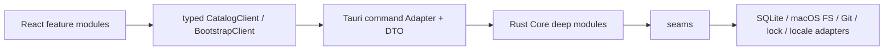
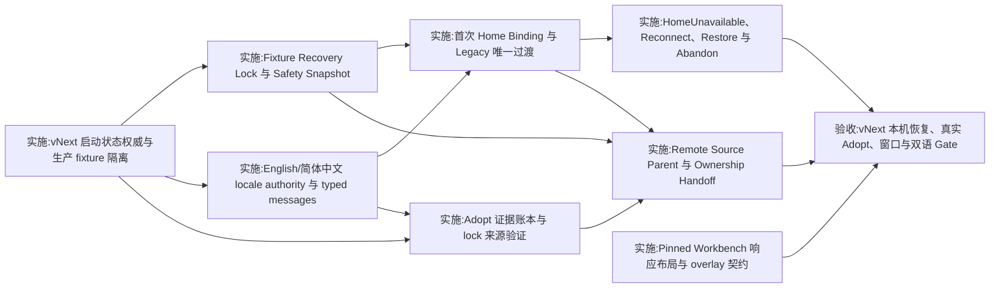

# Skill Man vNext 实施 Spec

> 状态：Ready for implementation
>
> Wayfinder map：[Skill Man 地图：vNext 真实数据可信、Home 首次绑定与中文体验](https://github.com/RookieZoe/skill-man/issues/32)
>
> 汇总票：[汇总：vNext 真实数据可信、可配置与中文体验 spec](https://github.com/RookieZoe/skill-man/issues/38)

## 1. 权威、范围与完成标准

本文件是 vNext 变更的实施权威。它把已关闭 Wayfinder 决策合并为一套无冲突的 schema、Core Module、seam、Adapter、typed Tauri DTO、React 状态机与验收契约。实施 agent 不得重新决定本文件已经定案的产品行为。

仍未被本文件改动的 MVP 行为继续遵循[历史 MVP 实施 Spec](mvp-implementation-spec.md)；发生冲突时，优先级为：

1. [CONTEXT.md](../CONTEXT.md) 中的规范领域词；
2. ADR-0010 至 ADR-0013 的长期不变量；
3. 本 vNext Spec 的实施编排和验收细节；
4. 旧 ADR 与历史 MVP Spec 中未被取代的部分。

### 1.1 本次交付

- 生产启动只读取真实 App-level state、Home 与 Catalog；fixture 只能存在于测试或显式 prototype composition。
- 建立统一 Skill Man Home、不可变 Home Binding、Legacy 唯一一次绑定前过渡及完整 fail-closed 状态。
- 提供 English 与简体中文的单一 locale authority；所有 App Copy、ARIA、native menu/tray 与公开错误可本地化，Source Content 原样保留。
- 实现 Pinned Workbench 自适应布局、明确的滚动归属、原生最小尺寸与稳定 overlay/focus 行为。
- Adopt 以完整来源证据分类 Local Link 与 Remote Install；lock 仅是 provenance hint；Remote Source Parent、Remote Binding 与 Ownership Handoff 保持内容和单一 owner。
- 通过自动化矩阵与四项人工 Gate，证明真实数据恢复、多跳 Adopt、WKWebView 布局和双语体验。

### 1.2 明确不做

- Home Binding 建立后的 Preferences 改址、Relocate 或普通 re-home。
- 自动删除或改写用户来源 Skill；把 fixture 恢复冒充 Remove、Adopt 或 Activation Repair。
- 翻译 Skill 名称、描述、正文、路径、URL、Git 标识、release notes 或外部命令输出。
- 非 macOS、CLI、URL scheme、本地 API、项目级 Skill/Profile。
- 签名、公证与真实 updater 升级验收；继续由[发布前：配置签名、公证并完成真实升级验收](https://github.com/RookieZoe/skill-man/issues/31)跟踪。
- 在本 Spec 汇总票内修改产品代码或清理本机数据。

### 1.3 vNext 完成定义

只有以下条件全部满足，vNext 才完成：

1. 第 9 节全部实施票关闭；native dependency 图无跳过的 blocker。
2. 第 10 节自动化矩阵通过，四项人工 Gate 留下日期、操作者、构建 commit 与证据链接。
3. 生产 composition root 不包含 fixture seed/fallback；无法读取真实状态时显示 closed failure state，而非 demo 数据。
4. 所有跨文件系统写入均有明确 commit point、崩溃恢复方向与 fail-closed 歧义处理。
5. README、本 Spec、CONTEXT 与 ADR 不再给出相反结论。

## 2. 不变量与旧决策取代矩阵

### 2.1 全局安全不变量

1. **真实数据优先。** 生产 Catalog 只来自已验证的 Bound Home；错误、空库与不可用状态不能 fallback 到 fixture。
2. **先识别再打开。** bootstrap locator、Home marker、卷身份与 Catalog identity 未验证前，不得以可写方式打开 SQLite，也不得构造产品写 Module。
3. **单一写门。** 所有 Import、Adopt、Update、Remove、Enable/Disable、Repair 与 Home 写操作共享一个 `WriteGate` snapshot；Fixture Recovery 自身使用独立、显式确认的 recovery capability。
4. **绑定身份而非字符串路径。** Bound Home 由 `home_id`、locator、marker、Catalog 与卷身份共同证明；路径相同不等于身份相同。
5. **无静默 re-home。** Reconnect 与 Restore 只恢复同一 `home_id`；只有 Abandon Home and Start New 能结束旧绑定并产生新身份。
6. **Safety Snapshot 永不自动删除。** 删除必须由用户显式发起，并在至少一次后续成功启动和 Rescan 后重新验证它仍是非活动 Snapshot。
7. **Source Content 保真。** locale、Preview、Adopt、迁移与错误呈现都不能改写 Source Content。
8. **Adopt 单一 owner。** 外部 installer lock 的 CAS 删除是 Ownership Handoff 的逻辑 commit point；commit 前 rollback，commit 后只 roll-forward。
9. **查看不等于选择。** Adopt 中所有可 Apply Skill 都需逐项显式 Include；Blocked、Deferred 与 fixture 项不可选择。
10. **DTO 不携带自由 App 文案。** Core 不接收 locale；跨 Tauri seam 的公开语义使用 closed code、typed params 与单独 diagnostic。

### 2.2 被取代的旧结论

| 旧来源                              | 被取代的结论                                       | vNext 权威结论                                                                                                     |
| ----------------------------------- | -------------------------------------------------- | ------------------------------------------------------------------------------------------------------------------ |
| ADR-0007、历史 Spec §4.6/§5.1/§8.7  | 启动即在固定路径创建 Library；首次启动可跳过       | 默认路径仍相同，但 Use Default 与 Choose… 都需显式确认；取消保持 Unconfigured、零 Home 产物                        |
| ADR-0007、历史 Spec §5.1/§15.1      | Library 路径固定且没有迁移                         | 首次绑定前可选择 Home；Legacy 仅有一次 copy/原位过渡；绑定后仍没有 Preferences 改址、Relocate 或普通 re-home       |
| ADR-0007、ADR-0009、历史 Spec §10.2 | Preferences 严格四项且不提供语言设置               | 四个既有 boolean 保留；另加非 switch 的 Language 选择 `system                                                      | en  | zh-Hans` |
| 历史 Spec §4.6                      | SQLite migration/open 先于状态识别                 | 先读 App-level state、校验 identity、执行 fixture/recovery gate，再决定只读或可写 Catalog open                     |
| 历史 Spec §5.4                      | `remote_sources` 每 Skill 一行且没有 parent        | repository 级 Remote Source Parent + per-Skill Remote Binding；mirror 仅为可重建 cache                             |
| ADR-0005、历史 Spec §6.5/§8.4       | Agent/shared 内实体通常直接迁入，safe 候选默认勾选 | lock 闭环才可 Remote Install；其余 Local Source 由用户拥有；所有候选逐项 Include，来源链和阻断证据完整展开         |
| 历史 Spec §8.4                      | external 只是 warning，可手动勾选继续              | Provenance Conflict、Verification Deferred 与链路错误是 closed states；只有精确忽略 lock 或修复/Retry 后才能换路径 |
| 历史 Spec §9                        | 900×600、三栏到 860px、页面可能滚动                | 原生最小 760×520；1060px 断点；pane/drawer/Notice tray 明确拥有滚动；页面无横向滚动                                |
| 当前 production composition         | 空 SQLite seed fixture；读失败 fallback fixture    | 永久删除生产 seed/fallback；Fresh Home 是 Empty Library + 真实 Preset；失败显示真实状态                            |

ADR-0004 的普通 Import/Update、ADR-0005 未被 ADR-0013 取代的扫描/Conflict/Activation/批量隔离、ADR-0007 的四个 boolean 行为和 Agent Preset 路径规则继续有效。

## 3. 持久化权威与 schema

### 3.1 物理布局

```text
~/Library/Application Support/skill-man-state/
├── home-binding.json       # bootstrap locator；当前 binding + abandoned history
├── locale.json             # system | en | zh-Hans
└── recovery-ledger.json    # active/completed Home 与 fixture recovery operations

<Skill Man Home>/
├── .skill-man-home.json    # Home marker
├── skill-man.sqlite3       # Catalog SQLite + WAL/SHM
├── skills/                 # Home-owned Install 实体
├── remotes/                # provenance-only Remote Source Parent manifests
├── operations/             # durable product operation journals/backups
├── cache/                  # 可重建；含 cache/git bare mirrors
└── staging/                # 瞬态；启动恢复后清理
```

`skill-man-state` 与默认 Home 同级且互不包含。Agent skills 目录、shared/installer root 与用户 Local Source 不属于 Home。

### 3.2 App-level state 文件

三个文件都使用 versioned JSON，写入协议统一为：同目录 temp file → 写完整 bytes → file fsync → atomic rename → parent fsync。`home-binding.json` 或 `recovery-ledger.json` 解析失败、未知 schema、字段矛盾或目录不可读时进入 `AppStateUnavailable`，不得猜测或重建；`locale.json` 失败按本节下述 English 安全基线处理，不能把坏值发布为有效 selection。

`home-binding.json` 的最小逻辑结构：

```text
schema_version
current: null | { home_id, path, volume_fsid, volume_uuid, bound_at }
abandoned: [{ home_id, path, volume_fsid, volume_uuid, abandoned_at }]
```

- `current = null` 表示没有活动 Home Binding；`abandoned` 历史仍必须保留。
- `home_id` 为 UUID v4；`path` 必须是绝对、UTF-8 可表示且确认时不含 symlink component 的路径。
- `volume_fsid + volume_uuid` 是稳定卷身份；任一无法取得时 Home Candidate 不可确认。
- 同一 `home_id` 不得同时出现在 `current` 与 `abandoned`。

`locale.json` 只含 `schema_version` 与 `selection`。缺失按 `system`；未知值或不可读时以 English 安全基线启动、记录 diagnostic，但不创建 Home。

`recovery-ledger.json` 记录单一 `active` operation 与只追加的 completed metadata。每项至少包括 `operation_id`、`kind`、`home_id?`、live/snapshot/prepared 路径、manifest hash、cursor、commit point 和时间。路径/identity/manifest 与 cursor 冲突时保持 recovery lock；不能仅凭 cursor 猜测方向。

### 3.3 Home marker 与三方身份证明

`.skill-man-home.json` 记录 `schema_version`、`home_id`、`volume_fsid`、`volume_uuid`、`created_at`。Catalog `catalog_meta` 记录相同 Home identity。只有 locator、marker、Catalog 三方值和当前卷身份全部一致，状态才是 Bound。

- locator 存在但路径/卷不可达：`HomeUnavailable`。
- 路径可达但任一 identity 不一致：`HomeIdentityMismatch`。
- locator 缺失/损坏/自相矛盾：`AppStateUnavailable`。
- 无 locator 且默认旧路径存在：只读 Legacy classifier；不得直接写 SQLite。

### 3.4 Catalog schema 迁移

当前 schema v4 之后按顺序保留两个独立 migration，禁止多个实施票争用同一个版本：

#### schema v5 — Home identity

- `catalog_meta` 新增 nullable `home_id`、`volume_fsid`、`volume_uuid`、`home_bound_at`。
- nullable 只服务未绑定 Legacy/恢复中间态；任何 `BoundCatalogStore` 构造都要求四项非空并已与 locator/marker 核对。
- Fresh Home Candidate 在 SQLite 初始化时直接写入；Legacy 原位或 copy 过渡在 locator commit 前写入并验证。
- v4 Catalog 不能由普通 `open()` 自动迁移；只能由 Home Binding/Legacy operation 在 Snapshot/backup 后迁移。

#### schema v6 — Remote Source Parent

```text
remote_source_parents(
  remote_id PK, canonical_url UNIQUE, created_at
)
remote_source_aliases(
  remote_id FK, alias_url UNIQUE, confirmed_at,
  PK(remote_id, alias_url)
)
remote_bindings(
  skill_id PK/FK, remote_id FK,
  requested_ref, verification_anchor_commit, original_commit_known,
  skill_path, provider_hash nullable,
  remote_baseline_hash, current_baseline_hash,
  last_checked_at, last_updated_at
)
```

- 删除旧 `remote_sources` 只能发生在同一 SQLite migration transaction 成功复制并通过 foreign-key check 后。
- 旧 Skill Man-owned Remote Install 按语法规范化后的 URL 建 parent；`resolved_commit` 成为已知安装 commit 和 Verification Anchor，现有 recorded content hash 同时成为 remote/current baseline。provider hash 可为 null，下一次 verified fetch 后补齐。
- migration 不读取或修改外部 `.skill-lock.json`，也不把已有 Skill Man-owned Install 当作新 Adopt。
- 两个已有 parent 因 redirect/rename 汇聚时不得自动合并；只有显式确认、逐 Skill 重验证后才能选择 survivor。

### 3.5 fixture recovery fingerprint

生产代码只保留不可变 `FixtureFingerprintV1` 常量，不保留可用于 seed/fallback 的 composition。安全恢复必须同时满足：

- SQLite 只有精确的 `skill-authoring`、`media-xray`、`legacy-audit` seed tuple 与精确 Agent tuple；无 Activation、file/remote source、operation、journal、未知 Library row 或交叉引用。
- `fixture-entities/skill-authoring` tree hash = `tree-sha256-v1:1ae22a3015f6d3f028667af331a3616ca2673d05fb3d7b33ac0802ab626a9061`。
- `fixture-entities/media-xray` tree hash = `tree-sha256-v1:146e94fa7177b5c4b034ccafad6fba24175de8a1030fbc0937744961811a2475`。
- 完整初始 `fixture-entities` root hash = `tree-sha256-v1:bfbd3ade08b7c05a2f5f806e2a0979dc6b241be253e71d28c73f08651af5cc0a`。
- `legacy-audit` 实体不存在；任何实际目录都使分类失败。
- 只迁移白名单 Preferences、可验证的 Claude/Codex Preset path override，以及无 Activation 且路径合法的 Custom Agent；fixture Workbench、detected observation 与 onboarding 状态不迁移。

单个名称、UI 内容、`snapshot_version`、mtime/inode 或路径存在都不是充分证据。任何额外、缺失、修改或无法读取的事实把整个 Home 分类为 mixed/unknown，并保持 `Fixture Recovery Lock`；不得恢复“看起来安全”的子集。

## 4. 调用方向与 Interface contract

### 4.1 单向依赖



- React 不读取 SQLite、App-state file、Git、lock 或任意 Home 路径。
- Tauri command Adapter 只做 DTO validation/mapping，不拥有领域状态机，也不本地化自由字符串。
- Core Interface 是调用者与测试共同使用的 surface；journal、补偿、hash、CAS 与 Adapter 组合隐藏在 Implementation 内。
- 复用现有 `FileSystem`、`CatalogStore`、`Source` 与 `AgentAdapter` seam；只有确有 system/test 两个 Adapter 的变化点才新增 seam。

### 4.2 Bootstrap Module

外部 Interface：

```text
inspect() -> BootstrapSnapshot
prepare_home(path) -> HomeCandidate
confirm_home(candidate_token) -> BootstrapSnapshot
continue_candidate(operation_id) -> BootstrapSnapshot
cancel_candidate(operation_id) -> BootstrapSnapshot
reconnect_same_home() -> BootstrapSnapshot
plan_abandon() -> AbandonPreview
apply_abandon(plan_token, typed_confirmation) -> BootstrapSnapshot
```

`BootstrapSnapshot` 是 closed union：

```text
AppStateUnavailable
Unconfigured
Abandoned { home_id, path }   # 旧主目录已显式放弃：向导可用，现场绝不作为候选（§5.5）
LegacyDetected
FixtureRecoveryLocked
HomeCandidatePending
Bound { home_id, catalog_access, snapshot_version }
HomeUnavailable
HomeIdentityMismatch
```

每个 variant 只携带渲染和下一合法动作所需的 typed fields。React 根据 variant 渲染唯一顶层 route；不得用若干互相独立 boolean 拼出非法组合。

新增 seam：

- `AppStateStore`：原子读取/CAS 写 locator 与 recovery ledger；system Adapter + fault-injecting temp-dir Adapter。locale 由第 4.5 节独立 `LocaleStore` 负责。
- `VolumeIdentitySource`：读取稳定卷身份；macOS Adapter + deterministic Adapter。
- `CatalogProbe`：只读识别 schema、integrity、foreign key、Home identity 与 fixture fingerprint；绝不迁移或 seed。

`BoundCatalogStore` 只接受已验证的 `BoundHome` value object 构造。删除可以仅凭任意 path 调用 `SqliteCatalogStore::open` 的 production path。

### 4.3 WriteGate

`WriteGate` 是不可伪造的 Core capability，而不是 UI disabled flag：

- `Open(BoundHome)`：允许常规产品写。
- `CatalogReadOnly(reason)`：只允许 Catalog read；全部产品写被拒绝。Remote Source Identity Conflict 下的 read/Disable/Remove 是 `Open(BoundHome)` 内更窄的 source-level gate，不得借此绕过全局只读。
- `Closed(reason)`：拒绝全部常规产品写。
- `Recovery(operation_id)`：只授予 Fixture Recovery/Restore Implementation 的窄写能力。

所有写 Module 构造时接收 gate provider；每次 Apply commit 前重新读取 gate generation。状态变化使旧 plan token `PlanStale`。

### 4.4 Fixture Recovery Module

```text
inspect() -> FixtureRecoveryPreview
plan(selection) -> FixtureRecoveryPlan
apply(plan_token) -> RecoveryResult
confirm_result(operation_id) -> BootstrapSnapshot
list_snapshots() -> [SafetySnapshot]
plan_delete_snapshot(snapshot_id) -> DeleteSnapshotPreview
apply_delete_snapshot(plan_token) -> Result
```

Implementation 隐藏 quiesce、whole-Home rename、manifest、prepared Home、ledger cursor、崩溃恢复与 targeted external-path lstat。普通 Catalog/Adopt/Activation Interface 不能获得 recovery capability。

### 4.5 Locale Authority Module

```text
snapshot() -> LocaleSnapshot { selection, effective_locale, generation }
set_selection(selection) -> LocaleSnapshot
refresh_system_languages() -> LocaleSnapshot
```

seam：`SystemLocaleSource::preferred_language_tags()` 与 `LocaleStore`。macOS/system Adapter 和 deterministic test Adapter 证明 seam 真实存在。`set_selection` 必须 persist-then-publish；失败保持旧 snapshot 与全部 surface 不变。

### 4.6 Adopt Module

保留现有 `scan → plan → apply → undo/finalize` 形状，深化而不另建平行 Module：

```text
scan(scope) -> AdoptEvidenceReport
plan(evidence_generation, selections) -> AdoptPlan
apply(plan_token) -> AdoptResult
undo(operation_id) -> AdoptUndoResult
finalize(operation_id) -> Result
```

新增/深化 seam：

- `InstallerLockStore`：枚举已知 lock、strict v3 parse、full fingerprint、exact-entry CAS rewrite；system + race-injecting Adapter。
- `RemoteProvider`：GitHub、GitLab、generic HTTPS Git；解析/获取 ref ancestry、tree 与 provider hash，不写 Home。
- 现有 `FileSystem`：提供 bounded symlink walk、entry identity、whole-tree hash、同父 rename、fsync；不暴露无条件递归删除。
- 现有 `CatalogStore`：增加 Remote Source Parent/Binding 与 source-level write gate transaction；不接收 lock JSON。

### 4.7 typed Tauri DTO

所有公开结果使用 `camelCase` fields + `snake_case` enum values。错误形状固定为：

```text
CommandFailureDto {
  error: PublicErrorDto,       # serde tagged union；每个 code 自带固定 typed fields
  diagnostic?: DiagnosticDto  # 原始技术事实；永不作为 App Copy
}
```

禁止 `message: String`、`warning: String`、`reason: String`、`sourceLabel: String` 承担 App 语义。替换为：

- closed code / state enum；
- typed params（path、Skill/Agent name、URL 等 Source Content 独立字段）；
- 可选 diagnostic code + raw detail；
- presentation 端 message key。

至少新增：

- `get_bootstrap_snapshot`、Home Candidate/confirm/reconnect/abandon commands；
- Fixture Recovery inspect/plan/apply/confirm/snapshot commands；
- `get_locale_snapshot`、`set_locale_selection`；
- expanded Adopt evidence/selection/plan/handoff DTO；
- `bootstrap://changed` 与 `locale://changed` events，payload 与 query snapshot 同构并带 generation。

React command client 不得在非 Tauri runtime 自动 fallback fixture。浏览器测试/prototype 必须显式注入 `createFixtureCatalogClient()`；production factory 若无 Tauri bridge，返回 closed bootstrap failure。

### 4.8 React 模块

把当前单体 App state 按领域 route 收拢，避免复制 Core 状态机：

```text
src/app/                # bootstrap provider、typed clients、event reconciliation
src/features/home/      # Unconfigured/Candidate/Unavailable/Recovery routes
src/features/locale/    # LocaleProvider、message formatting、Language control
src/features/library/   # Pinned Workbench shell
src/features/adopt/     # evidence ledger + result/Undo
src/ui/                 # locale-free primitives；visible copy 由 caller 传 key result
resources/locales/      # en.json、zh-Hans.json 单一 message catalog
```

React 只保存 ephemeral UI state（selection、filter、sheet、scroll、focus）；`home_id`、recovery cursor、locale selection、Adopt evidence generation 与 plan validity 以 native snapshot 为权威。

## 5. 启动、Home 与恢复状态机

### 5.1 production 启动顺序

1. 初始化不含 Skill 正文的 diagnostic logging。
2. 读取/校验 `skill-man-state`；解析 locale selection 并在任何 React/native visible surface 前得到有效 locale。
3. 若 App state 不可读，进入 `AppStateUnavailable`；只提供 Retry、Language 与 diagnostic export。
4. 无 current binding：只读检查默认 Legacy 路径；不存在则 `Unconfigured`，存在则进入 Legacy classifier。
5. current binding 存在：读取当前卷身份、Home marker、Catalog header/identity；任何不一致先形成 closed bootstrap state。
6. 恢复 active ledger operation；路径/identity/manifest 能唯一判断时 rollback 或 roll-forward，歧义则保持 recovery lock。
7. 只读执行 fixture classifier。pure fixture 进入 Preview；mixed/unknown 进入 Fixture Recovery Lock。
8. 只有 Bound identity、recovery 与 fixture gate 全部通过后，才打开 `BoundCatalogStore`、recover普通 operations、构造写 Module。
9. 运行只读 Rescan/Activation health，发布首个 `BootstrapSnapshot`，再呈现 Library Desk。
10. 网络 update check 最后异步启动；不能改变 bootstrap gate。

### 5.2 Fixture Recovery

状态机：

```text
Detected
→ Fixture Recovery Lock
→ Preview
→ Confirmed
→ Quiesced
→ Snapshotted
→ Validated/Classified
→ Prepared
→ Promoted
→ Verified
→ AwaitingCommit
→ Committed
```

- 检测只读；首次写入必须来自当前 Preview 的 plan token 和用户确认。
- Quiesced 必须证明没有旧 Skill Man/SQLite writer；无法证明则停止，不尝试 checkpoint。
- Snapshotted 以同卷 sibling atomic rename 隔离整个旧 Home，包括 SQLite/WAL/SHM、operations、journals、staging、cache、backup 与未知文件。
- Snapshot 立即只读；不得在其上重放旧 operation journal，因为 journal 可能包含 Home 外路径。
- Legacy unbound 模式准备一个干净但仍未绑定的 Home；Catalog identity 字段保持 null，常规产品写仍关闭。Bound Restore 模式必须保留同一 `home_id`。
- prepared Home 离线通过 SQLite integrity/foreign-key、fixture absence、manifest 与外部树不变验证后才 promote。
- AwaitingCommit 仍关闭常规写；用户确认恢复结果后才 Committed。
- commit 前可把失败 prepared/live 隔离并原子恢复 Snapshot；commit 后不提供覆盖新数据的一键 rollback。

### 5.3 首次 Home Binding

```text
Unconfigured
→ read-only Home Candidate validation
→ explicit confirmation
→ Candidate Preparing
→ Candidate Verified
→ locator atomic commit
→ Bound
```

候选校验：绝对 UTF-8 路径、无 symlink component；不等于/包含/被包含于状态目录或任何 Agent skills 目录；目标不存在时 parent 可写，存在时必须为空；卷身份稳定；可用空间至少 100 MB。

确认后创建 Home、schema v5 SQLite、marker 与标准目录，执行 integrity/foreign-key/identity/layout 校验，再原子提交 locator。locator rename + parent fsync 是唯一 binding commit point：

- commit 前崩溃：仍 Unconfigured；显示 Continue 或经确认 Cancel，仅删除已证明由本 operation 创建的候选产物。
- commit 后崩溃：只 roll-forward 验证同一 binding；不得删除或重新选址。

Use Default 和 Choose… 都执行相同显式确认；取消零 Home 产物。

### 5.4 Legacy 唯一一次过渡

仅当无 current binding 且默认路径存在时识别 Legacy。顺序固定：read-only identify → fixture classification/recovery → Home 选择。

- mixed/unknown Legacy 保持 Fixture Recovery Lock；不显示 Choose…，防止绕过。
- Default：在原路径完成 v5 migration、写 marker/identity、验证后提交 locator；零搬移。
- Choose…：外部 ledger → SQLite checkpoint/WAL 一致收口 → 完整树 copy 到候选 → 每文件大小 + tree hash + integrity/identity 校验 → 提交 locator。
- commit 前 Legacy 原样保留；失败删除已证明为本 operation 的不完整副本或按 ledger 重试。
- commit 后旧 Legacy 路径 inert，App 永不自动删除。

### 5.5 不可用、Reconnect、Restore、Abandon

| 状态/动作                  | 资格                                               | 允许行为                                                                                                    | 禁止行为 / commit point                                                      |
| -------------------------- | -------------------------------------------------- | ----------------------------------------------------------------------------------------------------------- | ---------------------------------------------------------------------------- |
| HomeUnavailable            | binding 存在但路径/卷不可达、权限拒绝或目录消失    | locale、Retry、Reconnect、Restore eligibility probe、Abandon、diagnostic；SQLite 若确实可只读则只读 Catalog | 不写、不重新绑定、不把默认路径当新 Home；四个 Home-scoped Preferences 不落盘 |
| HomeIdentityMismatch       | 路径可达但卷/marker/Catalog 与 locator 不一致      | 只读现场诊断、Reconnect probe、Abandon                                                                      | 现场内容绝不视为 Bound；不得自动补 marker/locator/DB                         |
| Reconnect Same Home        | Unavailable/Mismatch，用户显式发起                 | 卷→marker→Catalog 三方重验；成功恢复同一 `home_id`                                                          | 失败保持原状态；无 binding/path 修改                                         |
| Restore Bound Home         | locator 有效且同一 identity 可证明，但内容验证失败 | 复用 Fixture Recovery/Safety Snapshot 状态机，以同一 `home_id` promote                                      | 不改 locator identity、不触 Activation、不自动删 Snapshot                    |
| Abandon Home and Start New | 任意已绑定状态；Legacy Lock 不提供                 | 输入 home_id/固定短语 + 二次确认；CAS 把 current 移入 abandoned，随后回到 Unconfigured                      | locator CAS 是 commit point；不删旧 Home、不清理旧 Activation、不改变 locale |

Abandon 后旧 Activation 可能 Broken，只报告，不自动修复。新绑定生成全新 `home_id`；旧卷回来时只显示已 Abandon，不重新绑定或作为候选。

## 6. locale、消息与内容所有权

### 6.1 locale 解析

持久 selection：`system | en | zh-Hans`；effective locale：`en | zh-Hans`。

优先级：显式选择 → 系统首选语言列表 → English fallback。系统列表依序匹配：

- `en` / `en-*` → `en`；
- `zh` / `zh-Hans*` / `zh-CN` / `zh-SG` → `zh-Hans`；
- `zh-Hant*` / `zh-TW` / `zh-HK` / `zh-MO` 跳过并继续后续首选语言；无匹配才 `en`。

System 模式在 App 再次激活和下次启动时重新协商。手动切换立即同步 React、document `lang`、tray 与 native menu，不重载 Catalog、不 remount sheet，不丢筛选、选择、表单、scroll 或焦点。

### 6.2 message catalog 技术选择

首版不增加 runtime i18n framework。使用根目录 `resources/locales/en.json` 与 `zh-Hans.json` 作为共享 catalog：

- TypeScript 的 `MessageKey = keyof typeof en`；
- Rust native presentation 从同一 JSON `include_str!`，用受测的 closed `NativeMessageKey` 子集；
- `scripts/check-locales.mjs` 验证 key 集、placeholder 名称、复数参数与不可翻译 token 一致，缺失阻断 CI；
- English 是完整基线；运行时 zh-Hans 缺 key 可回退同 key English 防止空白，但 CI 仍失败；
- 日期、数字、文件大小和复数由 effective locale formatter 处理，不在 message 中手工拼接。

### 6.3 App Copy / Source Content

App Copy 全覆盖：可见 UI、Notice、error summary/action、ARIA、placeholder 自然语言、tray、native menu、notification/update flow、日期/数字/单位。

Source Content 原样字段：Skill 名称/description/body、用户 Agent 名、路径、URL、ref/commit/hash、lock 字段、release notes、外部命令输出。外部错误以本地化摘要包裹，并把 raw detail 放在明确标注、默认折叠的 diagnostic 区。

静态硬编码门禁只允许品牌、technical token 与维护过的 Source Content allowlist。测试 selector 继续优先 role/accessible name/稳定语义；不得用 `data-testid` 逃避 a11y 断言。

## 7. Pinned Workbench 布局契约

### 7.1 breakpoints 与滚动

| viewport     | 布局                                                             | 滚动 owner                                       |
| ------------ | ---------------------------------------------------------------- | ------------------------------------------------ |
| `>= 1060px`  | Library、Skill detail、Agent Inspector 三栏同屏                  | 三个 pane 分别纵向滚动；Toolbar 固定；页面不滚动 |
| `760–1059px` | Library + Skill detail 双栏；Agent Inspector 为右侧 modal drawer | 两个 pane 与 drawer 各自滚动；页面不滚动         |
| `< 760px`    | 防御性单 pane navigation                                         | active pane 滚动；不构成原生窗口支持承诺         |

原生窗口最小尺寸改为 `760×520`。精确边界 `1059/1060` 和 `759/760` 必须有自动化测试。

App shell 使用显式 `Toolbar / NoticeRegion / Workspace` rows；0 Notice 折叠、1 Notice 自然高度、多 Notice 进入有界独立滚动 tray，Workspace 永远占剩余高度。删除依赖 `display: contents` 和 implicit grid rows 的生产布局。任何状态下无 page-level 横向溢出。

### 7.2 overlay/focus

Overlay 位于 inert App background 之外。跨 breakpoint resize 不 remount 当前 sheet/drawer；focus trap 保持，关闭回到逻辑 opener。低高度时 backdrop 自身可滚到全部 action。busy 状态拒绝 Escape 与 backdrop dismissal；普通状态支持 Escape。正式 Empty/Error 使用真实可访问语义 DOM，不复用 prototype 的 CSS label。

## 8. Adopt 证据、分类与 Ownership Handoff

### 8.1 Evidence Ledger

Adopt Preview 采用三栏证据账本：候选上下文、完整来源链/验证门、裁决/计划/所有权结果。760×520 起可完整滚动审阅。

每个候选必须显示：

- 所有 Agent appearance；每一跳 symlink、原始 target text、entry identity；共享/installer canonical entity；最终实体；
- lock 命中路径与 exact entry；remote/ref/Verification Anchor、skillPath、provider hash；
- local/remote `tree-sha256-v1`、Modified 基线；
- verdict、可选动作、Home 结果路径、Activation 结果与 commit point。

同一最终实体的多个 appearance 聚合为一个候选但逐条显示。bounded walk 上限 16；dangling、cycle、hop-limit、non-UTF-8、读取失败或 identity replacement 停在精确失败 hop，不生成部分 fingerprint。

### 8.2 分类

| Evidence                                                     | verdict / 动作                                                                  |
| ------------------------------------------------------------ | ------------------------------------------------------------------------------- |
| 无 lock，实体已在稳定用户位置                                | Local Link；显式 Include；不复制/改写来源树                                     |
| 无 lock，但实体位于 Home、Agent/shared 或 installer root     | 先选上述 roots 之外的稳定位置并 journaled move，再 Local Link                   |
| lock 闭环，local tree = anchor tree                          | Healthy Remote Install；Home bytes = Apply 前当前 bytes                         |
| lock 闭环，local tree != anchor tree                         | Modified；三路显式选择：保留当前 bytes、放弃修改重装 anchor、转 Local Link      |
| lock/schema/owner/identity/source/path/hash/commit/tree 矛盾 | Provenance Conflict；保持 Untracked；修复或满足 exact-entry CAS 后显式忽略 lock |
| DNS/TLS/timeout/rate limit/401/403/404                       | Verification Deferred；Retry 或显式忽略；不自动降级                             |
| unsafe tree                                                  | Home-owned 选项禁用；不通过 Adopt 绕过 Install 安全规则                         |
| fixture 或无文件系统来源证明                                 | Excluded；无 selection control，由 Fixture Recovery 处理                        |

时间字段和 `pluginName` 只展示，不参与信任。requested ref 缺失记录 `HEAD`；moving ref 使用 tip 或其 ancestry 中最新 subtree match 作为 Verification Anchor，并明确 original install commit unknown；pinned tag/commit 必须精确匹配。

### 8.3 Remote Source Parent / Binding

每 repository 一个 UUID `remote_id`。`<Home>/remotes/<remote-id>/source.json` 只含 schema、remote_id、canonical HTTPS URL、confirmed aliases、created_at；不含 checkout/worktree、Git object、凭据、整份 lock 或 per-Skill 版本。

每 Skill Binding 独立保存 requested ref、Verification Anchor、skillPath、provider/remote/current baseline。同 repo 多 Skill/多 ref 共用 parent/fetch，但 Preview、Modified、Update 与提交逐 Skill独立。bare mirror 只在 `cache/git`；Skill 实体只在 `skills/<name>`。

Parent manifest 与 Catalog row 不一致进入 `Remote Source Identity Conflict`：相关 Skill 可读、可 Disable/Remove；该 parent 的 Update、新 Binding、alias 变更关闭；其它 parent/Local Source 继续。

### 8.4 Ownership Handoff

```text
Planned
→ Staged
→ Source Isolated
→ External Ownership Released   # logical commit: exact lock entry CAS removed
→ Managed Committed
→ Finalized
```

1. journal 冻结 full lock fingerprint、exact entry、canonical path/inode/tree、appearances、用户选择与 remote evidence。
2. stage 当前 tree 或用户明确选择的 anchor tree，完成 hash/空间/Install/Link 安全校验。
3. external canonical directory rename 到同父隐藏 operation path 并重验；CAS 前失败原位恢复。
4. full lock fingerprint 与 exact entry 仍匹配时，原子删除该 entry；保留 version、其它 top-level/entries/未知 JSON fields，最后一项删除后保留合法空 v3 lock。
5. CAS 后只 roll-forward：publish Home entity、Catalog parent/binding/Skill/desired Activations；真实 Agent private appearances 压平为直指最终实体的 Activation；shared/installer root 不留 Managed Activation。
6. 单 Skill 失败不撤销同批已成功项；lock 并发变化停止剩余未提交项。

结果窗口关闭/重启前允许 conditional Undo；只有 Home/entity/appearances 未变、external path 可恢复、lock 仍有效且 key 未被占用时才 CAS 恢复。普通 Remove 不恢复旧 external owner。installer 后续重建同名 entry/entity 时进入 Ownership Conflict，不自动覆盖、合并或再次 Adopt。

## 9. TDD 竖切、实施票与依赖

每张实施票必须走完整竖切，而不是只交付某一层：

1. 先在 Core Interface 写失败的 observable contract test。
2. 增加 schema/state migration 的隔离临时 HOME 测试与 fault point。
3. 实现 Core state transition；用 in-memory/fault Adapter 证明 rollback/roll-forward。
4. 实现 system Adapter；测试真实 SQLite、symlink、fsync/CAS 或 system locale seam。
5. 增加 typed DTO serialization/error mapping contract。
6. 接入 React route/interaction；保留 Source Content byte equality 与 a11y 断言。
7. smoke changed path；只有人工事实无法自动化时进入第 10.3 节 Gate。

### 9.1 dependency graph



A 与 F 可立即并行。A 完成后 B 与 E 并行；E 完成后 G 可与 B/C 并行；C 后 D 可与 G 并行；H 必须等待 recovery、binding 与 evidence contracts；最终人工 Gate 等待 D/F/H。

### 9.2 实施票

最终 tracker 链接在创建后写入本表；issue body 只承载该竖切的目标和验收，本 Spec 保持跨票 contract 的单一权威。

| Ticket                                                                                                        | 竖切结果                                                                                 | rollback point                                                  |
| ------------------------------------------------------------------------------------------------------------- | ---------------------------------------------------------------------------------------- | --------------------------------------------------------------- |
| [实施：vNext 启动状态权威与生产 fixture 隔离](https://github.com/RookieZoe/skill-man/issues/41)               | production startup state authority、v5、strict composition、closed React route           | v4 migration/locator 写入前；无 fixture fallback                |
| [实施：Fixture Recovery Lock 与 Safety Snapshot](https://github.com/RookieZoe/skill-man/issues/43)            | pure/mixed classifier、Recovery Lock、Safety Snapshot、crash convergence                 | Snapshot promote/用户 commit 前可原子恢复                       |
| [实施：首次 Home Binding 与 Legacy 唯一过渡](https://github.com/RookieZoe/skill-man/issues/45)                | explicit Default/Choose、Candidate、Legacy 原位/copy、locator commit                     | locator parent fsync 前 rollback；之后 roll-forward             |
| [实施：HomeUnavailable、Reconnect、Restore 与 Abandon](https://github.com/RookieZoe/skill-man/issues/46)      | unavailable/mismatch、Reconnect、Restore、Abandon                                        | Reconnect 无 commit；Restore 复用 recovery；Abandon locator CAS |
| [实施：English/简体中文 locale authority 与 typed messages](https://github.com/RookieZoe/skill-man/issues/44) | App-level locale authority、shared catalogs、typed public messages、native/React sync    | locale persist 失败不 publish                                   |
| [实施：Pinned Workbench 响应布局与 overlay 契约](https://github.com/RookieZoe/skill-man/issues/42)            | 760/1060 breakpoints、Notice tray、pane/drawer scroll、overlay/focus                     | 无持久数据；bundle revert                                       |
| [实施：Adopt 证据账本与 lock 来源验证](https://github.com/RookieZoe/skill-man/issues/47)                      | strict lock/provider/tree evidence、Evidence Ledger、explicit selection、read-only plans | scan/plan 无写；stale evidence 无 plan apply                    |
| [实施：Remote Source Parent 与 Ownership Handoff](https://github.com/RookieZoe/skill-man/issues/48)           | v6 parent/binding、handoff CAS、recovery、Update/Remove integration                      | lock CAS 前 rollback；CAS 后 roll-forward                       |
| [验收：vNext 本机恢复、真实 Adopt、窗口与双语 Gate](https://github.com/RookieZoe/skill-man/issues/49)         | 四项真实环境 Gate 与签字证据                                                             | Gate 前 Safety Snapshot/isolated test data；不代替自动化        |

## 10. 验收矩阵

### 10.1 自动化：bootstrap、Home 与 recovery

| Scenario                                                                          | Required evidence                                                                            |
| --------------------------------------------------------------------------------- | -------------------------------------------------------------------------------------------- |
| 非 Tauri runtime / SQLite open failure                                            | production client 显示 closed error；不出现 fixture Skill                                    |
| 空 Fresh Home                                                                     | 只有 schema、identity、真实 Claude/Codex Preset；无 Skill/Source/Activation/fixture entities |
| locator/marker/Catalog/卷任一缺失或不一致                                         | 精确进入 Unavailable/Mismatch/AppStateUnavailable；零自动补写                                |
| Candidate cancel / pre-commit crash                                               | 零绑定；只清理本 operation 创建且 identity 匹配的产物                                        |
| Candidate locator post-commit crash                                               | 重启只 roll-forward 同一 binding；无重新选址                                                 |
| path symlink、Agent overlap、state-dir overlap、非空、空间不足、无稳定卷 identity | read-only validation 拒绝，零产物                                                            |
| pure fixture                                                                      | exact DB tuple + 三个 tree hash 才可 Preview；恢复后 fixture/Workbench 消失                  |
| mixed/unknown/modified fixture                                                    | 整体 Fixture Recovery Lock；不可选择子集或 Choose… 绕过                                      |
| Snapshot 含 WAL/SHM/unknown files                                                 | whole-Home manifest 完整；Snapshot 只读；prepared 独立验证                                   |
| 每个 recovery cursor kill/restart                                                 | 最终唯一收敛 rollback 或 roll-forward；歧义保持 lock                                         |
| Legacy Default / Choose                                                           | 原位零搬移；或完整 copy/hash/integrity 后 locator commit；旧 Legacy 不自动删                 |
| Home offline/permission/path replaced                                             | 常规写关闭；locale 可写；Reconnect 仅同 identity 成功                                        |
| Restore                                                                           | 同 home_id、locator 不变、不触 Activation、Snapshot 不自动删                                 |
| Abandon                                                                           | 双确认；old id 进入 history；旧 Home/Activation 不删；新 binding 使用新 UUID                 |

### 10.2 自动化：locale、layout 与 Adopt

| Scenario                            | Required evidence                                                                         |
| ----------------------------------- | ----------------------------------------------------------------------------------------- |
| locale resolver                     | preferred list 顺序、Hant 跳过、后续命中、explicit override、English fallback             |
| locale persist failure              | React/native/document/lang 全部保持旧 generation                                          |
| runtime locale switch               | Catalog/filter/selection/sheet/form/scroll/focus 不丢；tray/menu 同步                     |
| catalog completeness                | en/zh-Hans key、placeholder、plural params 完全一致；硬编码门禁通过                       |
| Source Content                      | 相同 selected payload 在两种 locale 下逐字节相等                                          |
| viewport matrix                     | 759/760、1059/1060；0/1/multiple Notices；empty/error/dense EN/ZH；无 page x-overflow     |
| scroll ownership                    | 三栏、双栏/drawer 与 Notice tray 各自滚动；Toolbar 固定                                   |
| overlay resize                      | 不 remount；focus trap/inert/Escape/busy/return-focus/low-height action 全通过            |
| Adopt chains                        | multi-Agent、多跳、dangling、cycle、16-hop、non-UTF-8、read error、path replacement       |
| lock evidence                       | missing/corrupt/duplicate/stale、remote mismatch、commit mapping、Deferred network groups |
| Modified                            | 保留 bytes、放弃到 anchor、转 Local Link 三路分别证明 tree/owner 结果                     |
| TOCTOU                              | inode/tree/appearance/full-lock fingerprint 任一变化 → PlanStale、零部分提交              |
| same remote multi-Skill/ref         | 单 parent/fetch；per-Skill anchor/baseline/commit；失败隔离                               |
| handoff crash                       | CAS 前原位恢复；CAS 后 recovery gate 下 roll-forward；无长期双 owner/无 owner             |
| parent conflict                     | manifest/row mismatch 只关闭该 parent 的 Update/new binding/alias                         |
| external reappearance / last Remove | Ownership Conflict 不误作 Update；最后 child 删除空 parent，不恢复 external owner         |

### 10.3 必须人工执行的 Gate

自动化完成后才执行。每项在[验收：vNext 本机恢复、真实 Adopt、窗口与双语 Gate](https://github.com/RookieZoe/skill-man/issues/49)记录 build commit、日期、操作者、输入摘要、结果和资产链接；不得在 issue comment 粘贴 Skill 正文或凭据。

1. **本机数据恢复 Gate**
   - 完全退出旧 Skill Man，证明无 SQLite writer。
   - 只读 Preview 当前 Legacy/Bound Home 分类与 exact fixture evidence。
   - 由用户确认后运行恢复；记录 Safety Snapshot 路径、manifest hash、SQLite integrity/foreign-key、恢复前后 row counts。
   - Rescan 只报告真实 Untracked；不自动 Adopt/Enable/Repair；用户确认结果后才开放写。
2. **真实多跳 Adopt Gate**
   - 选一个 Local Link 多跳/多 appearance 与一个真实 lock-managed remote 候选。
   - 核对每一 hop、lock path、anchor、tree hashes、显式 Include 和最终 owner。
   - 对 source/Home/Activation 做 Apply 前后 byte/hash 与 symlink target 对比；凭据和 Skill 正文不进入日志。
3. **Tauri/WKWebView 视觉 Gate**
   - 真实 app 在 760×520、1059px、1060px 和高窗口检查 0/1/multiple Notice、dense EN/ZH、empty/error。
   - 打开 sheet/drawer 跨断点 resize；验证 scroll owner、无空白/横向溢出、focus trap、Escape、busy 与 return focus。
   - 保存窗口截图和 VoiceOver 基础记录。
4. **双语 native QA Gate**
   - 系统 English/简中、手动 override、System 回切、重新激活与重启。
   - 核对首帧、document `lang`、Preferences、tray、native menu、ARIA、日期/数字/单位与公开错误。
   - 抽样同一 Source Content 在两 locale 下 byte equality；核对 raw diagnostic 明确分区。

### 10.4 不属于本 Gate

Developer ID 签名、公证、Gatekeeper、公开 updater 的真实升级/回滚仍由发布票执行；本节只验证未签名/开发构建中的 vNext 产品行为。

## 11. 风险控制与实施纪律

- 任何 ticket 若发现需要改变 Destination、领域不变量或用户可见行为，停止实施并新开决策票；不得在代码 review 中暗改。
- schema v5、v6 各自由单一 ticket 持有；后续 ticket 只能追加 migration，不能改写已发布 migration。
- 每个 fault-injection point 使用稳定名称并写入测试矩阵；实现重构不能悄悄删除 crash coverage。
- 计划 token 必须绑定 bootstrap/write-gate generation、Catalog snapshot、path identity 与该操作专属 evidence；任一变化即 stale。
- recovery/operation logs 不记录 Skill 正文、token、credential 或 remote response body。
- 测试 fixture 通过 dependency injection 显式注入；禁止环境探测失败后自动选 fixture Adapter。

## 12. 决策追踪

| Area                                | Primary decision                                                                                                                                                                                                                                         |
| ----------------------------------- | -------------------------------------------------------------------------------------------------------------------------------------------------------------------------------------------------------------------------------------------------------- |
| fixture 恢复                        | [决策：受生产 fixture 污染的 Skill Man Home 如何安全恢复](https://github.com/RookieZoe/skill-man/issues/34)、[ADR-0010](adr/0010-production-fixture-recovery.md)                                                                                         |
| Home Binding / Legacy / unavailable | [决策：统一 Skill Man Home 的内部边界、首次绑定与不可用语义](https://github.com/RookieZoe/skill-man/issues/35)、[ADR-0012](adr/0012-skill-man-home-binding-and-unavailability.md)                                                                        |
| layout                              | [原型：窗口自适应布局、滚动归属与最小尺寸契约](https://github.com/RookieZoe/skill-man/issues/36)                                                                                                                                                         |
| locale/messages                     | [决策：English 与简体中文的本地化契约和双语术语表](https://github.com/RookieZoe/skill-man/issues/37)、[ADR-0011](adr/0011-interface-locale-and-message-ownership.md)                                                                                     |
| lock facts                          | [调研：.skill-lock.json 的来源契约与可信边界](https://github.com/RookieZoe/skill-man/issues/33)、[research report](https://github.com/RookieZoe/skill-man/blob/c8243b545c837720434556de398aa4638951d94e/docs/research/2026-08-11-skill-lock-contract.md) |
| Adopt model                         | [决策：Adopt 的 lock 驱动来源分类与 remote source 父级模型](https://github.com/RookieZoe/skill-man/issues/40)、[ADR-0013](adr/0013-adopt-provenance-and-remote-source-parents.md)                                                                        |
| Adopt Preview                       | [原型：Adopt Preview 的完整来源链与保真证据](https://github.com/RookieZoe/skill-man/issues/39)                                                                                                                                                           |

本 Spec 冻结上述产品决策；实施票只决定局部代码组织和满足 contract 的最小实现，不重新讨论用户行为。
